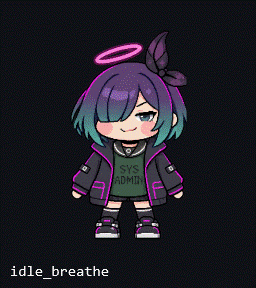

# Bolttagu Desktop Pet



독립 실행되는 Windows용 볼따구 데스크톱 펫이다. Engram은 필수 구성 요소가 아니며,
현재 투명 창에서 atlas 기반 등장·idle·walk·run·turn·click/huff·drag/fall/land·상하 climb·퇴장 애니메이션을 재생하고,
지지 창의 닫힘·가림·이동과 보행 중 가장자리 이탈에 즉시 반응한다. 자산 손상 시 정적 또는
벡터 fallback으로 복구한다.

## 바로 실행

Windows PowerShell에서 저장소 루트를 열고 다음 한 줄을 실행한다.

```powershell
powershell -NoProfile -ExecutionPolicy Bypass -File .\Run-Bolttagu.ps1
```

필요한 .NET SDK는 관리자 권한이나 시스템 PATH 변경 없이 저장소의 `.dotnet/`에 설치된다.
종료는 캐릭터의 오른쪽 메뉴 또는 시스템 트레이 메뉴에서 할 수 있다.

## 독립 실행 EXE 만들기

```powershell
powershell -NoProfile -ExecutionPolicy Bypass -File .\scripts\Publish-WinX64.ps1
```

Windows x64용 self-contained 단일 파일이 `artifacts\publish\win-x64\Bolttagu.exe`에 생성된다.
별도 .NET 설치 없이 실행할 수 있다. 생성물은 용량이 크므로 Git에 커밋하지 않고, CI artifact나
GitHub Release에 배포하는 것을 원칙으로 한다. 현재 실행 파일은 코드 서명이 없으므로 Windows가
SmartScreen 경고를 표시할 수 있다.

## 개발 환경

프로젝트 전용 .NET 10 LTS SDK를 `.dotnet/`에 설치한다. 저장소는 `global.json`으로
SDK 10.0.401을 고정한다.

```powershell
& .\scripts\bootstrap.ps1
$dotnetExe = Join-Path $PWD '.dotnet\dotnet.exe'
& $dotnetExe restore Bolttagu.slnx
& $dotnetExe build Bolttagu.slnx --no-restore
& $dotnetExe test Bolttagu.slnx --no-build
& $dotnetExe run --project src\Bolttagu.App\Bolttagu.App.csproj
```

## 조작

- 왼쪽 버튼으로 캐릭터 창을 드래그한다.
- 드래그 중 멈추면 정면 버둥 루프, 빠르게 움직이면 이동 반대쪽으로 팔다리와 몸 전체가
  쏠리는 루프가 재생된다.
- 짧게 클릭하면 `click` impact 뒤 `click_huff`가 재생되고 `idle_breathe`로 돌아간다.
- 드래그로 창을 옮길 때는 클릭 반응을 실행하지 않는다.
- 캐릭터가 선 창이 닫히거나 다른 창 뒤로 가려지면 다음 노출 표면까지 낙하한다.
- 자율 보행 중 현재 표면의 가장자리를 벗어나도 같은 낙하·착지 흐름을 사용한다.
- 걷기와 달리기는 전체 자율 행동 선택의 70% 이상을 차지하며, 짧은 idle 뒤 더 긴 거리를 이동한다.
- 걷다가 캐릭터 키 이상 높은 foreground 비최대화 창의 좌우 변 연장선을 만나면 경계마다
  한 번 35% 확률로 후면 rope-climb이 발동해 그 창 상단에 착지한다.
- idle 중에는 후면 free-climb이 임의 높이까지 발동하며, 노출된 창 상단을 만나면 착지하고
  만나지 못하면 기존 낙하 흐름으로 이어진다.
- 오른쪽 메뉴 또는 트레이에서 숨김·표시·종료를 선택한다.
- 실행 시 `spawn_in` 뒤 idle로 진입하고, 정상 종료 시 `despawn_out`을 마친 뒤 창을 닫는다.
- 캐릭터 아래의 표시는 현재 WPF DPI scale이다.

## 아트 파이프라인

Engram에서 가져온 원본은 `asset/bolttagu/upstream` 아래의 불변 snapshot이며 앱은 Engram
설치 경로를 읽지 않는다. P1 preview frame과 atlas를 다시 만들려면 다음을 실행한다.

```powershell
.\.dotnet\dotnet.exe run --project .\tools\Bolttagu.AssetBuild -- all
```

세부 규칙과 라이선스 주의사항은 `asset/bolttagu/README.md`를 참고한다.

## 설계 정본

- `docs/design/0001-bolttagu-art-pack.md`
- `docs/design/0002-desktop-pet-architecture.md`
- `docs/design/0003-desktop-pet-implementation-roadmap.md`
- `docs/design/0004-animation-surface-polish.md`
- `docs/design/0005-live-surface-reactions.md`
- `docs/design/0006-velocity-drag-lifecycle.md`
- `docs/design/0007-animation-transition-grammar.md`
- `docs/design/0008-window-climbing-behaviors.md`
- `docs/design/0009-launch-packaging-branding.md`
- `docs/design/0010-visual-text-surfaces.md`
- `docs/design/0011-directional-climb-and-run.md`
