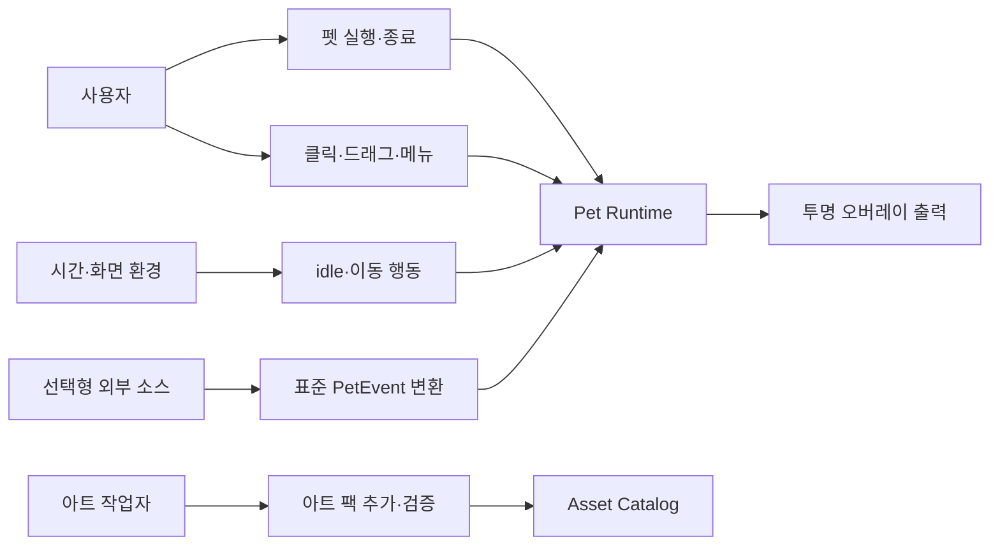
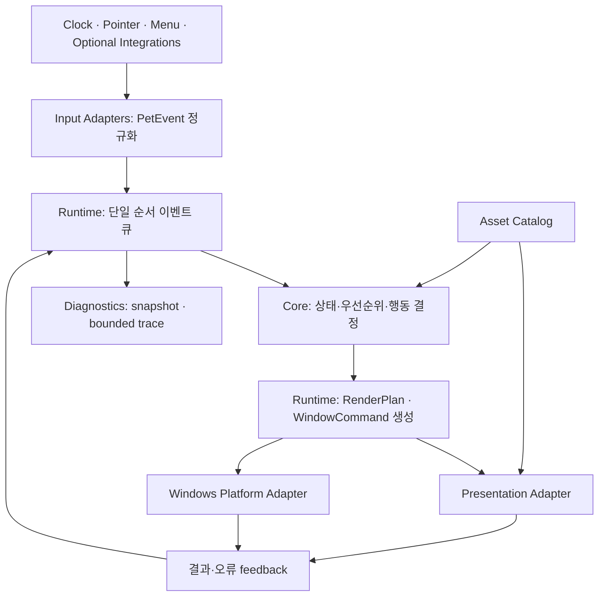
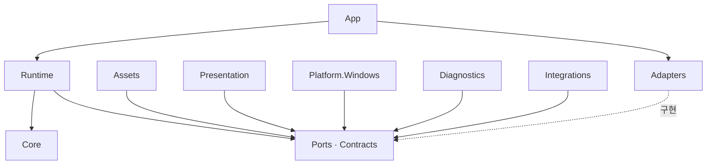
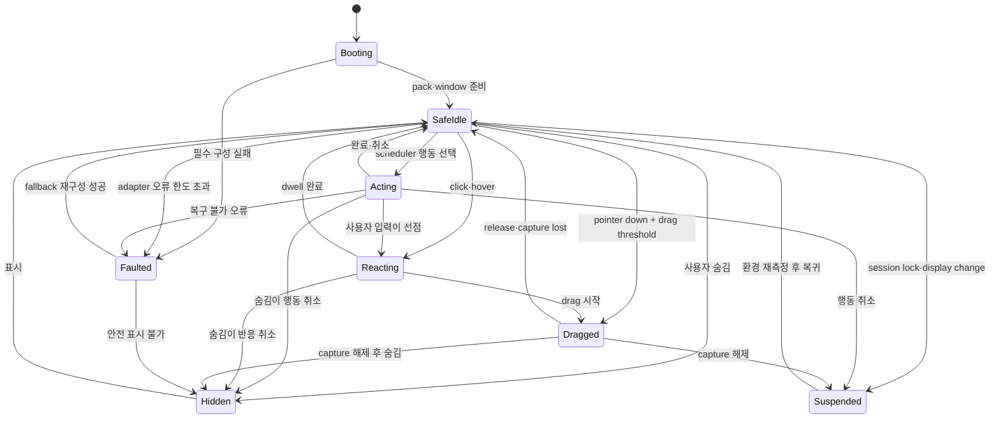

# 독립형 볼따구 데스크톱 펫 아키텍처

> tier **M** — 표준 — + 유스케이스·파이프라인·상태전이
> 채우는 순서: §1 의도 → §2 수용기준 → §3 확정사실(조사) → 다이어그램 → §9 변경지점 → §11 착수순서

## 1. 의도 (Intent)

| 항목 | 내용 |
|---|---|
| 문제 | 독립형 볼따구 데스크톱 펫의 행동·애니메이션·윈도우 제어가 한 덩어리로 구현되면 사람의 디버깅이 어렵고, 캐릭터나 플랫폼을 바꿀 때 재사용할 수 없다. |
| 왜 지금 | 런타임 구현 전에 모듈 경계와 의존성 방향을 고정해야 기능이 늘어도 거대한 이벤트 핸들러나 프레임 루프로 붕괴하지 않는다. |
| 주 사용자 | 볼따구의 행동과 아트를 반복해서 추가하고, 문제 발생 시 입력부터 화면 출력까지 추적하려는 앱 개발자. |
| 불변식 | 앱은 Engram 없이 완전하게 실행된다. 코어 행동 결정에는 OS·윈도우·그래픽 API가 들어오지 않는다. 시간과 난수는 주입한다. 원본 아트는 수정하지 않는다. 모듈 간 통신은 명시적 계약으로만 한다. |
| 비목표 | 이 문서는 구현 언어·UI 프레임워크를 확정하지 않는다. Engram 연결, LLM 대화, 물리 엔진, 플러그인 마켓, 다중 캐릭터 동시 실행은 초기 제품 범위가 아니다. |

## 2. 수용 기준 (Acceptance)

| ID | 수용 기준 | 검증 방법 |
|---|---|---|
| AC-1 | 최상위 모듈의 책임·공개 계약·금지 의존성이 정의되고 의존성은 `App → Runtime → Core`, `Runtime → Ports ← Adapters` 방향만 허용한다. | §5 모듈 표와 의존성 다이어그램을 검토하고 후속 구현에서 architecture test로 역참조 0건을 검사한다. |
| AC-2 | 동일한 초기 상태·입력 이벤트·시계·난수 seed를 주면 Core가 동일한 행동 결정과 렌더 지시를 생성할 수 있다. | 기록된 fixture를 두 번 replay하여 직렬화된 결정 스트림이 byte-for-byte 동일한지 비교한다. |
| AC-3 | 클릭·드래그·idle·이동·숨김의 정상 및 중단 경로가 명시되고, 어느 경로에서도 캡처된 포인터·진행 중 행동·임시 변환이 남지 않는다. | §6 상태 전이 검토 후 상태 전이 테스트에서 각 상태의 cancel/exit 불변식을 검사한다. |
| AC-4 | 잘못된 아트 팩이나 플랫폼 오류가 Core를 종료시키지 않고 fallback 캐릭터 또는 안전한 정지 상태로 격리된다. | 손상 manifest, 누락 프레임, 창 API 실패를 주입해 `Faulted` 진단 이벤트와 복구 상태를 검사한다. |
| AC-5 | 사용자가 최근 입력·상태 전이·행동 선택·활성 애니메이션·창 geometry를 하나의 진단 snapshot과 bounded trace로 확인할 수 있다. | 진단 snapshot schema 검사와 최대 보존량을 넘긴 이벤트 trace의 ring-buffer 동작을 테스트한다. |
| AC-6 | 미래의 Engram 또는 다른 외부 이벤트 연동은 Core 변경 없이 선택형 Input Adapter 하나로 추가할 수 있다. | 가짜 외부 어댑터가 표준 `PetEvent`만 발행하고 Core/Runtime에 외부 SDK 참조가 0건인지 architecture test로 확인한다. |

## 3. 확정 사실 (Findings)

설계 전에 **실제로 확인한 것만** 적는다. 추측은 §10 으로 보낸다.

| 항목 | 확인된 사실 | 설계 반영 |
|---|---|---|
| 프로젝트 상태 | .NET 10/WPF 모듈 solution, 투명 Windows overlay, deterministic asset pack과 P2 atlas playback이 구현되어 있다. Release build·15개 test·실제 HWND 기동으로 확인했다. (직접 측정, 2026-09-20) | Core/Runtime의 플랫폼 중립성을 유지하며 Assets→Contracts←Presentation 경계로 idle/click을 연결한다. |
| 제품 목표 | 사용자는 Engram 외장 오버레이가 아니라 「데스크탑 버터」와 유사한 독립형 볼따구 데스크톱 펫을 원한다. Engram 연동은 성공 이후의 선택 사항이다. | 기본 실행 경로와 도메인 모델에서 Engram 개념을 제거하고 외부 입력을 port 뒤로 격리한다. |
| 아트 기준 | 기본 캐릭터 606×606, 6×4 상태 시트 2604×1632, idle/click 효과와 두 manifest가 존재한다. 원본 파일과 manifest를 직접 확인했다. | Asset 모듈이 원본 포맷을 읽고 논리적 animation clip으로 정규화한다. Core는 셀 번호나 이미지 경로를 알지 않는다. |
| 상태 시트 의미 | 기존 manifest에는 default, idle, hover, click, input, generating, search, thought, memory, success, provider_error, error 상태와 프레임 정책이 있다. | 초기 앱은 범용 상태만 사용하고 나머지는 animation tag로 보존한다. 행동 상태와 아트 상태를 1:1로 결합하지 않는다. |
| 대상 플랫폼 | 저장소 이름과 사용자 목표는 Windows 화면 위 오버레이 앱을 가리킨다. | 첫 Platform Adapter는 Windows 전용으로 두되 Core·Runtime·Asset 계약에는 Win32 타입을 노출하지 않는다. |

## 4. 유스케이스 / 시나리오

**주 시나리오**: 사용자가 앱을 실행하면 → 검증된 기본 아트 팩과 설정을 로드하고 → 볼따구가 안전한 화면 위치에서 idle 상태로 나타난다 → 입력이나 scheduler가 행동을 요청하면 → Core가 우선순위와 현재 상태에 따라 행동을 선택한다 → Runtime이 animation·motion·window 명령을 각 adapter에 전달한다.

**예외 시나리오**: 아트 팩 검증 실패 시 fallback 캐릭터로 시작하며 오류를 trace에 남긴다. 드래그·행동 도중 창 또는 렌더 오류가 발생하면 pointer capture와 임시 transform을 해제하고 `SafeIdle` 또는 `Hidden`으로 전환한다. 구성 자체가 불가능하면 진단 정보를 남기고 트레이에서 복구·종료할 수 있게 한다.

## 5. 파이프라인 (flowchart)

### 최상위 모듈

| 모듈 | 소유 책임 | 공개 계약 | 금지 사항 |
|---|---|---|---|
| **Core** | 펫 상태, 행동 후보·우선순위, 이동 의도, 취소 규칙 | `PetEvent`, `PetState`, `BehaviorDecision`, `AnimationIntent`, `MotionIntent` | OS 핸들, 파일 경로, 이미지 객체, 실제 시간·전역 난수 참조 |
| **Runtime** | 단일 이벤트 큐, clock/tick, 행동 lifecycle, 명령 dispatch, 오류 격리 | `RuntimeCommand`, `Port` 인터페이스, `RuntimeSnapshot` | Win32 호출, 이미지 decode, 구체 외부 SDK 참조 |
| **Assets** | pack 검증, logical clip/tag catalog, fallback, hot reload 준비 | `AssetCatalog`, `AnimationClip`, `PackValidation` | Core 상태 변경, 창 제어, 원본 upstream 수정 |
| **Presentation** | clip 재생, sprite/VFX 합성, transform, render surface 갱신 | `RenderPlan`, `RenderFeedback` | 행동 선택, 포인터 정책, 영속 설정 결정 |
| **Platform.Windows** | 투명 topmost 창, 모니터/DPI/work-area, pointer capture, tray, startup | `WindowPort`, `InputSource`, `ScreenModel` | 행동 규칙·animation frame 선택, Asset 내부 구조 참조 |
| **Diagnostics** | 구조화 trace, snapshot, record/replay fixture, 선택형 debug HUD | `TraceSink`, `DiagnosticSnapshot`, `ReplayLog` | 제품 상태를 직접 변경하거나 모듈 오류를 삼키기 |
| **App** | composition root, 설정 로드, lifecycle, 모듈 조립 | 실행 entry point와 configuration schema | 도메인 규칙 구현 |
| **Integrations** *(후속)* | 외부 이벤트를 표준 `PetEvent`로 변환 | `InputSource` 구현 | Core/Assets/Presentation에 직접 접근 |

### 의존성 규칙

큰 모듈 내부는 처음부터 인터페이스로 잘게 찢지 않는다. **다른 모듈로 건너가는 경계**와 시간·난수·OS·파일·그래픽처럼 테스트를 방해하는 효과에만 port를 둔다.

## 6. 액션 · 상태 전이 (action diagram)

| 상태 | 저장/이벤트 | UI 반응 |
|---|---|---|
| Booting | pack/settings 검증 결과와 시작 trace | 창을 노출하기 전 fallback까지 결정한다. |
| SafeIdle | 현재 위치, 방향, logical animation tag, 다음 행동 deadline | idle clip을 재생하고 입력을 받는다. |
| Acting | 선택한 behavior id, 시작 시각, cancel token, motion intent | 걷기·잠자기 같은 자율 행동을 재생한다. |
| Reacting | 원인 event id, dwell deadline, 이전 상태 | 클릭·hover 반응을 재생하고 사용자 입력이 자율 행동보다 우선한다. |
| Dragged | drag anchor와 현재 screen point | pointer capture를 유지하며 창을 이동한다. exit에서 capture·임시 transform을 반드시 해제한다. |
| Hidden | 숨김 사유만 유지하고 진행 행동·입력 상태 제거 | 오버레이를 숨기고 tray 명령만 받는다. |
| Suspended | 모니터·세션 변화 사유, 재측정 필요 flag | 애니메이션과 이동을 멈추고 work area 재계산 후 복귀한다. |
| Faulted | 오류 분류, adapter, 마지막 정상 snapshot, 재시도 횟수 | capture·행동·VFX를 모두 정리하고 fallback 또는 숨김으로 제한한다. |

## 9. 변경 지점

경로는 백틱으로. 새로 만드는 파일은 `(신규)` 를 붙인다 — `check` 가 실존 여부를 본다.

| 파일 | 변경 |
|---|---|
| `docs/architecture/module-boundaries.md` | 모듈 책임, 공개 계약, 금지 의존성과 dependency rule을 구현 언어에 맞게 확정한다. |
| `docs/adr/0001-runtime-stack.md` | Windows 창·렌더·패키징 요구를 기준으로 구현 언어와 UI 프레임워크를 선택한다. |
| `src/Bolttagu.Core/` | 순수 도메인 상태·행동·전이와 결정론 규칙을 소유한다. |
| `src/Bolttagu.Contracts/` | 모듈 간 이벤트·명령·animation port·snapshot schema를 소유한다. |
| `src/Bolttagu.Runtime/` | 행동 lifecycle, animation dispatch, 향후 event queue를 소유한다. |
| `src/Bolttagu.Assets/` | 아트 팩 로딩·검증·fallback 및 logical animation catalog를 소유한다. |
| `src/Bolttagu.Presentation/` | sprite/VFX 합성과 animation playback을 소유한다. |
| `src/Bolttagu.Platform.Windows/` | 투명 창, 모니터/DPI, pointer, tray의 Windows adapter 경계를 소유한다. |
| `src/Bolttagu.Diagnostics/` | 향후 snapshot, bounded trace, deterministic replay, debug HUD를 소유한다. |
| `src/Bolttagu.App/` | composition root와 설정·lifecycle만 소유한다. |
| `tests/` | dependency rule, asset, runtime, presentation, Windows smoke 검사를 분리한다. |

## 10. 잠재 문제 & 대응

| 문제 | 대응 |
|---|---|
| WPF layered window의 성능 한계가 아직 전체 8개 clip에서 측정되지 않았다. | P7 성능 gate 전까지 WPF를 유지하고, 실패한 렌더 요구만 Presentation adapter 내부에서 교체한다. 모듈 계약은 WPF 타입을 포함하지 않는다. |
| 상태와 animation tag를 동일 enum으로 만들 유혹이 있다. | Core는 의미적 `AnimationIntent`만 출력하고 Asset Catalog가 실제 clip으로 매핑한다. 새 아트가 행동 코드를 바꾸지 않게 한다. |
| 이벤트 버스를 남용하면 흐름 추적이 어려워진다. | Runtime 하나만 큐를 소유하고 이벤트마다 monotonic sequence와 correlation id를 부여한다. 모듈 간 숨은 전역 publish를 금지한다. |
| 지나친 인터페이스 분리는 구현과 디버깅을 오히려 어렵게 한다. | 교체 가능성보다 **효과 격리와 모듈 경계**를 기준으로 port를 만들며 모듈 내부 클래스에는 기본적으로 인터페이스를 만들지 않는다. |
| idle·이동 루프가 CPU를 과다 사용하거나 프레임률에 따라 행동이 달라질 수 있다. | 상태 전이는 monotonic deadline 기반으로 계산하고, active motion과 animation만 제한된 cadence로 깨운다. 실제 cadence는 stack spike에서 측정 후 결정한다. |
| 모니터/DPI 변경 중 위치가 화면 밖으로 나갈 수 있다. | Platform이 logical `ScreenModel`을 갱신하고 Runtime이 위치를 새 work area에 clamp한 뒤 재개한다. |
| 손상 자산이 렌더 스레드에서 늦게 실패할 수 있다. | Asset 모듈이 pack 전체를 선검증하고 immutable catalog만 게시한다. reload 실패 시 마지막 정상 catalog를 유지한다. |

## 11. 착수 순서

각 항목에 담당 AC 를 적는다. `check` 가 고아 AC 를 잡아낸다.

- [x] 1. stack spike와 ADR을 작성하고 모듈 프로젝트·architecture test 골격을 만든다. (AC-1)
- [ ] 2. 고정 clock·seed와 `SafeIdle → Reacting → SafeIdle` 순수 Core 전이를 구현해 replay로 검증한다. (AC-2, AC-3)
- [x] 3. Asset Catalog가 볼따구 기준 팩을 검증하고 logical idle/click clip과 fallback을 제공하게 한다. (AC-4)
- [x] 4. 투명 창 하나에 idle·click을 표시하는 수직 슬라이스를 Runtime·Presentation·Windows adapter로 연결한다. (AC-1, AC-3)
- [ ] 5. drag/capture-lost·hide·display-change 경로와 오류 정리를 구현한다. (AC-3, AC-4)
- [ ] 6. snapshot·bounded trace·record/replay·debug HUD 최소 기능을 추가한다. (AC-2, AC-5)
- [ ] 7. 가짜 외부 Input Adapter로 Core 무변경 확장성을 증명한다. (AC-6)
