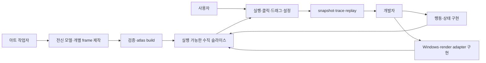
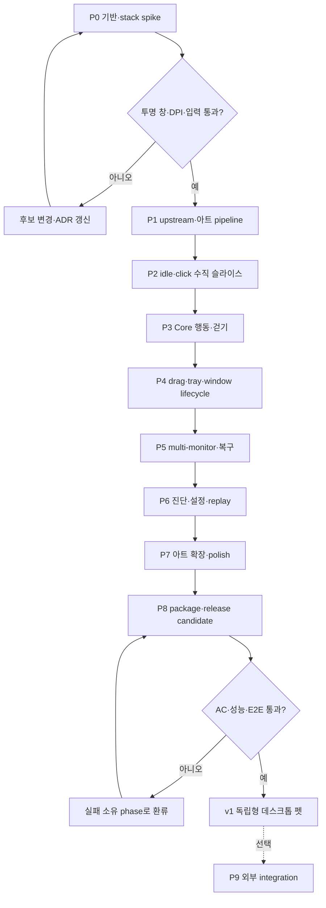
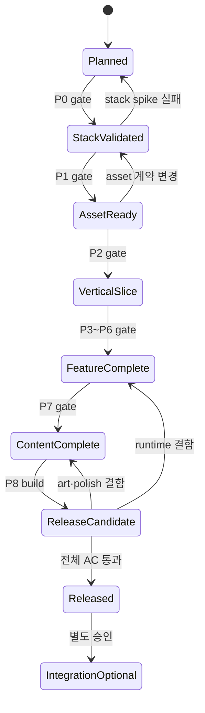

# 볼따구 데스크톱 펫 전체 구현 로드맵

> tier **M** — 표준 — + 유스케이스·파이프라인·상태전이
> 채우는 순서: §1 의도 → §2 수용기준 → §3 확정사실(조사) → 다이어그램 → §9 변경지점 → §11 착수순서

## 1. 의도 (Intent)

| 항목 | 내용 |
|---|---|
| 문제 | 제품 방향·모듈 구조·기존 볼따구 에셋은 확인했지만, 부족한 애니메이션 제작부터 Windows 런타임·상호작용·진단·배포까지 이어지는 단일 구현 순서와 단계별 완료 판정이 없다. |
| 왜 지금 | 기술과 아트를 따로 진행하면 clip 계약·기준점·상태 이름이 어긋나 재작업이 발생한다. 구현 전에 공통 계약과 수직 슬라이스 순서를 고정해야 한다. |
| 주 사용자 | 볼따구 아트와 데스크톱 펫 기능을 반복 개발하고, 각 단계의 실패 원인을 독립적으로 재현하려는 개발자 겸 아트 작업자. |
| 불변식 | 앱은 Engram 없이 실행된다. upstream 아트는 불변이다. Core는 OS·그래픽·파일 형식을 모른다. 시간·난수는 주입한다. 개별 모듈은 독립 테스트 가능해야 한다. 생성형 아트는 초안으로만 사용하고 최종 frame consistency를 검수한다. |
| 비목표 | 첫 공개 버전에는 LLM 대화, Engram 연결, 플러그인 마켓, 다중 캐릭터, 네트워크 서비스, 복잡한 물리 엔진을 포함하지 않는다. |

## 2. 수용 기준 (Acceptance)

| ID | 수용 기준 | 검증 방법 |
|---|---|---|
| AC-1 | 지원되는 Windows 환경에서 Engram이나 다른 외부 서비스 없이 앱을 실행·종료할 수 있고, 기본 볼따구가 투명 topmost 창에 표시된다. | 깨끗한 사용자 프로필에서 패키지 설치 후 launch/show/hide/exit smoke test를 실행한다. |
| AC-2 | 아트 소스는 개별 RGBA frame과 clip metadata로 관리되고, validator가 canvas·alpha·pivot·frame 참조를 검사한 뒤 runtime atlas와 manifest를 재현 가능하게 생성한다. | 동일 입력으로 두 번 build하여 산출물 SHA-256이 일치하고 손상 fixture가 명확한 validation error를 반환하는지 검사한다. |
| AC-3 | MVP clip `idle_breathe`, `walk`, `turn`, `click`, `drag`, `drop_land`, `sit`, `sleep`가 존재하며 모든 loop clip은 발 기준점의 비의도성 흔들림이 2px 이하이고 텍스트·녹색 배경이 없다. | 자동 pivot/canvas 검사와 animation contact sheet·실제 재생 육안 검수를 함께 수행한다. |
| AC-4 | 클릭·드래그·놓기·숨김·표시·자율 이동이 상태 전이 규칙대로 동작하고 capture lost·display change·오류 후 포인터 캡처와 임시 transform이 남지 않는다. | 각 정상·취소·실패 경로의 상태 전이 테스트와 실제 창 상호작용 테스트를 실행한다. |
| AC-5 | 동일한 초기 상태·입력 log·clock·난수 seed의 replay가 동일한 `BehaviorDecision`과 `RuntimeCommand` 스트림을 생성한다. | 동일 fixture를 두 번 replay하고 정규화한 출력의 byte-for-byte 동일성을 검사한다. |
| AC-6 | 모니터 이동, DPI 변경, 작업 영역 변경, session lock/unlock 후 캐릭터가 유효 work area 안에 있고 화면 밖에 고립되지 않는다. | 서로 다른 DPI의 2개 모니터와 합성 ScreenModel fixture에서 geometry·clamp 테스트를 수행한다. |
| AC-7 | 최근 입력·상태 전이·행동·clip·geometry·오류를 bounded trace와 diagnostic snapshot에서 확인할 수 있고 debug HUD를 끌 수 있다. | ring-buffer 한도, snapshot schema, HUD on/off 및 trace export 테스트를 실행한다. |
| AC-8 | architecture test에서 Core의 OS/UI/file dependency, adapter 간 직접 참조, 외부 SDK의 Core/Runtime 누수가 0건이다. | 빌드 시 dependency rule 검사와 프로젝트 참조 검사를 필수 gate로 실행한다. |
| AC-9 | 기준 PC에서 5분 idle 동안 평균 CPU 1% 이하, working set 200MB 이하이고 active animation의 p95 frame time이 33ms 이하이다. | release build를 고정 해상도·clip·측정 스크립트로 3회 실행해 최악 결과를 기록한다. 기준 PC 사양도 함께 저장한다. |
| AC-10 | 설치·업데이트·제거가 사용자 아트와 설정의 보존 정책을 따르고, 제거 후 자동 시작 항목과 실행 프로세스가 남지 않는다. | 새 설치→설정 변경→업데이트→제거의 패키징 E2E 체크리스트를 실행한다. |

## 3. 확정 사실 (Findings)

설계 전에 **실제로 확인한 것만** 적는다. 추측은 §10 으로 보낸다.

| 항목 | 확인된 사실 | 설계 반영 |
|---|---|---|
| 저장소 상태 | 현재 저장소는 Git 초기화 전이며 설계 문서 2개와 Mermaid 추출물만 있다. `Test-Path .git`과 `rg --files`로 확인했다. | Phase 0에서 저장소·빌드·테스트 기본선을 먼저 만든다. 기존 구현을 보존해야 한다는 가정은 두지 않는다. |
| 제품 아키텍처 | `0002-desktop-pet-architecture.md`가 Core, Runtime, Assets, Presentation, Platform.Windows, Diagnostics, App 경계와 상태 전이를 정의한다. | 프로젝트·폴더·테스트 구조는 해당 의존성 방향을 그대로 반영한다. |
| 에셋 기준 | 기존 상태 시트는 6×4의 24셀이고 대부분 동일한 상반신 포즈와 문구·표정 변형이다. 원본 시트를 직접 시각 검사했다. | 기존 시트는 참고·반응 자산으로 보존하되, 전신 모델과 연속 동작용 frame을 새로 제작한다. |
| 기존 파일 규격 | 기본 캐릭터는 606×606 RGBA, 상태 시트는 2604×1632 RGBA이며 idle/click 효과와 manifest가 있다. 파일 metadata와 manifest를 직접 확인했다. | upstream snapshot과 inventory를 먼저 만들고, 새 아트는 derived source에서 별도로 관리한다. |
| 기술 스택 | 프로젝트 로컬 .NET 10.0.401 SDK와 WPF로 Release build, 실제 HWND, 투명·topmost 속성, tray 생성·해제, self-contained win-x64 publish와 실제 프로세스 기동을 확인했다. (직접 측정, 2026-09-20) | LTS .NET 10 + WPF를 채택하고 Presentation 성능이 목표를 넘을 때만 renderer adapter 교체를 검토한다. |
| P1 아트 파이프라인 | Engram 원본 6개를 SHA-256 inventory로 고정했고, 1774×887 RGBA 전신 turnaround 후보와 512×512 `idle_breathe`·`click` preview 7프레임을 생성했다. validator와 atlas compiler를 동일 입력으로 두 번 실행해 build hash `B2A2DE706985FAEBAA0A97089C5A03C5A21081982B1E3350F4CA86699B9FF31D`가 일치함을 확인했다. | 모델 시트는 `candidate`로 유지해 사람 승인 전 대량 animation 제작을 막고, 승인 후 P1 gate를 닫는다. |
| 연동 범위 | Engram은 현재 제품의 실행 요구가 아니며 향후 연결 가능성만 있다. | Integrations는 출시 후 선택 단계이며 v1 일정과 dependency graph에서 제외한다. |

## 4. 유스케이스 / 시나리오

**주 시나리오**: 아트 작업자가 승인된 모델 시트에서 clip frame을 만든다 → asset validator가 atlas와 manifest를 생성한다 → 개발자가 순수 Core 행동과 adapter를 연결한다 → 사용자가 투명 오버레이의 볼따구와 상호작용한다 → 문제 발생 시 snapshot·trace·replay로 해당 모듈을 재현한다 → release gate를 통과한 패키지를 배포한다.

**예외 시나리오**: stack spike가 투명도·DPI·입력 요구를 충족하지 못하면 런타임 구현 전에 ADR 후보를 교체한다. 아트 검증 실패 시 이전 정상 atlas를 유지한다. adapter 오류 시 Core를 종료하지 않고 capture·행동을 정리한 뒤 fallback 또는 Hidden 상태로 전환한다. release gate 실패 시 배포물을 만들지 않고 해당 phase로 되돌아간다.

## 5. 파이프라인 (flowchart)

### 단계별 산출물과 종료 조건

| Phase | 구현 범위 | 핵심 산출물 | 종료 조건 |
|---|---|---|---|
| **P0 기반·stack spike** | Git/solution/test/CI 골격, dependency rule, 투명 창·클릭·드래그·DPI·tray·package 최소 spike | runtime stack ADR, reference machine 기록, architecture test | 투명 창 위에 임시 PNG를 표시하고 2개 DPI 환경에서 이동·종료 가능. AC-8 기본 gate 통과 |
| **P1 아트 기반** | upstream 복사·hash inventory, 전신 모델 시트, palette·outline·pivot 규칙, animation compiler | `asset/bolttagu/upstream`, `derived/model`, validator, atlas builder | 동일 입력 build hash 일치. 전신 정면·측면 기준 승인. AC-2 |
| **P2 첫 수직 슬라이스** | `idle_breathe`, `click`, Assets→Runtime→Presentation→Windows 연결 | 실행 가능한 앱, clip playback, fallback asset | 앱 실행·표시·클릭 반응·숨김·종료 smoke 통과. AC-1 일부, AC-3 일부 |
| **P3 행동과 이동** | 순수 Core 상태, scheduler, injected clock/RNG, `walk`, `turn`, 화면 안 이동 | deterministic Core와 locomotion | replay 동일성 및 걷기·전환 loop 육안 검수. AC-4·5 |
| **P4 직접 상호작용** | drag threshold, pointer capture, drop/land, sit/sleep, tray 명령 | `drag`, `drop_land`, `sit`, `sleep` clip과 interaction tests | capture lost·hide·exit 모든 경로에서 잔여 상태 0건. AC-3·4 |
| **P5 Windows 견고성** | multi-monitor/DPI/work-area/session lock, crash/fallback 정책 | ScreenModel fixture, geometry clamp, adapter fault injection | 화면 밖 고립 0건, 오류 후 SafeIdle/Hidden 복구. AC-4·6 |
| **P6 관측·설정** | bounded trace, snapshot, replay export, debug HUD, 사용자 설정 저장 | diagnostics panel/HUD, settings schema, replay CLI/test | 단일 오류를 입력→결정→clip→geometry까지 추적 가능. AC-5·7·8 |
| **P7 콘텐츠·polish** | 8개 MVP clip 완성, idle variation, sound toggle, hitbox·anchor 미세조정 | 승인 contact sheet, animation pack v1 | 아트 consistency·loop·pivot gate와 사용성 점검 통과. AC-3·9 |
| **P8 배포** | release build, signing 선택, installer/update/uninstall, 문서 | release candidate, 설치 패키지, 체크리스트 | AC-1~10 전체 및 깨끗한 PC E2E 통과 |
| **P9 선택 연동** | 표준 `PetEvent`를 발행하는 외부 Input Adapter | 별도 integration package | Core·Runtime 변경 없이 adapter on/off 가능. v1 출시와 독립 |

## 6. 액션 · 상태 전이 (action diagram)

| 상태 | 저장/이벤트 | UI 반응 |
|---|---|---|
| Planned | 문서·AC·risk만 존재 | 구현 시작 금지, stack spike 준비 |
| StackValidated | ADR과 측정 evidence | 선택 stack의 최소 창 demo 사용 가능 |
| AssetReady | immutable upstream, validated derived catalog | fallback 포함 preview 가능 |
| VerticalSlice | 실행 앱과 smoke 결과 | idle·click만 사용자 체험 가능 |
| FeatureComplete | Core·interaction·Windows·diagnostics test 결과 | 기능 freeze, 콘텐츠 조정만 허용 |
| ContentComplete | animation contact sheet와 승인 기록 | release candidate 생성 가능 |
| ReleaseCandidate | versioned package와 전체 test report | 실패 시 소유 phase로 되돌리고 불완전 package는 폐기 |
| Released | release manifest와 보존 정책 | 정상 설치·실행·제거 가능 |

## 9. 변경 지점

경로는 백틱으로. 새로 만드는 파일은 `(신규)` 를 붙인다 — `check` 가 실존 여부를 본다.

| 파일 | 변경 |
|---|---|
| `README.md` | 제품 범위, 개발·검증·실행 진입점을 제공한다. |
| `docs/adr/0001-runtime-stack.md` | stack spike 결과와 선택·기각 근거를 기록한다. |
| `docs/architecture/module-boundaries.md` | `0002`의 모듈 책임과 실제 프로젝트 참조 규칙을 고정한다. |
| `asset/bolttagu/README.md` | upstream/derived/build 규칙과 아트 제작 가이드를 제공한다. |
| `asset/bolttagu/inventory.json` | 원본 경로·크기·hash를 기록한다. |
| `asset/bolttagu/derived/model/` | 전신 기준 모델·palette·turnaround를 보관한다. |
| `asset/bolttagu/derived/animations/` | clip별 개별 RGBA frame과 metadata를 보관한다. |
| `tools/Bolttagu.AssetBuild/` | validator, preview frame 생성, atlas packing, manifest 생성을 담당한다. |
| `src/Bolttagu.Contracts/` | 모듈 경계 event·command·port·snapshot 계약을 소유한다. |
| `src/Bolttagu.Core/` | 순수 상태·행동·scheduler·motion intent를 소유한다. |
| `src/Bolttagu.Runtime/` | 단일 이벤트 큐와 behavior lifecycle·dispatch를 소유한다. |
| `src/Bolttagu.Assets/` | pack 검증·logical clip catalog·fallback을 소유한다. |
| `src/Bolttagu.Presentation/` | animation player와 sprite/VFX 합성을 소유한다. |
| `src/Bolttagu.Platform.Windows/` | 투명 창·monitor/DPI·pointer·tray adapter를 소유한다. |
| `src/Bolttagu.Diagnostics/` | trace·snapshot·replay·debug HUD를 소유한다. |
| `src/Bolttagu.App/` | composition root, 설정, lifecycle만 소유한다. |
| `tests/` | unit, architecture, asset, integration, UI smoke, performance fixture를 분리한다. |
| `packaging/windows/` (신규) | installer·update·uninstall 및 release manifest를 소유한다. |

## 10. 잠재 문제 & 대응

| 문제 | 대응 |
|---|---|
| 전신 캐릭터의 최종 미술 방향이 확정되지 않았다. | P1에서 정면·측면 turnaround와 2개 테스트 clip을 먼저 승인하고 나머지 frame을 제작한다. 대량 생성부터 시작하지 않는다. |
| 생성형 이미지가 frame마다 얼굴·의상·선 굵기를 바꿀 수 있다. | 생성 결과는 key pose 초안으로만 사용하고 모델 시트 기반 cleanup과 contact sheet 검수를 통과한 frame만 derived에 승인한다. |
| WPF가 목표 VFX나 frame 성능을 못 낼 수 있다. | P0에서는 WPF 기본 렌더를 우선 검증하고 실패한 요구만 Skia 등 별도 Presentation adapter로 교체한다. Core/Runtime은 유지한다. |
| 과도한 모듈화로 단순 기능도 여러 프로젝트를 횡단할 수 있다. | public port는 모듈 간 경계에만 두고 내부 구현은 구체 타입으로 유지한다. 첫 수직 슬라이스에서 변경 경로가 과도하면 경계를 조정한다. |
| 아트와 코드가 서로 다른 상태 이름을 사용할 수 있다. | Core는 의미적 `AnimationIntent`만 발행하고 Asset catalog가 clip으로 매핑한다. clip schema와 enum compatibility를 build에서 검사한다. |
| 화면 이벤트·tick 순서 때문에 간헐적 버그가 생길 수 있다. | Runtime 하나만 event queue를 소유하고 모든 항목에 sequence·correlation id를 부여한다. clock·RNG·ScreenModel은 replay 가능하게 주입한다. |
| performance 목표가 개발 PC에 종속된다. | P0에서 기준 PC와 측정 스크립트를 고정하고 결과는 절대값과 baseline 대비값을 함께 기록한다. |
| 설치·업데이트가 사용자 파생 아트를 덮어쓸 수 있다. | bundled assets와 user assets의 저장 위치·소유권을 분리하고 updater는 user 영역을 수정하지 않는다. |

## 11. 착수 순서

각 항목에 담당 AC 를 적는다. `check` 가 고아 AC 를 잡아낸다.

- [x] 1. 저장소·solution·test·CI 골격과 runtime stack spike/ADR을 완성한다. (AC-1, AC-8)
- [x] 2. Engram 원본 에셋 snapshot·inventory와 derived/build 디렉터리를 만들고 asset validator의 재현성을 검증한다. (AC-2)
- [x] 3. 전신 모델 시트와 `idle_breathe`·`click` frame을 승인하고 atlas를 생성한다. (AC-2, AC-3)
- [x] 4. 투명 창에서 idle·click·fallback이 동작하는 첫 수직 슬라이스를 완성한다. (AC-1, AC-4, AC-8)
- [x] 5. 순수 Core scheduler와 `walk`·`turn`을 구현하고 deterministic replay를 통과한다. (AC-4, AC-5)
- [ ] 6. drag/drop/land/sit/sleep과 tray lifecycle을 구현해 모든 cancel·capture-lost 경로를 검증한다. (AC-3, AC-4)
- [ ] 7. multi-monitor·DPI·work-area·session 변화와 adapter fault 복구를 구현한다. (AC-4, AC-6)
- [ ] 8. bounded trace·snapshot·replay export·debug HUD·settings persistence를 구현한다. (AC-5, AC-7, AC-8)
- [ ] 9. 8개 MVP animation을 완성하고 animation·사용성·성능 polish gate를 통과한다. (AC-3, AC-9)
- [ ] 10. installer/update/uninstall과 release E2E를 통과해 v1 package를 만든다. (AC-1, AC-10)
- [ ] 11. v1 이후 별도 승인 시에만 외부 Input Adapter를 추가하고 Core 무변경을 검증한다. (AC-8)
