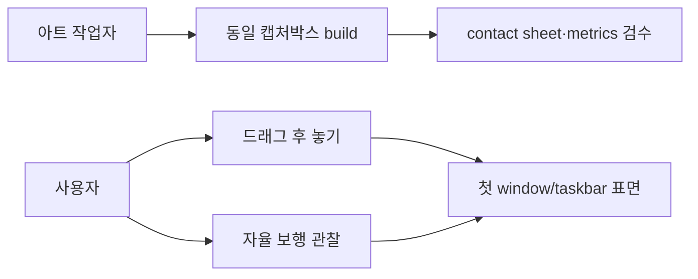
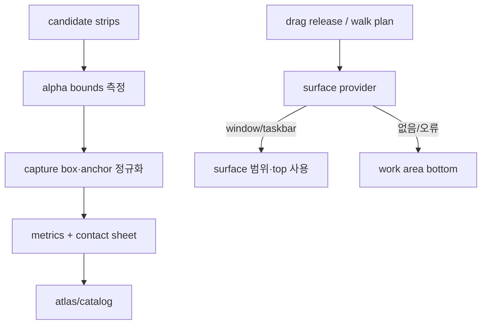
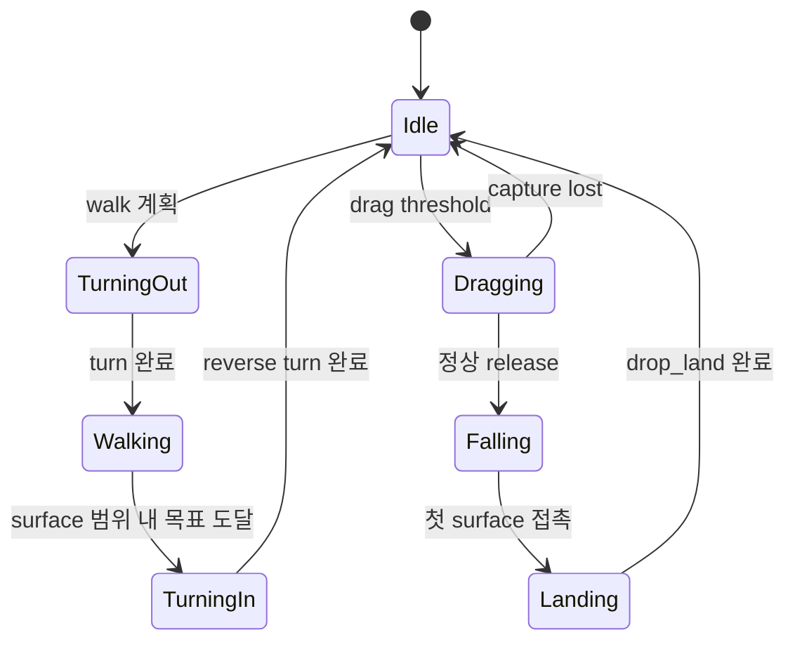

# Animation and desktop surface polish

> tier **M** — 표준 — + 유스케이스·파이프라인·상태전이
> 채우는 순서: §1 의도 → §2 수용기준 → §3 확정사실(조사) → 다이어그램 → §9 변경지점 → §11 착수순서

## 1. 의도 (Intent)

| 항목 | 내용 |
|---|---|
| 문제 | clip마다 투명 여백·가시 크기·기준점이 달라 전환 시 캐릭터 크기가 튀고, walk phase와 이동 속도가 맞지 않아 문워크처럼 보인다. drag는 팔이 사라지고 너무 빠르며, 이동 Y축이 실제 데스크톱 표면과 무관하다. |
| 왜 지금 | 동작을 더 추가하기 전에 공통 캡처박스와 데스크톱 지면 계약을 고정하지 않으면 모든 후속 아트를 다시 손봐야 한다. |
| 주 사용자 | 생성된 프레임을 동일 조건으로 비교하고 실제 데스크톱 위에서 동작감을 반복 검수하는 개발자 겸 아트 작업자. |
| 불변식 | upstream은 불변이다. 모든 생성 원화는 candidate로 남긴다. Core는 Win32를 참조하지 않는다. 일반 clip은 동일 가시 높이·발 기준선을 사용하고 drag만 별도 grab anchor를 사용한다. |
| 비목표 | 창 가장자리 충돌 물리, 창 이동 실시간 추적, 경사면, 다중 캐릭터, 최종 아트 승인은 이번 수정에 포함하지 않는다. |

## 2. 수용 기준 (Acceptance)

| ID | 수용 기준 | 검증 방법 |
|---|---|---|
| AC-1 | grounded clip의 가시 실루엣 높이는 canonical capture box 기준 ±2%이고 발 기준선 편차는 2px 이하이며 clip 전환 시 전체 크기 점프가 없다. | asset build가 alpha bounds metrics와 동일 512×512 contact sheet를 생성하고 validator/test가 편차를 검사한다. |
| AC-2 | idle은 비균일 squash 없이 재생되고, walk는 contact→down→passing→up 순서와 반대 팔 스윙을 가지며 idle↔walk 사이에 turn-in/turn-out 전환이 존재한다. | recipe/clip 순서 테스트와 contact sheet 및 실제 재생 육안 검수. |
| AC-3 | drag_dangle은 양팔이 모든 프레임에 보이고 frame duration이 160ms 이상이며, drop_land 접지 후 회복은 600ms 이상 재생된다. | pack metadata 테스트, alpha/contact sheet 육안 검수, 실제 drag/drop 확인. |
| AC-4 | drag release와 자율 보행은 현재 X에서 아래로 처음 만나는 visible top-level window 상단 또는 taskbar 상단을 지면으로 사용하며 앱 자신의 HWND는 제외한다. | 합성 surface fixture 단위 테스트와 Windows adapter smoke/manual test. |
| AC-5 | surface가 없거나 Win32 조회가 실패해도 work area 하단을 지면으로 사용하고 capture/runtime 상태가 남지 않는다. | provider fault fixture와 capture-lost 상태 전이 테스트. |

## 3. 확정 사실 (Findings)

설계 전에 **실제로 확인한 것만** 적는다. 추측은 §10 으로 보낸다.

| 항목 | 확인된 사실 | 설계 반영 |
|---|---|---|
| 프레임 생성 | AssetBuild는 source cell 전체를 512×512에 aspect-fit하고 alpha bounds를 정규화하지 않는다. `RenderFrame` 직접 확인. | alpha trim 후 canonical visible height와 anchor에 맞춰 렌더한다. |
| idle | idle_breathe는 같은 정면 원화에 ScaleY 0.975~1.0을 적용한다. recipe 직접 확인. | 비균일 scale을 제거하고 미세한 정수 Y offset만 사용한다. |
| walk 전환 | Runtime은 방향이 같으면 front idle에서 side walk로 즉시 전환하고, walk 종료도 즉시 front idle로 바뀐다. controller 직접 확인. | 모든 walk 앞에 turn, 뒤에 reverse turn clip을 재생한다. |
| drag/drop timing | drag는 90~110ms, drop_land 전체는 390ms다. pack 직접 확인. | drag는 180ms 내외, 접지 반응은 700ms 내외로 늦춘다. |
| Y축 이동 | autonomous walk는 시작 Y를 그대로 보간하며 drag release도 수직 낙하가 없다. controller 직접 확인. | `IDesktopSurfaceProvider`를 주입해 surface 범위 안에서 걷고 release 후 중력 낙하한다. |

## 4. 유스케이스 / 시나리오

**주 시나리오**: 원화를 빌드하면 alpha bounds가 동일 capture box로 정규화되고 review 산출물이 생긴다 → 앱은 idle에서 turn 후 surface 범위 안을 걷고 reverse turn으로 idle에 복귀한다 → 드래그 해제 시 아래 첫 표면까지 낙하한 뒤 느린 착지 반응을 재생한다.

**예외 시나리오**: Win32 surface 조회 실패 또는 후보 없음이면 현재 monitor work area 하단을 사용한다. capture lost면 낙하/착지를 시작하지 않고 idle로 정리한다. 잘못된 alpha bounds는 asset build를 실패시킨다.

## 5. 파이프라인 (flowchart)

## 6. 액션 · 상태 전이 (action diagram)

| 상태 | 저장/이벤트 | UI 반응 |
|---|---|---|
| TurningOut/TurningIn | 목표 방향·pending walk | front/profile 전환 clip |
| Walking | surface bounds·target X | 정규화 walk loop |
| Dragging | pointer capture·grab anchor | 느린 drag_dangle loop |
| Falling | surface top·낙하 속도 | fall loop, 창 Y 이동 |
| Landing | 접지 위치 | 느린 drop_land one-shot |
| fallback | work area bottom | 상태는 동일, 진단만 fallback 표시 |

## 7. 타이밍 (sequence) *(선택 — 이 tier 에선 생략 가능)*

<!-- 이 tier 에선 필수가 아니다. 필요 없으면 섹션째로 지워라. -->

## 8. 데이터 (ER) *(선택 — 이 tier 에선 생략 가능)*

<!-- 이 tier 에선 필수가 아니다. 필요 없으면 섹션째로 지워라. -->

## 9. 변경 지점

경로는 백틱으로. 새로 만드는 파일은 `(신규)` 를 붙인다 — `check` 가 실존 여부를 본다.

| 파일 | 변경 |
|---|---|
| `tools/Bolttagu.AssetBuild/Program.cs` | alpha trim·capture box 정규화와 review 산출물 생성. |
| `asset/bolttagu/derived/model/animation-recipes.json` | capture profile과 교정 원화 연결. |
| `asset/bolttagu/derived/animations/pack.json` | walk/drag/drop timing과 reverse turn/fall clip. |
| `src/Bolttagu.Contracts/OverlayContracts.cs` | desktop surface query port. |
| `src/Bolttagu.Runtime/PetAnimationController.cs` | turn-in/out, falling, surface-constrained locomotion. |
| `src/Bolttagu.Platform.Windows/DesktopSurfaceProvider.cs` (신규) | visible top-level window/taskbar surface adapter. |
| `tests/` | capture metrics, timing, surface selection, state transition 검증. |

## 10. 잠재 문제 & 대응

| 문제 | 대응 |
|---|---|
| 일부 UWP/게임 창은 일반 top-level bounds 조회가 부정확할 수 있다. | DWM extended frame bounds를 우선하고 실패하면 GetWindowRect, 최종적으로 work area를 쓴다. |
| alpha 정규화가 넓은 발차기 pose를 지나치게 축소할 수 있다. | 높이를 우선 고정하고 canvas 너비를 넘을 때만 축소하며 metrics에서 별도 경고한다. |
| window z-order와 실제 시각적 가림이 완전히 같지 않을 수 있다. | visible·non-minimized top-level window만 대상으로 하고 첫 버전은 top edge/수평 포함 여부만 판정한다. |

## 11. 착수 순서

각 항목에 담당 AC 를 적는다. `check` 가 고아 AC 를 잡아낸다.

- [x] 1. canonical capture box, alpha metrics, contact sheet를 구현한다. (AC-1)
- [x] 2. idle·walk·drag 교정 원화와 timing, idle↔walk 전환을 적용한다. (AC-2, AC-3)
- [x] 3. Windows surface provider와 fallback 선택을 구현한다. (AC-4, AC-5)
- [x] 4. 자율 보행 surface 제한과 drag release 낙하·착지를 연결한다. (AC-4, AC-5)
- [x] 5. 전체 asset/build/runtime test와 실제 실행 smoke를 통과한다. (AC-1, AC-2, AC-3, AC-4, AC-5)

## 12. 추적성 *(선택 — 이 tier 에선 생략 가능)*

<!-- 이 tier 에선 필수가 아니다. 필요 없으면 섹션째로 지워라. -->
