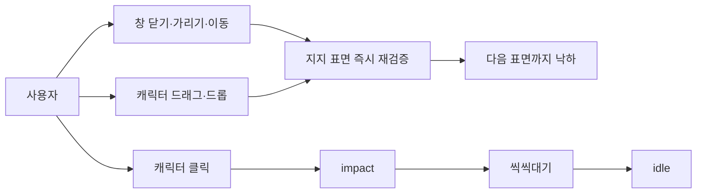
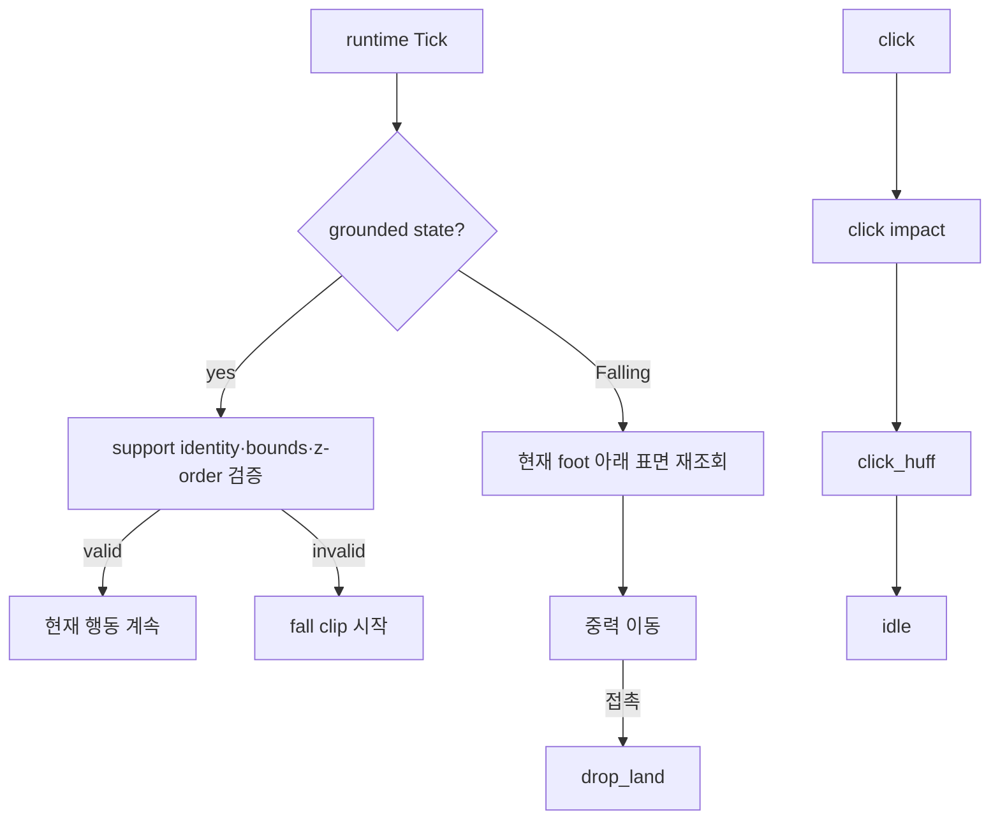
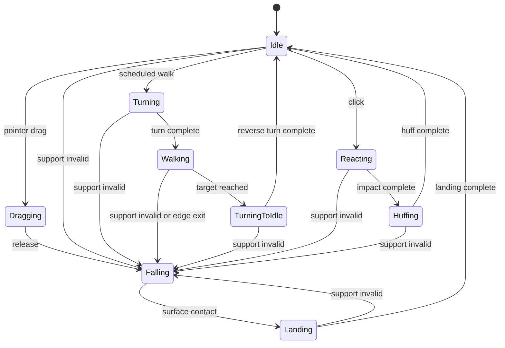

# Live surface and reaction animations

> tier **M** — 표준 — + 유스케이스·파이프라인·상태전이
> 채우는 순서: §1 의도 → §2 수용기준 → §3 확정사실(조사) → 다이어그램 → §9 변경지점 → §11 착수순서

## 1. 의도 (Intent)

| 항목 | 내용 |
|---|---|
| 문제 | 캐릭터가 착지한 창의 생존·노출 상태를 추적하지 않아 창이 닫히거나 뒤로 가도 공중에 남는다. drag와 click 반응도 동작 위상이 적어 상호작용 감각이 약하다. |
| 왜 지금 | idle 종류를 늘리기 전에 데스크톱 표면 변화가 즉시 상태 전이로 연결되는 물리 규약을 확정해야 후속 행동이 같은 기반을 재사용한다. |
| 주 사용자 | 창을 이동·겹침·닫기하면서 데스크톱 펫이 주변 환경에 즉시 반응하는 모습을 보는 사용자. |
| 불변식 | Core는 Win32를 참조하지 않고, upstream 원본은 변경하지 않으며, 생성 아트는 사람 승인 전 candidate다. 모든 상태 전이는 주입된 clock/surface provider로 재현 가능해야 한다. |
| 비목표 | 창 측면 충돌, 창 아래쪽 매달리기, 회전 물리, 픽셀 단위 다리 접촉, OPT idle 표정 아트 구현은 이번 변경에 포함하지 않는다. |

## 2. 수용 기준 (Acceptance)

| ID | 수용 기준 | 검증 방법 |
|---|---|---|
| AC-1 | Idle·Turning·Walking·TurningToIdle·Reacting·Huffing·Landing 중 지지 창이 닫힘·최소화·이동·리사이즈되거나 상단 probe가 더 높은 z-order 창에 가려지면 다음 Tick에서 Falling과 fall clip으로 전환한다. | Runtime fake provider 상태 전이 테스트와 Windows selector 단위 테스트. |
| AC-2 | Walking 중 발 probe가 현재 지지 표면의 좌우 범위를 벗어나면 다음 Tick에서 Falling으로 전환하고, 낙하 중 목표 표면이 사라지면 그 아래의 다음 표면 또는 taskbar까지 계속 낙하한다. | Runtime edge-exit·retarget 테스트. |
| AC-3 | drag_dangle은 덜미 anchor가 고정된 8개 고유 프레임으로 구성되고 모든 프레임이 100ms 이상이며 양팔이 보인다. | asset recipe/pack 자동 테스트, contact sheet 육안 검수. |
| AC-4 | 클릭하면 click impact 완료 후 click_huff가 800ms 이상 재생되고, `>_<`와 `>3<` 계열 표정이 보인 뒤 idle로 복귀한다. | Runtime clip 순서 테스트, pack 총 duration 테스트, contact sheet 육안 검수. |
| AC-5 | surface 조회 실패 시 work-area/taskbar fallback으로 안전하게 낙하하고 capture/runtime 상태가 남지 않는다. | provider fault 및 runtime fallback 테스트. |

## 3. 확정 사실 (Findings)

설계 전에 **실제로 확인한 것만** 적는다. 추측은 §10 으로 보낸다.

| 항목 | 확인된 사실 | 설계 반영 |
|---|---|---|
| 표면 계약 | `DesktopSurface`에는 bounds와 kind만 있고 identity/validation API가 없다. `OverlayContracts.cs` 직접 확인. | stable surface id와 `IsStillSupporting` port를 추가한다. |
| Windows 열거 | `EnumWindows`는 z-order 순서로 visible/non-iconic HWND를 수집하지만 현재 top 좌표만 정렬한다. `DesktopSurfaceProvider.cs` 직접 확인. | 열거 순서를 z-order로 보존하고 support top probe를 앞선 창이 덮는지 판정한다. |
| Runtime | 낙하 목표는 release 시 한 번만 저장하고 grounded state에서 surface 재검증을 하지 않는다. controller 직접 확인. | 모든 grounded Tick에서 support를 검증하고 Falling 중 목적지를 갱신한다. |
| 클릭 흐름 | click one-shot 완료 직후 idle로 복귀한다. controller/pack 직접 확인. | 별도 click_huff one-shot과 Huffing 상태를 둔다. |
| drag 아트 | v3는 4프레임, 180~190ms loop다. recipe/pack 직접 확인. | 덜미 고정 불변식을 유지한 8프레임 v4로 교체한다. |

## 4. 유스케이스 / 시나리오

**주 시나리오**: 사용자가 캐릭터가 선 창을 닫거나 가리면 다음 animation Tick에서 fall로 바뀌고, 낙하 중 현재 X 아래의 첫 노출 표면에 착지한다. 클릭하면 impact 뒤 씩씩대는 표정을 잠시 유지하고 idle로 돌아간다.

**예외 시나리오**: Win32 조회가 실패하거나 원래 표면이 사라지면 work-area/taskbar fallback을 사용한다. 낙하 중 새 목표까지 사라지면 다음 Tick에서 다시 retarget한다.

## 5. 파이프라인 (flowchart)

## 6. 액션 · 상태 전이 (action diagram)

| 상태 | 저장/이벤트 | UI 반응 |
|---|---|---|
| Grounded 계열 | supporting surface id·bounds | clip을 유지하며 매 Tick 검증 |
| Falling | fall origin·velocity·동적 target | fall loop와 Y 이동 |
| Landing | 새 supporting surface | drop_land one-shot |
| Reacting | click impact | 타격 표정 one-shot |
| Huffing | click_huff | `>_<`/`>3<` 표정 one-shot |

## 7. 타이밍 (sequence) *(선택 — 이 tier 에선 생략 가능)*

<!-- 이 tier 에선 필수가 아니다. 필요 없으면 섹션째로 지워라. -->

## 8. 데이터 (ER) *(선택 — 이 tier 에선 생략 가능)*

<!-- 이 tier 에선 필수가 아니다. 필요 없으면 섹션째로 지워라. -->

## 9. 변경 지점

경로는 백틱으로. 새로 만드는 파일은 `(신규)` 를 붙인다 — `check` 가 실존 여부를 본다.

| 파일 | 변경 |
|---|---|
| `src/Bolttagu.Contracts/OverlayContracts.cs` | surface identity와 live validation port. |
| `src/Bolttagu.Contracts/AnimationContracts.cs` | click_huff action/clip 계약. |
| `src/Bolttagu.Platform.Windows/DesktopSurfaceProvider.cs` | HWND identity·z-order occlusion·support validation. |
| `src/Bolttagu.Runtime/PetAnimationController.cs` | grounded revalidation, edge fall, dynamic retarget, Huffing 상태. |
| `src/Bolttagu.Assets/RuntimeAnimationCatalog.cs` | 새 semantic clip fallback. |
| `asset/bolttagu/derived/model/animation-recipes.json` | drag v4 8프레임과 click_huff 원화 recipe. |
| `asset/bolttagu/derived/animations/pack.json` | drag/huff timing. |
| `tests/Bolttagu.Runtime.Tests/PetAnimationControllerTests.cs` | 상태 전이·retarget·click sequence 검증. |
| `tests/Bolttagu.Architecture.Tests/DesktopSurfaceSelectorTests.cs` | identity와 z-order occlusion 검증. |
| `tests/Bolttagu.Assets.Tests/AssetPipelineTests.cs` | frame count/duration/action completeness 검증. |

## 10. 잠재 문제 & 대응

| 문제 | 대응 |
|---|---|
| 투명·비정형 창의 사각 bounds가 실제 가림과 다를 수 있다. | DWM extended frame 사각형 기준으로 판정하고 향후 region 기반 hit-test를 별도 개선한다. |
| HWND 재사용으로 오래된 id가 우연히 일치할 수 있다. | bounds/top tolerance까지 함께 검증한다. |
| 8프레임 단일 strip 생성 품질이 부족할 수 있다. | 두 개의 4-frame source를 지원하거나 6-frame 후보로 축소하지 않고 재생성한다. |
| OPT idle 표정은 interaction 우선순위를 흐릴 수 있다. | 이번 범위에서는 계약만 확장하지 않고 후속 독립 clip으로 남긴다. |

## 11. 착수 순서

각 항목에 담당 AC 를 적는다. `check` 가 고아 AC 를 잡아낸다.

- [x] 1. surface identity·z-order validation과 grounded→Falling 전이를 구현한다. (AC-1, AC-5)
- [x] 2. walk edge exit와 낙하 중 surface retarget을 구현한다. (AC-2, AC-5)
- [x] 3. drag 8-frame v4 원화와 recipe/pack을 적용한다. (AC-3)
- [x] 4. click_huff 원화·계약·runtime sequence를 적용한다. (AC-4)
- [x] 5. 전체 asset/runtime/platform 검증과 실제 실행 smoke를 통과한다. (AC-1, AC-2, AC-3, AC-4, AC-5)

## 12. 추적성 *(선택 — 이 tier 에선 생략 가능)*

<!-- 이 tier 에선 필수가 아니다. 필요 없으면 섹션째로 지워라. -->
