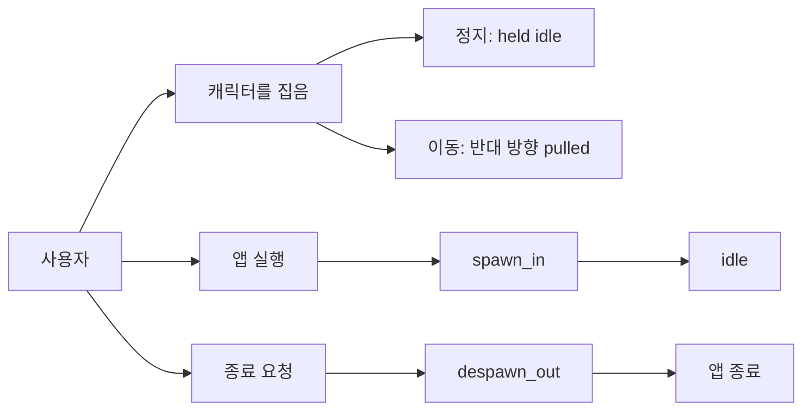
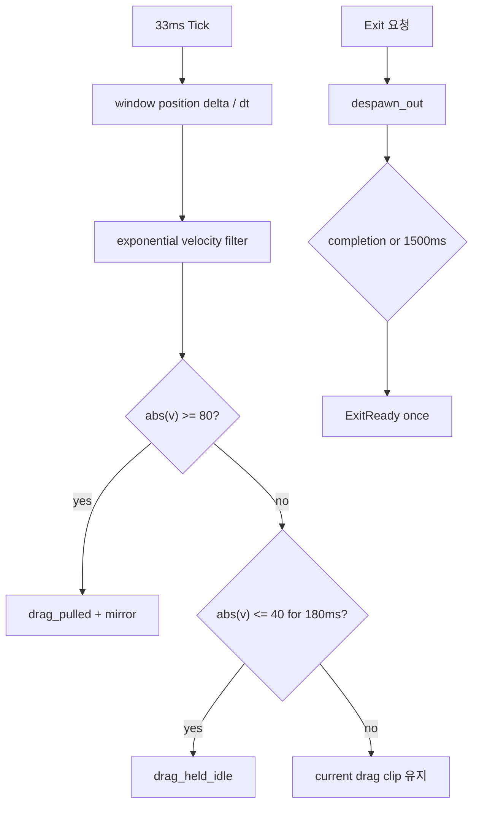
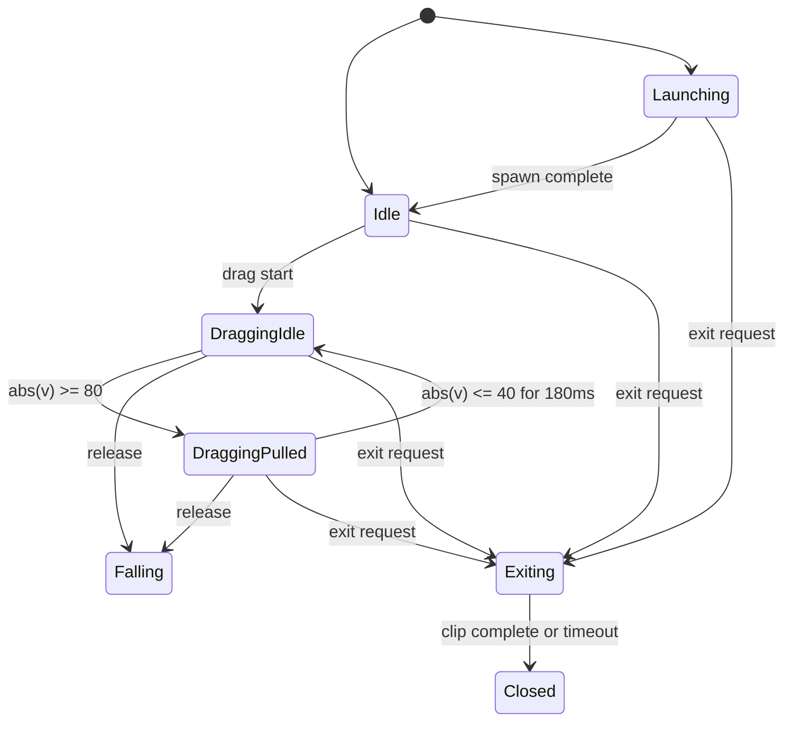

# Velocity drag and lifecycle animations

> tier **M** — 표준 — + 유스케이스·파이프라인·상태전이
> 채우는 순서: §1 의도 → §2 수용기준 → §3 확정사실(조사) → 다이어그램 → §9 변경지점 → §11 착수순서

## 1. 의도 (Intent)

| 항목 | 내용 |
|---|---|
| 문제 | drag 중 포인터 속도와 무관하게 같은 루프가 재생되고, 실행·정상 종료가 즉시 잘려 캐릭터가 환경에 반응하는 느낌이 약하다. |
| 왜 지금 | live surface 반응 다음으로 입력 인과성과 앱 lifecycle을 시각화해야 기본 상호작용 세트가 완결된다. |
| 주 사용자 | 캐릭터를 집어 움직이고 앱을 실행·종료하면서 즉각적인 애니메이션 피드백을 기대하는 사용자. |
| 불변식 | 포인터 미세 떨림으로 clip이 진동하지 않는다. 종료 애니메이션이 실패해도 앱은 제한 시간 안에 종료한다. upstream과 승인된 원화는 변경하지 않는다. |
| 비목표 | 수직 속도별 별도 pulled art, 회전/관성 물리, hide/show lifecycle 애니메이션, idle variation은 제외한다. |

## 2. 수용 기준 (Acceptance)

| ID | 수용 기준 | 검증 방법 |
|---|---|---|
| AC-1 | drag 시작 시 drag_held_idle이 재생되고, 필터 속도 절댓값이 80px/s 이상이면 1 Tick 안에 drag_pulled로 전환해 이동 반대 방향으로 몸을 기울인다. | clock/window fake를 사용한 runtime 테스트. |
| AC-2 | pulled 상태에서 속도 절댓값이 40px/s 이하로 180ms 이상 유지될 때만 held_idle로 복귀하며 임계값 사이에서는 기존 상태를 유지한다. | hysteresis·settle duration runtime 테스트. |
| AC-3 | drag_held_idle과 drag_pulled은 각각 6개 이상 고유 프레임, 100ms 이상 frame duration, 동일한 Y=104 scruff anchor를 가진다. | asset pack/metrics 테스트와 contact sheet 육안 검수. |
| AC-4 | 앱 Start는 spawn_in을 먼저 재생하고 완료 후 Idle로 전환한다. 정상 Exit 요청은 despawn_out 완료 후에만 close callback을 발생시킨다. | controller clip sequence 단위 테스트와 WPF playback 테스트. |
| AC-5 | despawn_out completion이 오지 않아도 Exit 요청 후 1500ms 안에 close callback이 정확히 한 번 발생한다. | fake clock timeout/idempotency 테스트. |

## 3. 확정 사실 (Findings)

설계 전에 **실제로 확인한 것만** 적는다. 추측은 §10 으로 보낸다.

| 항목 | 확인된 사실 | 설계 반영 |
|---|---|---|
| drag 입력 | OverlayWindow가 drag 중 직접 Position을 갱신하고 runtime은 33ms Tick을 받는다. 소스 직접 확인. | 새 pointer event 없이 Position delta/clock으로 속도를 계산한다. |
| playback | one-shot 완료는 IAnimationPlayer.PlaybackCompleted로 전달된다. PetSpriteView 직접 확인. | spawn/despawn 완료도 controller 상태 전이로 처리한다. |
| 종료 | App.ExitApplication이 즉시 CloseOverlay+Shutdown을 호출한다. App.xaml.cs 직접 확인. | RequestExit와 ExitReady 이벤트로 정상 종료를 지연한다. |
| drag art | 기존 drag_dangle v4는 8-frame 방향 비종속 loop다. pack/contact sheet 직접 확인. | 정지/끌림 semantic clip을 별도 원화로 추가하고 legacy id는 제거한다. |

## 4. 유스케이스 / 시나리오

**주 시나리오**: 사용자가 캐릭터를 집고 멈추면 정면 버둥 루프가, 움직이면 속도 반대쪽으로 끌리는 루프가 재생된다. 실행은 등장 후 idle, 종료는 퇴장 후 close로 이어진다.

**예외 시나리오**: despawn completion이 누락되면 1500ms timeout이 close를 한 번 발생시킨다. drag 취소는 기존 idle 정리 경로를 유지한다.

## 5. 파이프라인 (flowchart)

## 6. 액션 · 상태 전이 (action diagram)

| 상태 | 저장/이벤트 | UI 반응 |
|---|---|---|
| Launching | supporting surface | spawn_in one-shot, 입력 시 interrupt 가능 |
| DraggingIdle | last position/time, filtered velocity | 정면 팔다리 버둥 loop |
| DraggingPulled | filtered velocity, settle start | 이동 반대 방향 lean loop |
| Exiting | deadline, ready-fired flag | despawn_out 후 ExitReady 1회 |
| Closed | controller 종료 예정 | App이 overlay close와 Shutdown 수행 |

## 7. 타이밍 (sequence) *(선택 — 이 tier 에선 생략 가능)*

<!-- 이 tier 에선 필수가 아니다. 필요 없으면 섹션째로 지워라. -->

## 8. 데이터 (ER) *(선택 — 이 tier 에선 생략 가능)*

<!-- 이 tier 에선 필수가 아니다. 필요 없으면 섹션째로 지워라. -->

## 9. 변경 지점

경로는 백틱으로. 새로 만드는 파일은 `(신규)` 를 붙인다 — `check` 가 실존 여부를 본다.

| 파일 | 변경 |
|---|---|
| `src/Bolttagu.Contracts/AnimationContracts.cs` | held/pulled/spawn/despawn action clip 계약. |
| `src/Bolttagu.Runtime/PetAnimationController.cs` | velocity hysteresis와 lifecycle 상태/ExitReady. |
| `src/Bolttagu.App/App.xaml.cs` | 지연 종료 orchestration. |
| `asset/bolttagu/derived/model/animation-recipes.json` | 추가 4종 원화 recipe. |
| `asset/bolttagu/derived/animations/pack.json` | 추가 clip timing/pivot. |
| `tests/Bolttagu.Runtime.Tests/PetAnimationControllerTests.cs` | drag/lifecycle deterministic 상태 테스트. |
| `tests/Bolttagu.Assets.Tests/AssetPipelineTests.cs` | 추가 art completeness/frame gate. |
| `tests/Bolttagu.Presentation.Tests/AnimationPlaybackTests.cs` | real one-shot lifecycle playback. |

## 10. 잠재 문제 & 대응

| 문제 | 대응 |
|---|---|
| WPF Move 이벤트 빈도가 runtime Tick보다 높다. | 최종 window Position을 33ms마다 샘플링하고 지수 필터로 aliasing을 완화한다. |
| 수직 drag만으로 pulled가 전환되지 않는다. | v1은 수평 delta를 주 신호로 하되 전체 speed가 빠르고 X가 0이면 마지막 facing을 유지해 pulled로 진입한다. |
| 종료 중 OS가 프로세스를 강제 종료할 수 있다. | 정상 UI 종료만 animation 보장 대상으로 하고 OS 강제 종료는 즉시 OnExit cleanup한다. |

## 11. 착수 순서

각 항목에 담당 AC 를 적는다. `check` 가 고아 AC 를 잡아낸다.

- [x] 1. velocity filter·hysteresis와 held/pulled 상태를 구현한다. (AC-1, AC-2)
- [x] 2. held/pulled 원화·recipe·pack을 연결한다. (AC-3)
- [x] 3. Launching/Exiting 상태와 App 지연 종료를 구현한다. (AC-4, AC-5)
- [x] 4. spawn/despawn 원화·recipe·pack을 연결한다. (AC-4)
- [x] 5. 전체 테스트·결정적 asset build·실행/종료 smoke를 통과한다. (AC-1, AC-2, AC-3, AC-4, AC-5)

## 12. 추적성 *(선택 — 이 tier 에선 생략 가능)*

<!-- 이 tier 에선 필수가 아니다. 필요 없으면 섹션째로 지워라. -->
