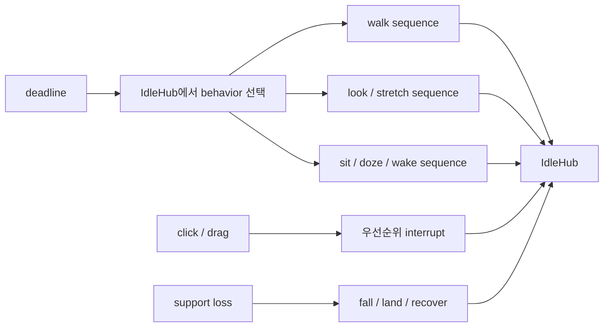
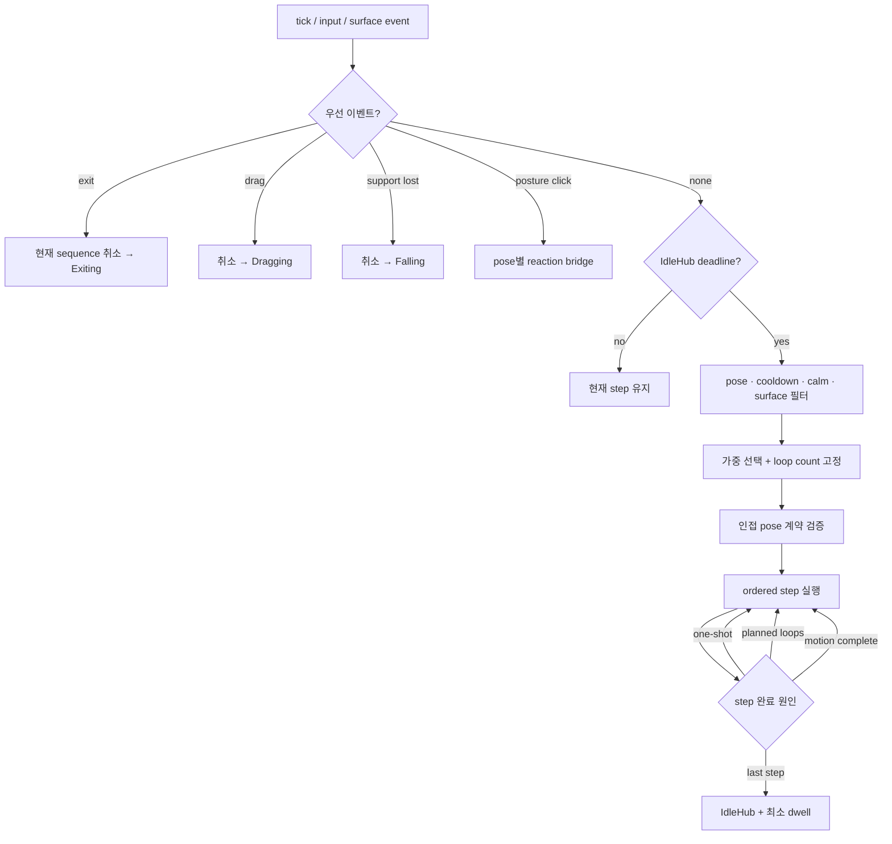
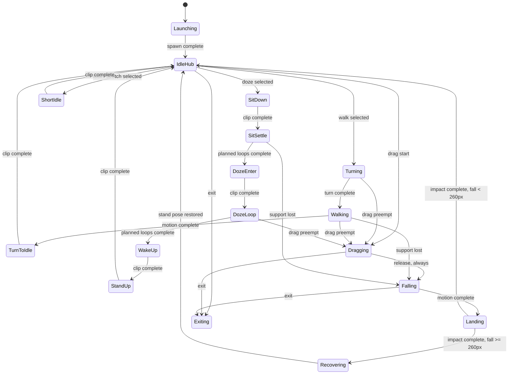

# Animation transition grammar

> tier **M** — 표준 — + 유스케이스·파이프라인·상태전이
> 채우는 순서: §1 의도 → §2 수용기준 → §3 확정사실(조사) → 다이어그램 → §9 변경지점 → §11 착수순서

## 1. 의도 (Intent)

| 항목 | 내용 |
|---|---|
| 문제 | 행동 수가 늘 때 clip 완료 콜백마다 다음 clip을 직접 고르면 `걷기 → 졸기`, `드래그 해제 → idle`처럼 자세와 인과가 끊기는 전이가 생긴다. |
| 왜 지금 | sit/doze·climb 원화를 만들기 전에 연결 문법을 고정하지 않으면 행동마다 예외 분기가 Runtime에 누적되고 아트를 다시 만들어야 한다. |
| 주 사용자 | 행동 세트를 추가하고 전이 순서·중단 원인을 재현 가능한 테스트로 검수하는 개발자와 애니메이터. |
| 불변식 | random은 완결된 behavior만 선택한다. 시작된 behavior 내부 순서는 결정적이다. 인접 step의 자세 계약이 맞지 않으면 pack을 거부한다. drag release와 support loss는 반드시 fall/land 경로를 지나고 실제 낙하 높이가 260px 이상일 때만 어지럼 회복을 추가한다. 사용자 입력과 종료가 자율 행동보다 우선한다. |
| 비목표 | 이 문서에서는 wall geometry 구현, 물리 엔진, 감정·욕구 시뮬레이션, 확률값 최종 튜닝을 하지 않는다. |

## 2. 수용 기준 (Acceptance)

| ID | 수용 기준 | 검증 방법 |
|---|---|---|
| AC-1 | 모든 자율 행동은 `entryPose`, ordered step, `exitPose`, interrupt policy를 가진 `BehaviorDefinition`으로 선언하며 random 선택은 `IdleHub`에서만 일어난다. | definition validator 단위 테스트에서 pose 불일치·고아 step·loop 종료조건 누락을 각각 거부한다. |
| AC-2 | drag release와 support loss는 위치와 무관하게 `Falling → Landing`을 거친다. 실제 낙하 높이가 260px 미만이면 기존 landing 뒤 IdleHub로, 260px 이상이면 `Recovering`의 어지럼 clip을 추가한 뒤 IdleHub로 복귀한다. | fake clock/surface runtime 테스트에서 낮은 낙하와 높은 낙하의 상태·clip trace를 각각 exact sequence로 비교한다. |
| AC-3 | walk는 `Turn? → Walk → TurnToIdle → IdleHub`, doze는 `SitDown → SitSettle → DozeEnter → DozeLoop[n] → WakeUp → StandUp → IdleHub`의 필연 전이를 따른다. | one-shot completion과 계획된 loop count를 주입해 전체 trace를 비교한다. |
| AC-4 | scheduler는 동일 seed·clock·eligibility에서 동일 행동열을 만들고, 최근 2개 behavior 반복 금지·behavior cooldown·최소 1500ms IdleHub dwell을 지킨다. Doze는 마지막 locomotion 후 8초, 마지막 사용자 입력 후 10초 전에는 선택되지 않는다. | `BehaviorPlanner` 결정론·cooldown·calm gate 단위 테스트. |
| AC-5 | 우선순위는 `Exit > Drag > SupportLost > Click > Autonomous`이며, preempt된 behavior의 motion·loop count·pending step이 모두 제거된다. 자세가 다른 click은 posture별 bridge를 사용하고 bridge가 없으면 standing click을 직접 재생하지 않는다. | 각 상태×입력의 transition table parameterized test와 cleanup assertion. |
| AC-6 | 신규 behavior는 Core definition과 대응 art/pack을 함께 추가해야 하며, 대표 frame scale·pivot과 모든 step clip 존재 여부가 자동 검증된다. | asset completeness·scale audit·behavior registry validation 테스트. |

## 3. 확정 사실 (Findings)

설계 전에 **실제로 확인한 것만** 적는다. 추측은 §10 으로 보낸다.

| 항목 | 확인된 사실 | 설계 반영 |
|---|---|---|
| 현재 자동 행동 | `PetAnimationController.Tick`은 Idle deadline마다 항상 `PlanWalk`만 호출한다. 소스 직접 확인. | scheduler가 clip이 아니라 완결된 behavior 후보를 선택하도록 분리한다. |
| 현재 필연 전이 | turn→walk, click→huff→idle, land→idle이 `OnPlaybackCompleted` 조건문에 하드코딩되어 있다. 소스 직접 확인. | ordered step 실행을 `BehaviorSequenceRunner`가 맡고 controller는 우선순위·환경 전이만 맡는다. |
| drag release | 발이 현재 surface와 3px 이내면 fall 없이 곧바로 landing으로 간다. `CompleteDrag` 직접 확인. | release는 항상 Falling에 진입하고 최소 한 tick 뒤 landing을 판정한다. |
| 낙하 art | fall은 독립 clip/frame을 갖지만 loop clip이라 completion을 발생시키지 않는다. pack과 playback cursor 직접 확인. | fall 종료는 clip completion이 아니라 motion completion event가 결정한다. |
| 난수·시간 | `BehaviorPlanner`는 주입된 `IRandomSource`, runtime은 `IMonotonicClock`을 사용한다. 소스 직접 확인. | weighted choice·cooldown·loop count를 결정론적으로 테스트할 수 있다. |
| surface revalidation | grounded 여부가 Runtime enum 목록으로 하드코딩되어 미래 seated 상태를 모른다. `IsGrounded` 직접 확인. | 자세(`PetPose`)와 support requirement를 behavior step metadata로 승격한다. |

## 4. 유스케이스 / 시나리오

**주 시나리오**: IdleHub의 deadline이 되면 → planner가 현재 자세·cooldown·환경으로 후보를
거르고 → 가중치로 behavior 하나와 loop 횟수를 한 번 결정한다 → runner가 선언된 step을
순서대로 실행한다 → 마지막 step의 exit pose가 Standing이면 IdleHub로 복귀해 최소 dwell을 둔다.

**예외 시나리오**: drag·support loss·exit가 발생하면 현재 sequence를 원자적으로 취소하고
우선순위 경로로 진입한다. click은 현재 pose에 맞는 reaction bridge만 사용한다. 예를 들어
Dozing에서 click은 standing click으로 순간이동하지 않고 `DozeStartle → StandUp → IdleHub`로 간다.

## 5. 파이프라인 (flowchart)

## 6. 액션 · 상태 전이 (action diagram)

| 상태 | 저장/이벤트 | UI 반응 |
|---|---|---|
| IdleHub | pose=Standing, next deadline, recent behavior 2개, cooldown map | `idle_breathe`; 이 상태에서만 random 선택. |
| Autonomous sequence | behavior id, step index, planned loop count, motion plan | definition의 step만 순차 재생하며 중간 random 금지. |
| Seated/Dozing | pose=Seated, support id, remaining doze loops | sit/doze 전용 clip; standing clip 직접 재생 금지. |
| Dragging | pose=Hanging, velocity filter | release는 surface 거리와 무관하게 Falling으로 전이. |
| Falling | pose=Airborne, fall origin, landing target | fall loop; motion 완료가 Landing을 발생시킴. |
| Landing/Recovering | pose=GroundedCompressed → Standing | impact clip은 항상 끝낸다. 260px 이상 낙하만 어지럼 회복 clip을 추가한 뒤 IdleHub로 간다. |
| Climbing *(후속)* | pose=Climbing, wall/top surface, progress | wall 상실 시 Falling; 정상 완료 시 top landing/recover. |
| Exiting | 모든 behavior 임시 상태 제거, exit deadline | despawn 외 입력 무시, 완료/timeout 후 종료. |

### 자세 계약

| Pose | 들어올 수 있는 대표 clip | 직접 나갈 수 있는 대상 |
|---|---|---|
| Standing | idle, look, stretch, turn, walk, click | Standing 또는 transition을 통한 Seated/Hanging/Airborne |
| Seated | sit_settle, doze_enter, doze_loop, wake_up | Seated 또는 stand_up을 통한 Standing |
| Hanging | drag_held_idle, drag_pulled | Airborne만 허용 |
| Airborne | fall | GroundedCompressed만 허용 |
| GroundedCompressed | drop_land, land_recover | Standing |
| Climbing | climb_prepare, climb_loop, climb_finish | top landing 또는 Airborne |

### 우선순위와 중단

| 우선순위 | 이벤트 | 규칙 |
|---:|---|---|
| 1 | Exit | 현재 step/motion/loop를 제거하고 Exiting. |
| 2 | Drag start | Exiting 외 모든 상태를 즉시 Hanging으로 선점. |
| 3 | Support lost | support가 필요한 pose를 취소하고 Airborne. |
| 4 | Click | Standing은 click chain, Seated/Dozing은 `DozeStartle`, Climbing은 전용 reaction이 있을 때만 반응. |
| 5 | Autonomous deadline | IdleHub에서만 후보를 선택하며 실행 중 behavior를 선점하지 않음. |

### 초기 random behavior 정책

가중치는 설정값이며 합계 100을 요구하지 않는다. 후보를 먼저 eligibility로 거른 뒤 남은
가중치만 정규화한다. 같은 behavior는 최근 2개 history에 있거나 cooldown 중이면 제외한다.

| Behavior | 기본 weight | 추가 eligibility | 필연 sequence |
|---|---:|---|---|
| Walk | 40 | 이동 가능한 support 폭 | `Turn? → Walk → TurnToIdle` |
| LookAround | 25 | Standing | `LookAround` |
| Stretch | 20 | Standing | `Stretch` |
| SitDoze | 15 | locomotion 후 8초, 사용자 입력 후 10초 경과 | `SitDown → SitSettle[1..2] → DozeEnter → DozeLoop[2..5] → WakeUp → StandUp` |
| WallClimb *(후속)* | 별도 튜닝 | 도달 가능한 수직면·상단 surface 존재 | `WalkToWall → ClimbPrepare → ClimbLoop[n] → ClimbFinish → LandRecover` |

## 7. 타이밍 (sequence) *(선택 — 이 tier 에선 생략 가능)*

<!-- 이 tier 에선 필수가 아니다. 필요 없으면 섹션째로 지워라. -->

## 8. 데이터 (ER) *(선택 — 이 tier 에선 생략 가능)*

<!-- 이 tier 에선 필수가 아니다. 필요 없으면 섹션째로 지워라. -->

## 9. 변경 지점

경로는 백틱으로. 새로 만드는 파일은 `(신규)` 를 붙인다 — `check` 가 실존 여부를 본다.

| 파일 | 변경 |
|---|---|
| `src/Bolttagu.Core/BehaviorPlanner.cs` | eligibility·weight·cooldown·history 기반 behavior plan을 결정한다. |
| `src/Bolttagu.Core/BehaviorDefinition.cs` (신규) | pose 계약, ordered step, completion kind, interrupt policy를 정의하고 검증한다. |
| `src/Bolttagu.Runtime/PetAnimationController.cs` | top-level 우선순위·support/drag/fall lifecycle만 소유하도록 축소한다. |
| `src/Bolttagu.Runtime/BehaviorSequenceRunner.cs` (신규) | 선택된 behavior의 step·loop·motion completion을 순차 실행하고 취소한다. |
| `src/Bolttagu.Contracts/AnimationContracts.cs` | 추가 semantic action과 pose/step에 필요한 모듈 간 계약을 확장한다. |
| `asset/bolttagu/derived/animations/pack.json` | transition/loop clip과 completion 가능한 timing을 선언한다. |
| `asset/bolttagu/derived/model/animation-recipes.json` | behavior별 진입·루프·복귀 원화를 공통 캡처 박스로 컴파일한다. |
| `tests/Bolttagu.Runtime.Tests/` | 필연 sequence·priority preemption·cleanup trace를 검증한다. |
| `tests/Bolttagu.Assets.Tests/AssetPipelineTests.cs` | definition이 요구하는 모든 clip과 scale/pivot을 검증한다. |

## 10. 잠재 문제 & 대응

| 문제 | 대응 |
|---|---|
| behavior step마다 Runtime enum을 추가하면 상태 폭발이 생긴다. | top-level interaction state와 data-driven sequence step을 분리하고 snapshot에 둘을 함께 노출한다. |
| loop clip은 playback completion을 발생시키지 않는다. | planner가 loop count를 고정하고 runner가 frame-cycle feedback 또는 monotonic deadline으로 종료한다. 구현 전에 Presentation feedback 계약을 확정한다. |
| click 자세별 reaction을 전부 만들면 아트 비용이 커진다. | 첫 버전은 Standing click과 DozeStartle만 만들고, 전용 bridge가 없는 posture에서는 pose를 깨는 fallback clip을 재생하지 않는다. |
| drag release 직후 실제 낙하 거리가 0px일 수 있다. | Falling을 최소 한 Tick 유지한 뒤 같은 surface에 landing해도 fall→land 인과 trace와 최소 anticipation frame을 보장한다. 낙하 시작 top과 착지 top의 차이가 260px 이상일 때만 어지럼 회복을 추가한다. |
| 최근 2개 반복 금지로 후보가 모두 제거될 수 있다. | IdleBreathe를 행동이 아닌 안전 fallback으로 두고 다음 deadline에 다시 선택한다. |
| wall climb은 occlusion·수직면 탐색이 아직 없다. | grammar에는 pose와 중단 계약만 예약하고, geometry가 구현될 때까지 eligibility가 항상 false인 후속 behavior로 둔다. |

## 11. 착수 순서

각 항목에 담당 AC 를 적는다. `check` 가 고아 AC 를 잡아낸다.

- [x] 1. pose·step·behavior definition과 validator를 추가하고 기존 walk/click chain을 선언형으로 이관한다. (AC-1, AC-3, AC-5)
- [x] 2. sequence runner와 exact transition trace를 연결하고 drag release를 강제 fall/land chain으로 바꾼다. (AC-2, AC-3, AC-5)
- [x] 3. weighted idle scheduler에 history·cooldown·dwell·calm gate를 추가하고 기존 walk를 첫 후보로 연결한다. (AC-4)
- [x] 4. `SitDown → Doze → WakeUp → StandUp` 아트와 behavior를 수직 슬라이스로 추가한다. (AC-3, AC-5, AC-6)
- [x] 5. look/stretch behavior를 추가하고 completeness·scale audit gate를 확장한다. (AC-1, AC-4, AC-6)
- [x] 6. wall climb은 `Climbing` pose만 예약하고 geometry capability와 eligibility/fall interrupt 구현은 후속 명세 경계로 분리한다. (AC-2, AC-5, AC-6)

## 12. 추적성 *(선택 — 이 tier 에선 생략 가능)*

<!-- 이 tier 에선 필수가 아니다. 필요 없으면 섹션째로 지워라. -->
