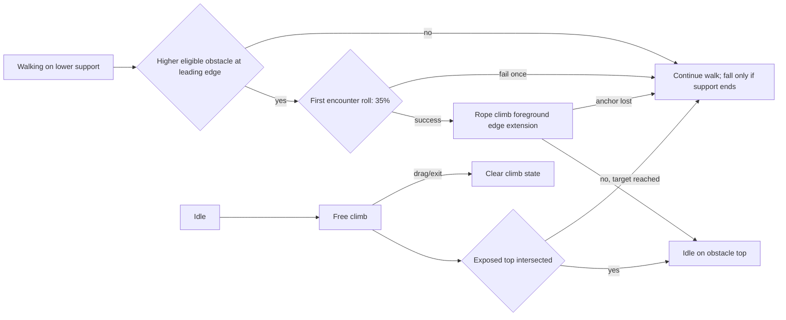
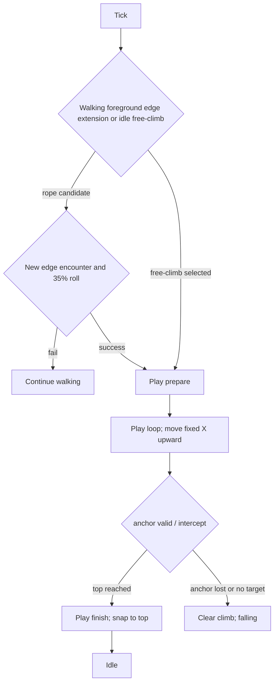
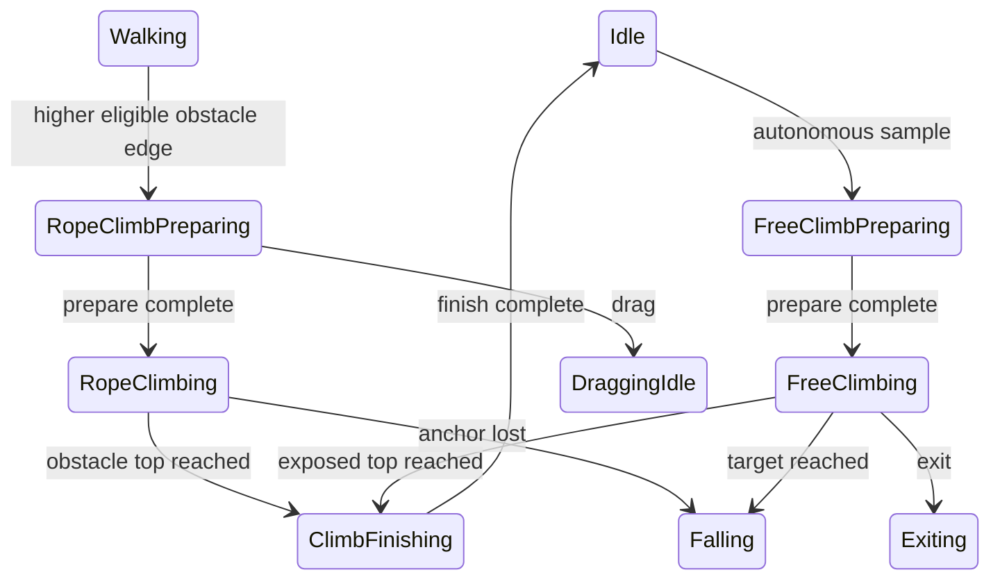

# Window Climbing Behaviors

> tier **M** — runtime state and Windows desktop-surface boundary

## 1. 의도 (Intent)

| 항목 | 내용 |
|---|---|
| 문제 | 볼따구가 단순히 창 상단을 걷는 것에서 그치지 않고, 현재 보이는 창과 물리적으로 일관되게 상호작용해야 한다. |
| 왜 지금 | 드래그·낙하·창 상단 지지면의 기반이 있어, 같은 경계에서 자율 클라이밍을 추가할 수 있다. |
| 주 사용자 | 데스크톱 위에서 볼따구가 창을 탐험하는 모습을 보는 사용자. |
| 불변식 | 실제로 노출된 창 상단에서만 idle한다. 앵커 창이 숨김·닫힘·최대화되면 즉시 낙하하며, drag·exit는 클라이밍을 선점한다. |
| 비목표 | 실제 rope physics, 창 내부 hit-test, 창을 이동하거나 포커스를 바꾸는 동작은 이번 범위가 아니다. |

## 2. 수용 기준 (Acceptance)

| ID | 수용 기준 | 검증 방법 |
|---|---|---|
| AC-1 | 애니메이션 패키지는 `rope_climb_*`, `free_climb_*` 의미 ID를 제공하며 prepare/loop는 캐릭터의 후면을 보여준다. finish는 상단 도달 뒤 canonical idle로 수렴한다. | asset 파이프라인 테스트와 scale audit sheet로 검증한다. |
| AC-2 | 걷기 leading edge가 OS foreground인 비최대화 Window의 좌/우 변 연장선과 만날 때, 그 창 top이 현재 발판보다 pet 높이 이상 위라면 해당 경계에서 단 한 번 35% 확률을 판정한다. 성공하면 고정 X로 창 상단까지 rope climb하고, 실패하면 보행을 계속한다. | `PetAnimationControllerTests`의 좌·우 edge 성공, 동일 경계 1회 판정, 확률 실패 테스트와 `DesktopSurfaceSelectorTests`의 foreground·연장선·높이 gate 테스트. |
| AC-3 | idle 자율 행동은 결정론적으로 1.25~3.0 pet-height 목표를 뽑아 fixed X로 free climb한다. 경로의 노출 창 상단을 만나면 idle, 목표까지 못 만나면 Falling이다. | `PetAnimationControllerTests`의 intercept/no-intercept geometry 및 trace 테스트. |
| AC-4 | 새 클립의 raster artwork과 pack 등록은 공통 512×512 캡처박스와 canonical idle calibration 기준을 사용한다. | asset 파이프라인 테스트와 frame metrics. |
| AC-5 | rope climb 중 장애물 앵커가 더 이상 유효하지 않으면 Falling으로 전이한다. | `PetAnimationControllerTests` anchor-loss 테스트. |
| AC-6 | drag 및 exit는 prepare/loop/finish 어느 단계든 클라이밍 transient state를 지우고 각각 drag/exit 상태로 전이한다. | `PetAnimationControllerTests` cleanup 테스트. |

## 3. 확정 사실 (Findings)

| 항목 | 확인된 사실 | 설계 반영 |
|---|---|---|
| 지지면 | `IDesktopSurfaceProvider`는 `FindFirstBelow`와 `TryRefreshSupport`로 화면 좌표의 창 상단을 이미 검증한다. | 동일 provider에 horizontal obstacle, upward intercept와 climb-anchor revalidation을 추가한다. |
| Z-order | Windows provider는 `GetForegroundWindow` 결과를 `IsForeground`로 기록한다. | rope/free climb의 창 후보는 `IsForeground=true`, 비최대화, 상단 노출 조건을 모두 만족해야 한다. |
| 런타임 | `PetAnimationController`가 animation completion과 Tick 기반 이동을 함께 소유한다. | prepare/finish는 completion, loop 이동은 Tick으로 분리한다. |
| 랜덤성 | `BehaviorPlanner`는 주입된 `IRandomSource`를 쓴다. | free-climb 높이와 rope 경계의 35% 판정도 동일 random source를 사용한다. `(windowId, edge)` encounter latch로 같은 접촉 구간의 재추첨을 막는다. |
| 낙하 선행 원인 | 기존 selector는 후보 창 본체가 캐릭터 높이 구간과 세로로 겹쳐야 한다는 조건을 두어, 위에 떨어진 창의 변 연장선을 후보에서 제외한다. | rope 후보는 창 본체와의 세로 겹침을 요구하지 않고 `candidate.Top <= support.Top - petHeight`만 검사한다. |
| 시점 | 등반 중 정면 포즈는 벽/밧줄과의 접촉 방향을 흐린다. | prepare/loop/finish action frame은 후면 또는 후면 3/4 시점으로 그리고, terminal calibration frame만 정면 idle을 사용한다. |

## 4. 유스케이스 / 시나리오

**주 시나리오**: 걷기 leading edge가 더 높은 전면 창의 좌·우 변과 만나면 pet은 그 변의 고정 X로 상승해 그 창 top에 발을 맞춰 idle한다. idle에서 시작한 free climb도 경로에서 현재 노출된 창 상단을 만나면 동일하게 착지한다.

**예외 시나리오**: rope 장애물이 유효하지 않거나 free target까지 착지면이 없으면 climb의 transient 상태를 비우고 기존 fall sequence로 넘긴다. drag와 exit도 같은 정리를 수행한다.

## 5. 파이프라인 (flowchart)

## 6. 액션 · 상태 전이 (action diagram)

| 상태 | 저장/이벤트 | UI 반응 |
|---|---|---|
| RopeClimbPreparing / FreeClimbPreparing | climb plan과 anchor를 보존한다. | 후면 prepare clip을 재생한다. |
| RopeClimbing / FreeClimbing | fixed X, 시작 Y, 목표 Y를 보존하고 Tick마다 후보 top을 조회한다. | 후면 loop clip 재생 및 위로 이동한다. |
| ClimbFinishing | 도착한 surface를 support로 보존한다. | 후면 top-out frame과 canonical idle frame으로 구성된 finish clip 후 idle한다. |
| Falling / DraggingIdle / Exiting | plan·anchor를 모두 비운다. | 기존 fall/drag/exit clip을 재생한다. |

## 9. 변경 지점

| 파일 | 변경 |
|---|---|
| `src/Bolttagu.Contracts/OverlayContracts.cs` | foreground/maximized metadata 및 climb query default contract. |
| `src/Bolttagu.Contracts/AnimationContracts.cs` | rope/free climb action 및 semantic clip IDs. |
| `src/Bolttagu.Core/BehaviorPlanner.cs` | 결정론적 free-climb target sampling. |
| `src/Bolttagu.Runtime/PetAnimationController.cs` | climb states, movement, interrupt cleanup. |
| `src/Bolttagu.Platform.Windows/DesktopSurfaceProvider.cs` | foreground/maximized Windows query와 exposed obstacle/intercept. |
| `tests/Bolttagu.Runtime.Tests/PetAnimationControllerTests.cs` | trace, geometry 및 negative-gate tests. |
| `tests/Bolttagu.Architecture.Tests/DesktopSurfaceSelectorTests.cs` | deterministic front/top candidate selection tests. |
| `asset/bolttagu/derived/model/rope-climb-grid-v1.png` | 후면 rope climb 원본 시트와 마지막 idle 검수 셀. |
| `asset/bolttagu/derived/model/free-climb-grid-v1.png` | 후면 free climb 원본 시트와 마지막 idle 검수 셀. |
| `asset/bolttagu/derived/model/canonical-idle-calibration-v1.png` | 클립 간 공통 스케일·발 기준선. |
| `asset/bolttagu/derived/animations/pack.json` | 6개 climb clip의 타이밍과 runtime frame 등록. |
| `docs/design/0008-window-climbing-behaviors.md` | this feature contract. |

## 10. 잠재 문제 & 대응

| 문제 | 대응 |
|---|---|
| EnumWindows와 foreground가 관찰 사이에 바뀔 수 있다. | 매 Tick anchor를 refresh하며 foreground/노출 조건이 깨지면 fall한다. |
| 창 테두리 DPI 변환에 1px 오차가 있다. | 기존 provider와 같이 overlay DPI를 사용하고 top snap만 provider bounds를 신뢰한다. |
| 생성 시트마다 머리·몸 비율이 달라질 수 있다. | 각 시트 마지막 idle은 육안 비교용으로 두고, 실제 빌드는 공유 canonical idle의 alpha bounds로 scale을 고정한다. |
| 후면 climb에서 idle로 전환할 때 시점이 튈 수 있다. | finish action frame을 top-out 후면 포즈로 제한하고 terminal frame을 공통 idle로 고정한다. |

## 11. 착수 순서

- [x] 0. art producer가 후면 semantic clip raster와 pack coverage를 추가한다. (AC-1, AC-4)
- [x] 1. DesktopSurface metadata와 deterministic selector/provider query를 추가한다. (AC-2, AC-3, AC-5)
- [x] 2. clip/state/planner contract와 rope/free climb runtime slice를 추가한다. (AC-2, AC-3, AC-6)
- [x] 3. geometry, negative-gate, interrupt cleanup 테스트를 추가하고 관련 suite를 실행한다. (AC-2, AC-3, AC-5, AC-6)
- [x] 4. canonical idle calibration, scale audit, 전체 65개 테스트로 아트/런타임 통합을 검증한다. (AC-1~AC-6)
- [x] 5. rope 후보를 foreground 창의 좌우 연장선으로 교정하고 경계별 1회 35% 판정 및 회귀 테스트를 추가한다. (AC-2, AC-5)
