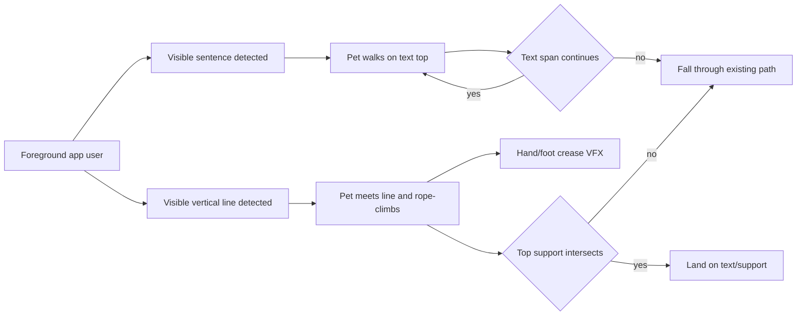
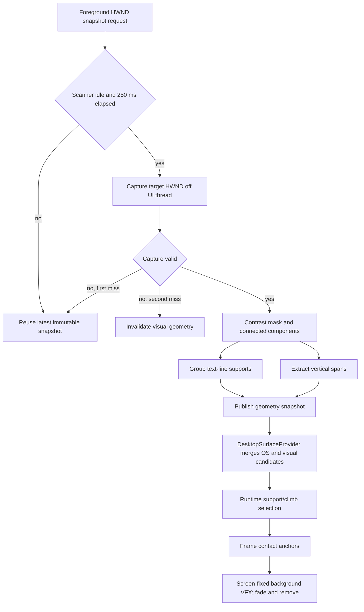
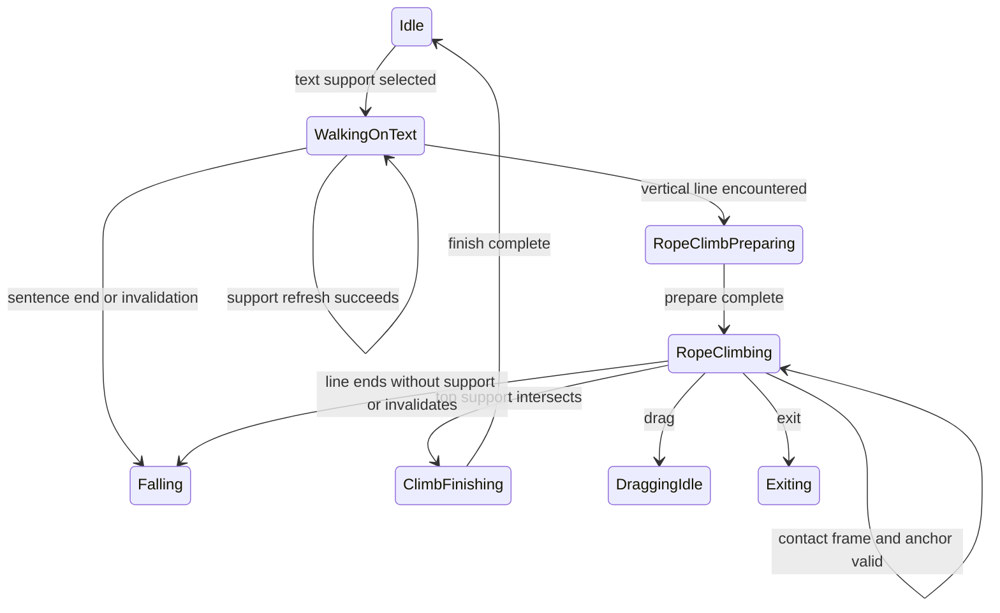

# Visual Text Surfaces and Contact VFX

> tier **M** — foreground-window visual geometry, runtime surface lifecycle, and transient climb VFX

## 1. 의도 (Intent)

| 항목 | 내용 |
|---|---|
| 문제 | 볼따구가 OS 창의 외곽만 지형으로 보므로 창 내부의 문장과 수직선 위에서는 화면 내용과 무관하게 움직인다. 기존 벽타기는 손발이 화면에 닿아도 접촉 흔적이 없어 물리적 연결감이 약하다. |
| 왜 지금 | 창 상단 support, support-loss 낙하, foreground edge rope climb이 이미 있으므로 같은 geometry 계약에 화면 내용 기반 surface와 접촉 VFX를 연결할 수 있다. |
| 주 사용자 | 활성 창의 글과 선을 따라 걷고 오르는 볼따구를 데스크톱에서 보는 사용자. |
| 불변식 | 화면 픽셀과 인식 결과는 메모리 밖으로 저장·전송·로그하지 않는다. 검출은 UI Tick을 막지 않는다. pet/VFX overlay 자체는 검출하지 않는다. 기존 창 상단·taskbar·drag·fall·exit 동작을 보존한다. |
| 비목표 | 문장 내용을 OCR로 읽기, 곡선·임의 도형을 충돌 mesh로 만들기, 비활성 창 내부 분석, 실제 앱 화면 픽셀을 변형하기는 이번 범위가 아니다. |

## 2. 수용 기준 (Acceptance)

| ID | 수용 기준 | 검증 방법 |
|---|---|---|
| AC-1 | 현재 foreground 창 캡처에서 글자형 component가 3개 이상 같은 행으로 묶이면 그 union의 top과 좌우 끝을 `TextLine` support로 제공한다. pet 중심이 문장 끝을 벗어나면 다음 support 재검증에서 Falling으로 전이한다. | 합성 monochrome frame을 쓰는 detector/selector 단위 테스트와 `PetAnimationControllerTests`의 문장 끝 낙하 trace를 검증한다. |
| AC-2 | foreground 창 캡처에서 폭 8 DIP 이하, 높이 96 DIP 이상인 연속 수직 span을 `VerticalLine` climb anchor로 제공한다. 보행 leading edge가 처음 만난 visual line은 확률 판정 없이 기존 rope climb sequence를 시작한다. line top이 `TextLine` 또는 horizontal support와 만나면 착지하고, 아니면 line 끝에서 Falling으로 전이한다. | 좌·우 접근, 동일 line 1회 encounter, top support 유무를 synthetic geometry 및 runtime trace 테스트로 검증한다. |
| AC-3 | foreground HWND가 바뀌거나 visual geometry가 두 번 연속 scan에서 사라지면 해당 text support/line anchor를 무효화하고 기존 support-loss 또는 anchor-loss Falling 경로를 사용한다. 한 번의 누락은 직전 snapshot을 유지해 캡처 흔들림을 흡수한다. | fake foreground id와 scan sequence로 grace 1회, 2회째 invalidation, stale snapshot 낙하를 검증한다. |
| AC-4 | 캡처·geometry 분석은 UI thread 밖에서 최대 4 Hz, single-flight로 실행하며 runtime의 33 ms Tick은 마지막 immutable snapshot만 읽는다. 결과는 분석 완료 시각에 게시하고 foreground HWND가 계속 일치하는 동안 최대 3초까지 사용한 뒤 기존 Window/Taskbar surface로 fallback한다. | scanner scheduler 단위 테스트에서 동시 작업 최대 1개, 최소 250 ms scan 간격, 고해상도 scan 간 snapshot 유지와 stale rejection을 검증한다. |
| AC-5 | rope/free climb frame의 hand/foot contact metadata가 활성화될 때 pet 뒤·foreground 창 앞의 click-through VFX layer에 12~24 DIP 주름을 만든다. 접점 해제 후 300 ms 안에 fade를 시작하고 600 ms 안에 제거하며, 동시에 16개를 넘지 않는다. | pack/catalog metadata 테스트, presentation tracker fake-clock 테스트, 실제 climb 녹화의 stacking·fade 육안 검수로 확인한다. |
| AC-6 | fall, drag, hide, foreground 전환, exit 및 dispose는 visual support/anchor와 모든 contact VFX를 정리하며 VFX window는 포커스·pointer hit-test를 가져가지 않는다. | runtime interrupt trace, WPF window style smoke test, 종료 후 VFX item 0개 검증으로 확인한다. |

## 3. 확정 사실 (Findings)

| 항목 | 확인된 사실 | 설계 반영 |
|---|---|---|
| 현재 surface | `DesktopSurfaceProvider.Snapshot`은 visible/non-iconic top-level HWND와 taskbar를 만들고 `DesktopSurfaceSelector`가 노출 top을 선택한다. rope 후보만 foreground·비최대화 조건을 요구한다. | 기존 window snapshot은 유지하고 foreground HWND 내부에서 검출한 visual geometry를 별도 kind로 합성한다. |
| support lifecycle | `TryRefreshSupport` 실패는 다음 Runtime Tick에서 Falling으로 이어지고, rope anchor는 `TryRefreshClimbAnchor`로 매 Tick 재검증된다. | text 끝과 line 소실을 새 상태기계로 만들지 않고 기존 loss 경로에 연결한다. |
| render loop | `WpfRuntimeLoop`는 Dispatcher에서 33 ms마다 controller Tick을 호출한다. | 캡처와 pixel 분석은 background scanner가 담당하고 provider는 snapshot read만 수행한다. |
| overlay | pet window는 220×220 투명 Topmost/NoActivate 창이며 이동한다. 현재 창 안에 VFX를 두면 지난 접점이 pet과 함께 이동한다. 별도 fullscreen VFX HWND를 일반 surface 열거에 포함하면 모든 실제 창이 가려진 것으로 판정된다. | 화면 좌표를 유지하는 별도 transparent VFX window를 사용하되 pet owner와 함께 surface/occlusion 열거에서 명시적으로 제외한다. |
| animation metadata | `SpriteFrame`과 pack schema v1 frame에는 atlas rect·duration·pivot만 있고 frame-presented event와 접점 좌표가 없다. | optional contact anchors와 frame event를 pack→catalog→presentation 경로에 추가한다. |
| climb timing | rope/free climb loop는 150 ms frame으로 구성되고 controller는 fixed X로 window를 위로 이동한다. | 각 loop frame의 손·발 접점을 screen 좌표로 변환해 같은 접점을 refresh하고 새 접점만 spawn한다. |
| capture dependency | Platform.Windows 프로젝트는 WPF/WinForms 외 화면 캡처·OCR package를 참조하지 않으며 저장소에 `PrintWindow`, OCR, UI Automation 기반 content detector가 없다. | 첫 버전은 foreground HWND 전용 in-memory GDI capture와 자체 geometry detector를 사용하고 OCR·외부 서비스는 추가하지 않는다. |

## 4. 유스케이스 / 시나리오

**주 시나리오**: foreground 창의 문장은 하나의 제한된 수평 support가 되고, 볼따구는 그 위를 걷다가 문장 끝을 지나면 낙하한다. 걷는 방향의 수직선을 만나면 100% rope climb을 시작하며, 활성 contact frame마다 뒤쪽 VFX layer에 짧은 주름이 남았다가 사라진다.

**예외 시나리오**: 캡처 실패 1회는 직전 geometry를 유지한다. 두 번째 연속 실패, foreground 변경, stale snapshot, drag/hide/exit에서는 visual geometry와 VFX를 지우고 기존 window/taskbar fallback 또는 Falling으로 복귀한다.

## 5. 파이프라인 (flowchart)

## 6. 액션 · 상태 전이 (action diagram)

| 상태 | 저장/이벤트 | UI 반응 |
|---|---|---|
| WalkingOnText | foreground id, stable geometry id, text span bounds, snapshot timestamp를 support에 보존한다. | 기존 walk clip을 재생한다. span 끝에서는 기존 fall clip으로 전환한다. |
| RopeClimbPreparing / RopeClimbing | vertical line id·top/bottom과 접촉 방향을 anchor로 보존한다. frame contact event를 VFX sink에 전달한다. | 기존 rope clips과 screen-fixed 주름 VFX를 합성한다. |
| ClimbFinishing | line top과 교차한 text/window support를 보존한다. | 기존 finish clip 뒤 canonical idle로 복귀한다. |
| Falling / DraggingIdle / Hidden / Exiting | visual support·anchor·miss grace·contact markers를 모두 지운다. | VFX layer를 비우고 기존 fall/drag/hide/exit UI를 유지한다. |

## 9. 변경 지점

| 파일 | 변경 |
|---|---|
| `src/Bolttagu.Contracts/OverlayContracts.cs` | `TextLine`/`VerticalLine` geometry kind, snapshot freshness와 climb-only surface 계약을 추가한다. |
| `src/Bolttagu.Contracts/AnimationContracts.cs` | optional frame contact anchors와 frame-presented event 계약을 추가한다. |
| `src/Bolttagu.Platform.Windows/DesktopSurfaceProvider.cs` | pet/VFX HWND를 제외한 OS surface와 최신 foreground visual snapshot을 합성하고 text support/vertical anchor를 재검증한다. |
| `src/Bolttagu.Platform.Windows/ForegroundVisualGeometryScanner.cs` | single-flight foreground HWND capture, 4 Hz scheduling, miss grace, immutable snapshot 게시를 담당한다. |
| `src/Bolttagu.Platform.Windows/VisualGeometryDetector.cs` | in-memory contrast mask에서 text row와 vertical span을 결정론적으로 추출한다. |
| `src/Bolttagu.Platform.Windows/ContactVfxWindow.cs` | pet 뒤의 click-through transparent layer와 bounded fade lifecycle을 구현한다. |
| `src/Bolttagu.Presentation/PetSpriteView.cs` | frame contact를 screen-coordinate compositor에 전달할 수 있도록 frame event를 발행한다. |
| `src/Bolttagu.Assets/AnimationPack.cs` | optional contact metadata validation을 추가한다. |
| `src/Bolttagu.Assets/RuntimeAnimationCatalog.cs` | build catalog contact를 `SpriteFrame`으로 전달한다. |
| `tools/Bolttagu.AssetBuild/Program.cs` | pack contact metadata를 runtime catalog에 보존한다. |
| `asset/bolttagu/derived/animations/pack.json` | rope/free climb frame별 hand/foot contact anchor를 선언한다. |
| `src/Bolttagu.App/App.xaml.cs` | scanner/provider/VFX window의 생성·배선·dispose를 소유한다. |
| `tests/Bolttagu.Architecture.Tests/VisualGeometryDetectorTests.cs` | synthetic frame text/line detection, scheduler, stale/miss lifecycle을 검증한다. |
| `tests/Bolttagu.Architecture.Tests/DesktopSurfaceSelectorTests.cs` | visual support 끝과 deterministic vertical-line obstacle 선택을 검증한다. |
| `tests/Bolttagu.Runtime.Tests/PetAnimationControllerTests.cs` | text 끝 낙하, line climb, top-support/no-support trace와 interrupt cleanup을 검증한다. |
| `tests/Bolttagu.Presentation.Tests/AnimationPlaybackTests.cs` | frame contact event와 bounded VFX fade tracker를 검증한다. |
| `docs/design/0010-visual-text-surfaces.md` | 기능 의도·상태·검증 계약을 유지한다. |

## 10. 잠재 문제 & 대응

| 문제 | 대응 |
|---|---|
| GDI target-window capture가 hardware-accelerated 또는 보호된 창에서 검은 frame을 반환할 수 있다. | invalid frame으로 처리해 기존 OS window surface만 사용한다. 범용 캡처가 필요해지면 scanner contract 뒤에서 Windows Graphics Capture adapter로 교체한다. |
| 글자와 아이콘/노이즈를 geometry만으로 완전히 구분할 수 없다. | 최소 component 수·글자 높이 범위·baseline 정렬·gap 제한을 synthetic fixture와 실제 화면에서 보수적으로 튜닝한다. OCR 내용 판정은 하지 않는다. |
| 긴 수직 글자 획이 climb line으로 오검출될 수 있다. | 최소 96 DIP 연속 길이, 최대 8 DIP 폭, 수직 straightness와 주변 branch 비율 gate를 함께 적용한다. |
| VFX Topmost window가 대상 창보다 뒤로 내려가거나 pet보다 앞설 수 있다. | no-activate owner 관계와 명시적 z-order 재확인을 smoke test로 검증하고 실패하면 VFX만 비활성화한다. 행동 상태는 유지한다. |
| per-frame 접점이 artwork와 어긋날 수 있다. | pack contact 좌표를 contact-sheet overlay로 렌더해 육안 검수하고 런타임은 metadata만 신뢰한다. |
| multi-monitor DPI가 다른 경우 capture pixel과 WPF DIP가 어긋날 수 있다. | snapshot에 capture origin·DPI scale을 보존하고 모든 geometry를 provider 진입 전에 screen DIP로 정규화한다. |
| 4K foreground 분석 시간이 기존 750 ms freshness를 초과할 수 있다. | 결과의 게시 시각을 분석 완료 시점으로 기록하고, HWND 일치 검증을 유지한 채 snapshot freshness를 3초로 확장한다. |
| fullscreen VFX HWND가 실제 창보다 앞선 z-order에서 occlusion을 만들 수 있다. | VFX handle을 `DesktopSurfaceProvider`의 제외 목록에 전달하고 실제 HWND smoke test로 창 상단 선택을 검증한다. |

## 11. 착수 순서

- [x] 1. synthetic frame에서 text row·vertical span을 검출하고 stable geometry snapshot을 게시하는 순수 detector/scanner slice를 만든다. (AC-1, AC-2, AC-3, AC-4)
- [x] 2. visual geometry를 `DesktopSurfaceProvider`와 runtime support/climb 경로에 연결해 문장 끝 낙하와 deterministic line climb을 완성한다. (AC-1, AC-2, AC-3, AC-6)
- [x] 3. climb frame contact metadata를 pack→catalog→presentation event로 관통시킨다. (AC-5)
- [x] 4. screen-fixed click-through VFX layer와 fade/cleanup lifecycle을 연결한다. (AC-5, AC-6)
- [x] 5. 관련 Core/Runtime/Architecture/Presentation/Asset test와 실제 foreground fixture 창 smoke를 실행하고 design status를 `done`으로 닫는다. (AC-1, AC-2, AC-3, AC-4, AC-5, AC-6)
