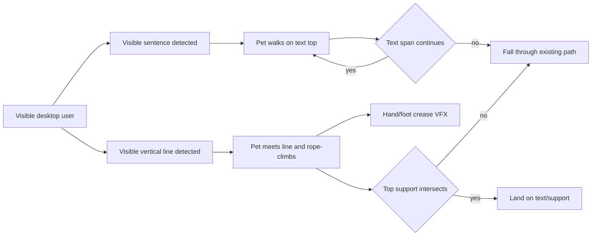
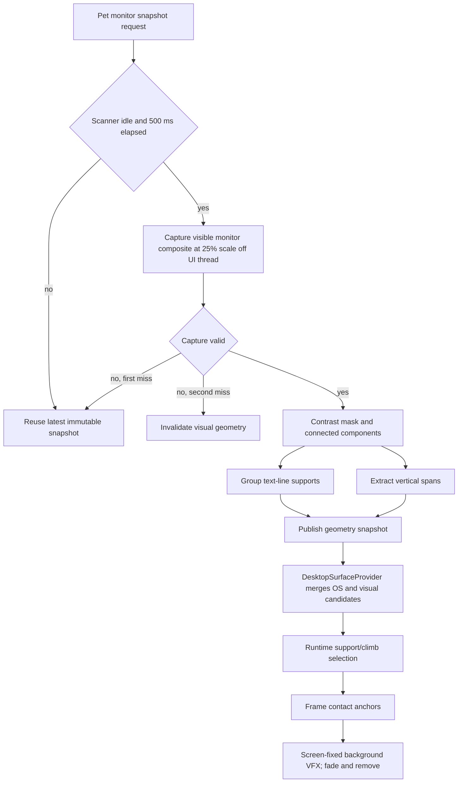
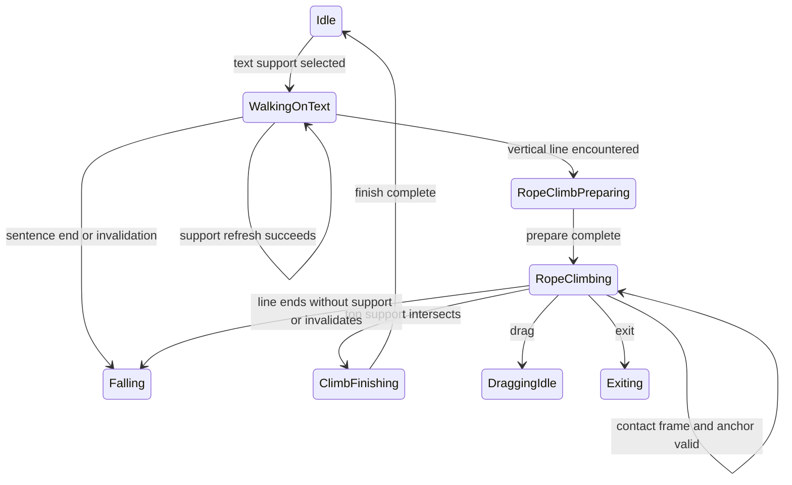

# Visual Text Surfaces and Contact VFX

> tier **M** — display-visible visual geometry, runtime surface lifecycle, and transient climb VFX

> 2026-09-21 revision: 실제 4K foreground 진단에서 문장 component grouping이 조각화되고
> 수직 획을 과검출함을 확인했다. MobaXterm penguin 동작을 참고해 실제 물리는 객체 목록이
> 아니라 foreground collision mask의 local foot probe를 사용한다. 기존 geometry 목록은
> debug visualization과 vertical-line 실험용으로만 유지한다.

> 2026-09-21 image clarification: 사용자가 지정한 지형은 raw glyph pixel이 아니라
> (1) 큰 글자 덩어리, (2) 긴 수평 구분선, (3) 작은 글자 덩어리의 bounded horizontal
> support와 (4) 긴 수직 구분선의 climb anchor다. collision mask는 분석 중간 산출물로만
> 남기고 실제 physics는 `TextLine`/`HorizontalLine`/`VerticalLine` geometry를 사용한다.

> 2026-09-21 scope correction: 여기서 "전면"은 키보드 focus를 가진 foreground HWND가 아니라
> pet이 위치한 디스플레이에 실제 합성되어 보이는 모든 창과 글씨를 뜻한다. 캡처·snapshot·physics를
> foreground HWND 수명주기에서 분리하고 monitor-visible composite를 기준으로 유지한다.

## 1. 의도 (Intent)

| 항목 | 내용 |
|---|---|
| 문제 | 볼따구가 OS 창의 외곽만 지형으로 보므로 창 내부의 문장과 수직선 위에서는 화면 내용과 무관하게 움직인다. 기존 벽타기는 손발이 화면에 닿아도 접촉 흔적이 없어 물리적 연결감이 약하다. |
| 왜 지금 | 창 상단 support, support-loss 낙하, window edge rope climb이 이미 있으므로 같은 geometry 계약에 화면 내용 기반 surface와 접촉 VFX를 연결할 수 있다. |
| 주 사용자 | 현재 디스플레이에 보이는 여러 창의 글과 선을 따라 걷고 오르는 볼따구를 보는 사용자. |
| 불변식 | 화면 픽셀과 인식 결과는 메모리 밖으로 저장·전송·로그하지 않는다. 검출은 UI Tick을 막지 않는다. pet/VFX overlay 자체는 검출하지 않는다. 기존 창 상단·taskbar·drag·fall·exit 동작을 보존한다. |
| 비목표 | 문장 내용을 OCR로 읽기, 곡선·임의 도형을 충돌 mesh로 만들기, 가려져 화면에 보이지 않는 창 내부 분석, 실제 앱 화면 픽셀을 변형하기는 이번 범위가 아니다. |

## 2. 수용 기준 (Acceptance)

| ID | 수용 기준 | 검증 방법 |
|---|---|---|
| AC-1 | pet이 위치한 monitor의 visible composite에서 글자형 component가 3개 이상 같은 행으로 묶이면 그 union의 top과 좌우 끝을 `TextLine` support로 제공한다. focus를 다른 창으로 옮겨도 화면에 보이는 동일 문장은 유지하며, pet 중심이 문장 끝을 벗어나면 Falling으로 전이한다. | 합성 frame detector/selector 테스트, 서로 다른 두 visible window fixture, focus 전환 전후 동일 geometry smoke와 문장 끝 runtime trace를 검증한다. |
| AC-2 | 같은 monitor-visible composite에서 폭 8 DIP 이하, 높이 96 DIP 이상인 연속 수직 span을 `VerticalLine` climb anchor로 제공한다. 보행 leading edge가 처음 만난 visual line은 확률 판정 없이 기존 rope climb sequence를 시작한다. | 좌·우 접근, 동일 line 1회 encounter, focus와 무관한 anchor 유지, top support 유무를 synthetic geometry 및 runtime trace로 검증한다. |
| AC-3 | focus HWND 변경은 visual geometry를 무효화하지 않는다. pet이 다른 monitor로 이동하거나 visible geometry 배치가 바뀌면 다음 성공 scan에서 snapshot을 즉시 교체한다. capture 자체가 실패한 경우에만 마지막 정상 snapshot을 age limit까지 유지한다. pet에 가린 geometry는 가림 밖 배치가 호환될 때만 보존한다. | fake display id와 scan sequence로 focus-independent 유지, display 변경, scroll 즉시 교체, capture failure 보존, occlusion compatibility, stale rejection을 검증한다. |
| AC-4 | monitor 캡처·geometry 분석은 UI thread 밖에서 2 Hz, single-flight, 25% linear scale로 실행하며 runtime의 33 ms Tick은 마지막 immutable snapshot만 읽는다. 결과는 분석 완료 시각에 게시하고 같은 display scope에서 최대 3초까지 사용한다. | scheduler 단위 테스트에서 동시 작업 최대 1개, 최소 500 ms 간격, 고해상도 scan 간 snapshot 유지와 stale rejection을 검증한다. |
| AC-5 | rope/free climb frame의 hand/foot contact metadata가 활성화될 때 pet 뒤·visible desktop 앞의 click-through VFX layer에 12~24 DIP 주름을 만든다. 접점 해제 후 300 ms 안에 fade를 시작하고 600 ms 안에 제거하며, 동시에 16개를 넘지 않는다. | pack/catalog metadata 테스트, presentation tracker fake-clock 테스트, 실제 climb 녹화의 stacking·fade 육안 검수로 확인한다. |
| AC-6 | fall, drag, hide, display 변경, exit 및 dispose는 visual support/anchor와 모든 contact VFX를 정리하며 VFX window는 포커스·pointer hit-test를 가져가지 않는다. | runtime interrupt trace, WPF window style smoke test, 종료 후 VFX item 0개 검증으로 확인한다. |
| AC-7 | 앱 시작 시 pet은 work-area 상단에서 Falling으로 진입하고, display-visible geometry를 아래로 sweep해 처음 만난 local support에 착지한다. 걷는 중 foot probe가 support run 끝을 벗어나면 다시 Falling으로 전이한다. | spawn→fall→land, drag→fall→land, walk→edge→fall runtime trace를 검증한다. |
| AC-8 | `BOLTTAGU_VISUAL_DEBUG=1`에서만 scanner geometry·probe·선택 surface를 click-through VFX layer에 표시하고 일반 실행에서는 시안·마젠타·빨간·금색 보조선을 모두 표시하지 않는다. `P3 · DPI` 진단 문구는 context menu로 옮기고 sprite canvas를 atlas foot pivot(480/512)에서 crop해 발바닥과 물리 바닥을 일치시킨다. | 환경 변수 on/off WPF smoke, context-menu status 검사, view height 206.25 DIP 및 진단 `TextBlock` 부재를 검증한다. |
| AC-9 | 큰 제목과 작은 본문은 글자 크기와 무관하게 같은 baseline의 bounded `TextLine`으로, 폭 96 DIP 이상의 얇은 수평선은 `HorizontalLine` support로, 높이 96 DIP 이상의 얇은 수직선은 `VerticalLine` anchor로 구분한다. | 사용자 예시를 축약한 synthetic frame에서 세 종류를 동시에 검출하고 surface kind mapping을 검증한다. |
| AC-10 | rope climb loop는 후면 시점에서 손 동작이 교대하되, 교차하는 팔은 머리카락 뒤에 가려지고 손목·손만 줄 쪽으로 나와야 한다. contact metadata도 같은 손 위치를 따른다. | 4-frame contact sheet의 arm/head occlusion 육안 검수, pack/catalog frame contact 좌표 테스트, 실제 loop 재생 검수로 확인한다. |
| AC-11 | free climb은 prepare 완료 후 매 tick 이동한 구간만 surface intercept 검사하며, 아직 도달하지 않은 목적지로 즉시 이동하지 않는다. pet overlay에 가려진 기존 visual surface는 해당 영역이 다시 드러날 때까지 직전 snapshot geometry를 유지한다. | 단계별 clock runtime test와 occlusion merge 단위 테스트로 중간 위치·도달 시점·가려진 발판 보존을 검증한다. |
| AC-12 | rope/free climb 목표 Y가 monitor work-area 상단보다 위로 계산되면 목표를 work-area top으로 clamp하고, 실제 창이 상단에 도달한 tick에 finish 또는 Falling으로 전이한다. | 화면 상단보다 짧은 잔여 거리 fixture에서 창 Y=top과 비-climbing 상태를 검증한다. |

## 3. 확정 사실 (Findings)

| 항목 | 확인된 사실 | 설계 반영 |
|---|---|---|
| 현재 surface | `DesktopSurfaceProvider.Snapshot`은 visible/non-iconic top-level HWND와 taskbar를 만들고 `DesktopSurfaceSelector`가 노출 top을 선택한다. rope 후보만 foreground·비최대화 조건을 요구한다. | 기존 window snapshot은 유지하고 foreground HWND 내부에서 검출한 visual geometry를 별도 kind로 합성한다. |
| support lifecycle | `TryRefreshSupport` 실패는 다음 Runtime Tick에서 Falling으로 이어지고, rope anchor는 `TryRefreshClimbAnchor`로 매 Tick 재검증된다. | text 끝과 line 소실을 새 상태기계로 만들지 않고 기존 loss 경로에 연결한다. |
| render loop | `WpfRuntimeLoop`는 Dispatcher에서 33 ms마다 controller Tick을 호출한다. | 캡처와 pixel 분석은 background scanner가 담당하고 provider는 snapshot read만 수행한다. |
| overlay | pet window는 220×220 투명 Topmost/NoActivate 창이며 이동한다. 현재 창 안에 VFX를 두면 지난 접점이 pet과 함께 이동한다. 별도 fullscreen VFX HWND를 일반 surface 열거에 포함하면 모든 실제 창이 가려진 것으로 판정된다. | 화면 좌표를 유지하는 별도 transparent VFX window를 사용하되 pet owner와 함께 surface/occlusion 열거에서 명시적으로 제외한다. |
| animation metadata | `SpriteFrame`과 pack schema v1 frame에는 atlas rect·duration·pivot만 있고 frame-presented event와 접점 좌표가 없다. | optional contact anchors와 frame event를 pack→catalog→presentation 경로에 추가한다. |
| climb timing | rope/free climb loop는 150 ms frame으로 구성되고 controller는 fixed X로 window를 위로 이동한다. | 각 loop frame의 손·발 접점을 screen 좌표로 변환해 같은 접점을 refresh하고 새 접점만 spawn한다. |
| capture dependency | `PrintWindow`는 focus HWND 한 개의 backing surface만 반환해 display-visible 요구와 다르다. Win32 monitor bounds와 screen composite capture는 별도 OCR package 없이 in-memory GDI로 제공할 수 있다. | pet monitor의 visible composite를 캡처하고 focus HWND는 snapshot identity와 provider merge 조건에서 제거한다. |
| rope artwork | `rope-climb-grid-v1.png`와 `rope_climb_loop` 4개 frame은 모두 화면 오른쪽의 같은 손으로 줄을 잡는다. | loop 1·3을 반대 손 grip으로 교체하고 contact 좌표를 그림과 함께 갱신한다. |

## 4. 유스케이스 / 시나리오

**주 시나리오**: 현재 monitor에 실제 보이는 모든 창의 문장은 제한된 수평 support가 되고, 볼따구는 그 위를 걷다가 문장 끝을 지나면 낙하한다. 걷는 방향의 수직선을 만나면 100% rope climb을 시작하며, 좌우 손을 번갈아 짚는 contact frame마다 뒤쪽 VFX layer에 짧은 주름이 남았다가 사라진다.

**예외 시나리오**: 캡처 실패 1회는 직전 geometry를 유지한다. 두 번째 연속 실패, monitor 변경, stale snapshot, hide/exit에서는 visual geometry와 VFX를 지우고 기존 window/taskbar fallback 또는 Falling으로 복귀한다. focus 변경과 drag 자체는 display snapshot을 지우지 않는다.

## 5. 파이프라인 (flowchart)

## 6. 액션 · 상태 전이 (action diagram)

| 상태 | 저장/이벤트 | UI 반응 |
|---|---|---|
| WalkingOnText | display id, stable geometry id, text span bounds, snapshot timestamp를 support에 보존한다. | 기존 walk clip을 재생한다. span 끝에서는 기존 fall clip으로 전환한다. |
| RopeClimbPreparing / RopeClimbing | vertical line id·top/bottom과 접촉 방향을 anchor로 보존한다. frame contact event를 VFX sink에 전달한다. | 기존 rope clips과 screen-fixed 주름 VFX를 합성한다. |
| ClimbFinishing | line top과 교차한 text/window support를 보존한다. | 기존 finish clip 뒤 canonical idle로 복귀한다. |
| Falling / DraggingIdle / Hidden / Exiting | visual support·anchor·miss grace·contact markers를 모두 지운다. | VFX layer를 비우고 기존 fall/drag/hide/exit UI를 유지한다. |

## 9. 변경 지점

| 파일 | 변경 |
|---|---|
| `src/Bolttagu.Contracts/OverlayContracts.cs` | `TextLine`/`VerticalLine` geometry kind, snapshot freshness와 climb-only surface 계약을 추가한다. |
| `src/Bolttagu.Contracts/AnimationContracts.cs` | optional frame contact anchors와 frame-presented event 계약을 추가한다. |
| `src/Bolttagu.Platform.Windows/DesktopSurfaceProvider.cs` | pet/VFX HWND를 제외한 OS surface와 최신 display visual snapshot을 focus와 무관하게 합성하고 text support/vertical anchor를 재검증한다. |
| `src/Bolttagu.Platform.Windows/ForegroundVisualGeometryScanner.cs` | pet monitor의 visible composite capture, 2 Hz scheduling, pet bounds exclusion, miss grace, immutable snapshot 게시를 담당한다. |
| `src/Bolttagu.Platform.Windows/VisualGeometryDetector.cs` | in-memory contrast mask에서 text row와 vertical span을 결정론적으로 추출한다. |
| `src/Bolttagu.Platform.Windows/ContactVfxWindow.cs` | pet 뒤의 click-through transparent layer와 bounded fade lifecycle을 구현한다. |
| `src/Bolttagu.Presentation/PetSpriteView.cs` | frame contact event를 발행하고 pet canvas의 DPI 진단 라벨을 제거해 sprite foot baseline을 창 바닥과 일치시킨다. |
| `src/Bolttagu.Presentation/PetPlaceholderView.cs` | fallback canvas에서도 발밑 진단 라벨을 제거한다. |
| `src/Bolttagu.Platform.Windows/OverlayWindow.cs` | DPI·asset 진단을 비활성 context-menu status 항목으로 제공한다. |
| `src/Bolttagu.Assets/AnimationPack.cs` | optional contact metadata validation을 추가한다. |
| `src/Bolttagu.Assets/RuntimeAnimationCatalog.cs` | build catalog contact를 `SpriteFrame`으로 전달한다. |
| `tools/Bolttagu.AssetBuild/Program.cs` | pack contact metadata를 runtime catalog에 보존한다. |
| `asset/bolttagu/derived/animations/pack.json` | rope/free climb frame별 hand/foot contact anchor를 선언한다. |
| `asset/bolttagu/derived/animations/rope_climb_loop/frames/001-left-v2.png` | `003-left.png`과 함께 좌우 손 grip이 교대하는 rope loop artwork를 제공한다. |
| `src/Bolttagu.App/App.xaml.cs` | scanner/provider/VFX window의 생성·배선·dispose를 소유한다. |
| `tests/Bolttagu.Architecture.Tests/VisualGeometryDetectorTests.cs` | synthetic frame text/line detection, scheduler, stale/miss lifecycle을 검증한다. |
| `tests/Bolttagu.Architecture.Tests/DesktopSurfaceSelectorTests.cs` | visual support 끝과 deterministic vertical-line obstacle 선택을 검증한다. |
| `tests/Bolttagu.Runtime.Tests/PetAnimationControllerTests.cs` | text 끝 낙하, line climb, top-support/no-support trace와 interrupt cleanup을 검증한다. |
| `tests/Bolttagu.Presentation.Tests/AnimationPlaybackTests.cs` | frame contact event와 bounded VFX fade tracker를 검증한다. |
| `docs/design/0010-visual-text-surfaces.md` | 기능 의도·상태·검증 계약을 유지한다. |

## 10. 잠재 문제 & 대응

| 문제 | 대응 |
|---|---|
| monitor composite capture에 pet/VFX overlay가 다시 들어가 feedback geometry를 만들 수 있다. | 두 overlay HWND에 `WDA_EXCLUDEFROMCAPTURE`를 설정하고, 실패 시 overlay bounds를 detector exclusion mask로 전달한다. |
| pet bounds exclusion이 sprite 뒤의 실제 글/선을 함께 가릴 수 있다. | 현재 pet 영역과 교차하는 직전 geometry만 새 snapshot에 병합하고, pet이 이동해 영역이 드러나면 새 검출 결과로 교체한다. |
| 글자와 아이콘/노이즈를 geometry만으로 완전히 구분할 수 없다. | 최소 component 수·글자 높이 범위·baseline 정렬·gap 제한을 synthetic fixture와 실제 화면에서 보수적으로 튜닝한다. OCR 내용 판정은 하지 않는다. |
| 긴 수직 글자 획이 climb line으로 오검출될 수 있다. | 최소 96 DIP 연속 길이, 최대 8 DIP 폭, 수직 straightness와 주변 branch 비율 gate를 함께 적용한다. |
| VFX Topmost window가 대상 창보다 뒤로 내려가거나 pet보다 앞설 수 있다. | no-activate owner 관계와 명시적 z-order 재확인을 smoke test로 검증하고 실패하면 VFX만 비활성화한다. 행동 상태는 유지한다. |
| per-frame 접점이 artwork와 어긋날 수 있다. | pack contact 좌표를 contact-sheet overlay로 렌더해 육안 검수하고 런타임은 metadata만 신뢰한다. |
| multi-monitor DPI가 다른 경우 capture pixel과 WPF DIP가 어긋날 수 있다. | snapshot에 capture origin·DPI scale을 보존하고 모든 geometry를 provider 진입 전에 screen DIP로 정규화한다. |
| 4K monitor 분석 시간이 기존 scan 간격을 초과할 수 있다. | single-flight를 유지하고 결과의 게시 시각을 분석 완료 시점으로 기록해 snapshot freshness를 3초로 유지한다. |
| fullscreen VFX HWND가 실제 창보다 앞선 z-order에서 occlusion을 만들 수 있다. | VFX handle을 `DesktopSurfaceProvider`의 제외 목록에 전달하고 실제 HWND smoke test로 창 상단 선택을 검증한다. |

## 11. 착수 순서

- [x] 1. synthetic frame에서 text row·vertical span을 검출하고 stable geometry snapshot을 게시하는 순수 detector/scanner slice를 만든다. (AC-1, AC-2, AC-3, AC-4)
- [x] 2. visual geometry를 `DesktopSurfaceProvider`와 runtime support/climb 경로에 연결해 문장 끝 낙하와 deterministic line climb을 완성한다. (AC-1, AC-2, AC-3, AC-6)
- [x] 3. climb frame contact metadata를 pack→catalog→presentation event로 관통시킨다. (AC-5)
- [x] 4. screen-fixed click-through VFX layer와 fade/cleanup lifecycle을 연결한다. (AC-5, AC-6)
- [x] 5. 관련 Core/Runtime/Architecture/Presentation/Asset test와 실제 foreground fixture 창 smoke를 실행하고 design status를 `done`으로 닫는다. (AC-1, AC-2, AC-3, AC-4, AC-5, AC-6)
- [x] 6. foreground edge mask를 local collision mask로 게시하고 foot raycast 착지를 연결한다. (AC-7)
- [x] 7. startup fall과 in-process debug geometry overlay를 연결하고 실제 4K foreground에서 검증한다. PID 13068이 OS window top이 없는 foot Y=1876에 mask 착지한 뒤 edge 낙하로 work-area bottom Y=2112까지 이동함을 확인했다. (AC-7, AC-8)
- [x] 8. 사용자 이미지에서 큰 제목 `TextLine(20,355,179)`, 수평선 `HorizontalLine(20,565,700)`, 작은 본문 `TextLine(y=808/831/855)`, 수직선 `VerticalLine(745,1,3,920)`을 검출하고 raw mask를 physics에서 제거했다. (AC-9)
- [ ] 9. 실제 사용자 화면에서 구조 검출 결과와 runtime 최종 surface 선택이 일치하는지 발 probe·선택 surface·candidate count를 in-process debug overlay로 추적하고, 재현 실패 원인을 수정한 뒤 사용자 확인으로 닫는다. (AC-7, AC-8, AC-9)
- [x] 10. capture scope를 foreground HWND에서 pet monitor visible composite로 교체하고 focus 변경에도 geometry가 유지됨을 live smoke로 확인했다. pet window bounds는 capture exclusion으로 전달해 sprite 자체가 support/anchor가 되지 않도록 했다. (AC-1, AC-2, AC-3, AC-4, AC-6, AC-7)
- [x] 11. rope loop 1·3의 손 grip을 반대편으로 수정하고 artwork와 contact metadata를 asset test 및 contact sheet로 검증했다. (AC-5, AC-10)
- [x] 12. pet canvas의 발밑 진단 라벨을 제거하고 context menu로 옮겼으며, 일반 환경 변수 없이 앱을 실행해 geometry debug timer가 생성되지 않는 경로를 검증했다. (AC-8)
- [x] 13. pet exclusion 뒤의 기존 geometry를 보존하고, free climb intercept를 전체 목적 구간이 아니라 실제 tick 이동 구간으로 제한했다. (AC-7, AC-11)
- [x] 14. atlas foot pivot 기준으로 하단 13.75 DIP를 crop하고 overlay 물리 높이를 206.25 DIP로 맞췄다. visible scene 대변경은 occlusion carry와 miss grace를 즉시 끊고, rope 홀수 frame의 팔을 머리 뒤로 재합성했다. (AC-3, AC-8, AC-10)
- [x] 15. 매 성공 scan을 즉시 게시하고, pet 가림 밖 geometry의 위치·종류·폭 호환율이 60% 미만이면 가려진 이전 geometry를 폐기한다. (AC-3, AC-11)
- [x] 16. 화면 전환 중 연속 changed frame은 게시하지 않고 첫 stable frame에서 한 번만 force-replace해 반복 fall/land를 방지한다. (AC-3, AC-7)
- [x] 17. rope/free climb 목표를 monitor work-area top으로 clamp해 창만 상단에서 멈춘 채 climbing 상태가 계속되는 경로를 제거한다. (AC-12)
