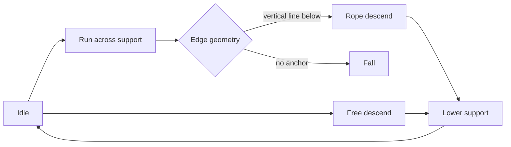
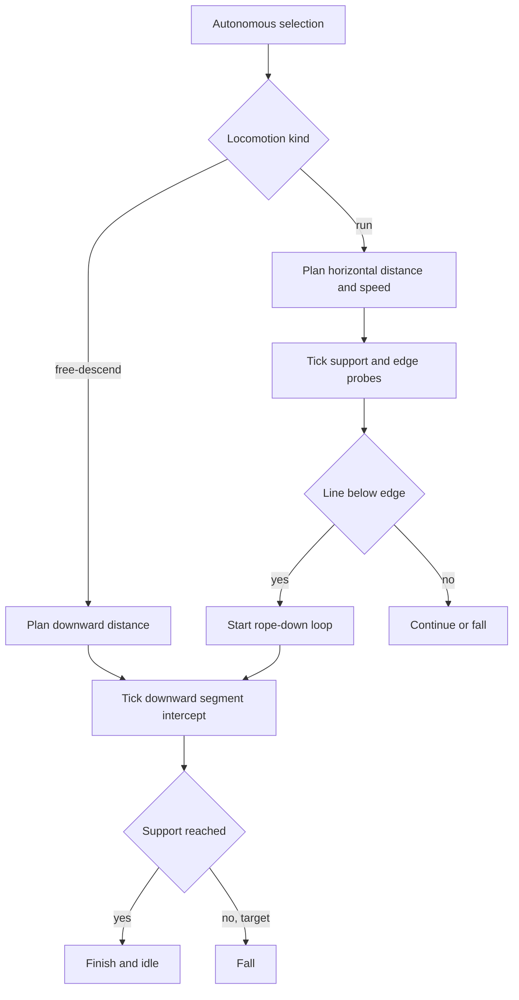
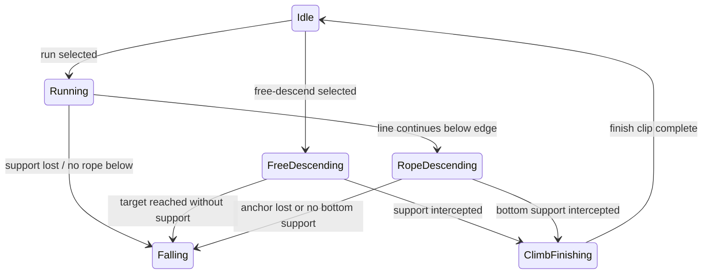

# Directional Climb and Run

> tier **M** — downward free/rope traversal, run locomotion, and autonomous movement cadence

## 1. 의도 (Intent)

| 항목 | 내용 |
|---|---|
| 문제 | 현재 수직 이동은 상승만 있고 수평 이동은 walk 한 종류라 화면 이동의 방향·속도 변화가 적다. |
| 목표 | 기존 상승 경로의 대칭인 하강 경로와 별도 run sprite/속도를 추가하고 자율 locomotion 선택 비중을 높인다. |
| 불변식 | 모든 목표는 work-area에 clamp한다. support/anchor loss, drag, hide, exit는 기존처럼 즉시 중단한다. run도 walk와 같은 edge fall·vertical-line encounter 규칙을 쓴다. |
| 비목표 | 대각선 벽, 곡선 rope, 키보드 직접 조작, 물리 가속도 기반 달리기는 이번 범위가 아니다. |

## 2. 수용 기준 (Acceptance)

| ID | 수용 기준 | 검증 방법 |
|---|---|---|
| AC-1 | run은 별도 4-frame loop를 사용하고 132 DIP/s로 300~700 DIP를 이동한다. walk는 180~480 DIP로 최대 약 6.7초 재생하며, run은 walk보다 큰 보폭·상체 기울기·팔 스윙이 보여야 한다. | asset/contact sheet 검수와 controller clock trace에서 clip, 속도, 목표 거리·최대 시간을 검증한다. |
| AC-2 | run은 walk와 동일하게 support를 매 tick 재검증하고 text 끝에서 fall, vertical line encounter에서 rope transition을 수행한다. | run edge-loss와 vertical-line runtime tests로 검증한다. |
| AC-3 | free descend는 현재 위치에서 아래쪽 sampled distance로 이동하며 매 tick 실제 이동 구간의 첫 horizontal support에 finish한다. support가 없으면 target 도달 후 Falling으로 전이한다. | 중간 intercept와 no-intercept trace로 검증한다. |
| AC-4 | walk/run으로 platform edge에 도달했을 때 아래로 이어지는 `VerticalLine`이 있으면 확률 판정 없이 rope descend를 시작한다. anchor bottom 또는 중간 support에 도달하면 finish하고, anchor가 사라지면 Falling으로 전이한다. | selector와 controller의 line-below-edge tests로 검증한다. |
| AC-5 | downward loop는 상승 loop의 역순 clip을 사용하되 별도 clip ID를 가져 runtime 방향을 명시한다. rope/free contact VFX는 하강 중에도 유지된다. | pack/catalog clip 순서와 frame contact metadata를 검증한다. |
| AC-6 | upward/downward 목표 Y는 각각 work-area top과 bottom-pet-height로 clamp되고, 실제 창이 clamp 지점에 도달한 tick에 climbing 상태를 종료한다. | 상·하단 boundary fixture로 검증한다. |
| AC-7 | locomotion 선택 비중은 walk+run 합계가 전체 autonomous weight의 70% 이상이고 idle 재선택 지연은 0.8~2.5초다. doze cooldown/user-input 억제는 보존한다. | definition weight와 planner boundary tests로 검증한다. |
| AC-8 | 모든 build frame을 clip 이름과 함께 순환하는 README용 GIF를 자산 빌드가 재현 가능하게 생성한다. | GIF decoder로 135개 frame과 256x288 크기를 검증하고 README 상대 경로를 확인한다. |

## 3. 확정 사실 (Findings)

| 사실 | 영향 |
|---|---|
| walk는 external completion과 support refresh를 이미 제공한다. | run은 동일 locomotion 경로에서 clip·속도·거리만 분리한다. |
| climb controller는 fixed X와 elapsed-time Y 이동을 공유한다. | 방향 부호와 target clamp를 일반화해 하강을 추가한다. |
| rope/free loop frame에는 contact metadata가 있다. | 역순 clip은 frame path와 contact를 함께 역순화할 수 있다. |

## 4. 유스케이스 / 시나리오

주 시나리오: 캐릭터는 idle에서 walk 또는 run을 더 자주 선택하고, platform edge 아래 수직선이 이어지면 줄을 타고 내려간다. free-descend는 화면 내부 목표까지 벽을 타고 내려가며 중간 support를 만나면 종료한다.

## 5. 파이프라인 (flowchart)

## 6. 액션 · 상태 전이 (action diagram)

## 9. 변경 지점

| 파일 | 변경 |
|---|---|
| `src/Bolttagu.Contracts/AnimationContracts.cs` | run/downward clip IDs를 추가한다. |
| `src/Bolttagu.Contracts/OverlayContracts.cs` | rope descent anchor와 downward intercept query를 surface provider 계약에 추가한다. |
| `src/Bolttagu.Core/BehaviorDefinition.cs` | run/free-descend definitions와 locomotion weight를 추가한다. |
| `src/Bolttagu.Core/BehaviorPlanner.cs` | run plan, descend plan, 짧아진 idle delay를 제공한다. |
| `src/Bolttagu.Runtime/PetAnimationController.cs` | Running/descending state와 bounded movement를 구현한다. |
| `src/Bolttagu.Platform.Windows/DesktopSurfaceProvider.cs` | line-below-edge 및 downward intercept selector를 구현한다. |
| `asset/bolttagu/derived/animations/pack.json` | run 및 역순 climb-down clips를 선언한다. |
| `tests/Bolttagu.Runtime.Tests/PetAnimationControllerTests.cs` | run/downward controller trace를 추가한다. |
| `tests/Bolttagu.Architecture.Tests/DesktopSurfaceSelectorTests.cs` | line-below-edge와 downward intercept를 검증한다. |
| `tests/Bolttagu.Assets.Tests/AssetPipelineTests.cs` | run/downward clip과 frame order를 검증한다. |
| `tools/Bolttagu.AssetBuild/Program.cs` | 전체 clip 순환 GIF를 build review artifact로 생성한다. |
| `README.md` | animation showcase GIF와 새 locomotion 동작을 노출한다. |

## 10. 잠재 문제 & 대응

| 리스크 | 대응 |
|---|---|
| 하강 시작 직후 현재 support를 다시 잡는다. | downward intercept는 시작 foot Y보다 3 DIP 아래인 surface만 허용한다. |
| run이 thin text surface를 한 tick에 건너뛴다. | walk와 같은 support refresh를 유지하고 leading edge rope check 뒤 fall한다. |
| 화면 하단 밖의 목표로 climbing이 지속된다. | target top을 `workArea.Bottom - petHeight`로 clamp한다. |
| 역순 loop의 contact가 artwork와 어긋난다. | frame path와 contacts를 함께 역순으로 catalog에 컴파일한다. |

## 11. 착수 순서

- [x] 1. run/downward clip 계약과 pack/catalog validation을 추가한다. (AC-1, AC-5)
- [x] 2. run/free-descend planner와 autonomous weights를 추가한다. (AC-1, AC-7)
- [x] 3. downward selector와 controller state transition을 구현한다. (AC-2, AC-3, AC-4, AC-6)
- [x] 4. run 4-frame artwork를 생성하고 contact sheet로 검수한다. (AC-1)
- [x] 5. 전체 frame 순환 GIF를 빌드하고 README에 연결한다. (AC-8)
- [x] 6. 전체 test/build 및 실제 runtime을 검증한다. (AC-1~AC-8)
