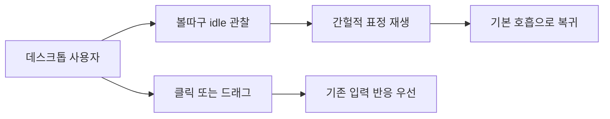
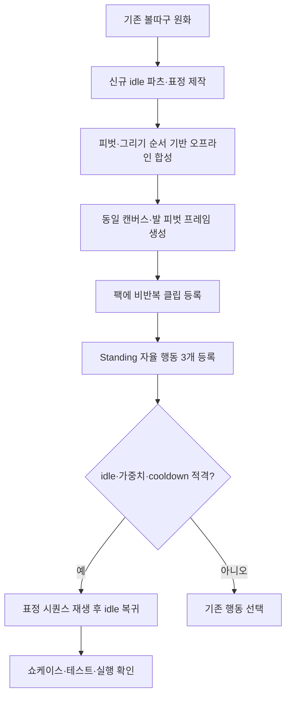
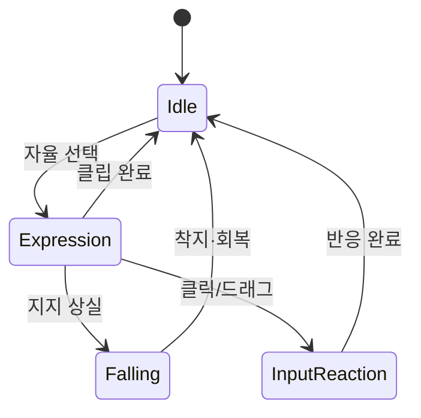

# Idle expression variants

## 1. 의도 (Intent)

| 항목 | 내용 |
|---|---|
| 문제 | 대기 중 같은 호흡 표정이 반복되어 캐릭터의 감정 표현이 단조롭다. |
| 왜 지금 | 이동·낙하·클라이밍이 안정된 상태에서 화면에 머무는 순간의 개성을 높일 수 있다. |
| 주 사용자 | 데스크톱에서 볼따구를 띄워 놓고 일하는 사용자. |
| 불변식 | 볼따구의 기존 의상·색·실루엣·발바닥 기준점 유지. 걷기·달리기·낙하·클라이밍·클릭·드래그를 가로막지 않는다. 외부 캐릭터·이모티콘의 원화를 복제하지 않는다. |
| 비목표 | 기존 이동/충돌 로직 변경, 새로운 상호작용 입력, 몰루콘 원본 스프라이트 사용, 기존 모든 클립의 일괄 리깅. |

## 2. 수용 기준 (Acceptance)

| ID | 수용 기준 | 검증 방법 |
|---|---|---|
| AC-1 | 기존 볼따구 외형을 유지한 서로 구별되는 idle 행동 3종이 각각 표정과 대응 몸짓을 포함한 비반복 클립으로 재생되고 기본 호흡으로 돌아간다. 멍함은 느린 눈깜빡임·고개 기울임, 뿌듯함은 눈웃음·가슴 펴기·허리 손, 삐짐은 볼 부풀림·팔 모으기·작은 홱 돌림을 기본안으로 한다. | 자산 빌드·카탈로그 테스트와 투명 배경 프레임/GIF 육안 확인. |
| AC-2 | 세 표정은 서 있는 idle에서만 낮은 가중치로 선택되고, 연속 반복을 피하며, 걷기·달리기 빈도와 사용자 입력 우선순위를 손상하지 않는다. | 행동 정의/플래너/런타임 테스트에서 선택·쿨다운·중단·복귀 확인. |
| AC-3 | 표정 전환 중 캐릭터 발 위치가 고정되며 기존 애니메이션과 앵커가 일치한다. | 프레임 알파 바운드/피벗 검사 및 실제 Windows 실행에서 발판 접촉과 전환 육안 확인. |
| AC-4 | README 애니메이션 쇼케이스와 실행 자산에 새 표정이 포함된다. | 자산 파이프라인 재생성, GIF·매니페스트 및 실행 클립 확인. |
| AC-5 | 신규 idle 행동의 소스는 머리(얼굴/앞머리/장식 포함)·몸통·좌우 팔·좌우 다리·캐릭터 부착 효과를 독립 파츠와 고정된 피벗/그리기 순서로 관리하고, 빌드 시 기존 512×512 프레임으로 합성할 수 있다. 기존 클립과 런타임 카탈로그 형식은 유지한다. | 레이어 소스/메타데이터 검증, 합성 프레임 비교 및 기존 클립 회귀 테스트. |

## 3. 확정 사실 (Findings)

| 항목 | 확인된 사실 | 설계 반영 |
|---|---|---|
| 기본 idle | `pack.json`의 `idle_breathe`는 512×512, 4프레임 반복 클립이고 피벗은 (256, 480)이다(파일 확인). | 새 표정도 같은 캔버스·발 피벗을 쓴다. |
| 행동 문법 | `BehaviorDefinitions.Autonomous`에 `LookAround` 20, `Stretch` 15, `Walk` 80, `Run` 55 등이 있으며 각 행동은 clip step을 가진다(코드 확인). | 표정은 별도 Standing→Standing 행동 3개로 추가한다. |
| 선택 조건 | `BehaviorPlanner.ChooseAutonomousBehavior`는 idle hub 진입 1.5초 이후 가중 선택하고 최근 2개 행동 및 행동별 cooldown을 배제한다(코드 확인). | 표정 가중치는 이동보다 낮게 두고 별도 cooldown을 준다. |
| 복귀 경로 | `PetAnimationController.OnSequenceCompleted`가 `EnterIdle`을 호출하며 `EnterIdle`은 `idle_breathe`를 재생한다(코드 확인). | 비반복 표정 시퀀스 완료 후 기존 복귀 경로를 재사용한다. |
| 자산 파이프라인 | `README.md`에 `tools/Bolttagu.AssetBuild -- all` 명령이 있고 쇼케이스 GIF는 `asset/bolttagu/build/review/animation-showcase.gif`다(파일 확인). | 자산 레시피·팩·쇼케이스를 함께 갱신한다. |
| 현재 렌더 경계 | `PetSpriteView`는 매 틱 하나의 atlas crop을 단일 `Image`에 넣는다. 자산 빌더는 프레임 PNG를 atlas에 그린다(코드 확인). | 레이어 합성은 먼저 빌드 단계에 넣고 런타임 계약은 유지한다. |
| 원본 형태 | `asset/bolttagu`의 확인된 원본·파생 이미지에는 PSD/ORA 등 파츠가 분리된 편집 파일이 없고 PNG와 JSON 레시피가 있다(파일 목록 확인). | 기존 통짜 PNG의 기계적 분할이 아닌 신규 idle 파츠 제작이 필요하다. |
| 접촉 효과 | `ContactVfxWindow`가 손·발 접촉 이펙트를 별도 창으로 그린다(코드 확인). | 화면/발판 접촉 VFX는 캐릭터 리그의 배경 파츠로 합치지 않는다. |
| 자산 출처 기록 | 현재 빌더의 model 입력 해시는 최상위 `model/*.png`만 집계한다(코드 확인). | 리그 파츠 하위 폴더와 JSON을 출처 해시에 포함해야 한다. |
| 회귀 기준 | 기존 자산 테스트는 135프레임과 일부 클립 목록을 고정한다(테스트 확인). | 새 클립 등록과 쇼케이스 기대치를 함께 갱신한다. |

## 4. 유스케이스 / 시나리오

**주 시나리오**: 캐릭터가 발판 위에서 서서 쉰다 → 간헐적으로 멍함·뿌듯함·삐짐 중 하나를 표정과 대응 몸짓으로 짧게 표현한다 → 기본 호흡으로 돌아간다.

**예외 시나리오**: 표정 중 지지가 사라지거나 사용자 입력이 오면 기존 중단 경로가 표정 시퀀스를 정리하고 낙하/입력 반응으로 전환한다. 누락된 자산은 빌드/카탈로그 검증에서 실패한다.

## 5. 파이프라인 (flowchart)

## 6. 액션 · 상태 전이 (action diagram)

| 상태 | 저장/이벤트 | UI 반응 |
|---|---|---|
| Idle | 기존 idle hub·선택 기록 유지 | 호흡 클립 반복 |
| Expression | 선택한 행동 ID·시퀀스 진행 | 비반복 표정 클립, 발 피벗 고정 |
| Falling/InputReaction | 기존 중단 경로로 표정 시퀀스 해제 | 기존 낙하/클릭/드래그 애니메이션 우선 |

## 9. 변경 지점

| 파일 | 변경 |
|---|---|
| `asset/bolttagu/derived/model/animation-recipes.json` | 기존 일체형 클립의 레시피는 유지한다. 새 idle은 별도의 레이어 리그에서 합성한다. |
| `asset/bolttagu/derived/model/idle-rig.json` (신규) | 신규 idle 파츠의 피벗·계층·그리기 순서·행동별 키프레임 정의. |
| `asset/bolttagu/derived/model/idle-rig/` (신규) | 머리/몸통/좌우 팔·다리/캐릭터 부착 효과의 투명 PNG 소스. |
| `asset/bolttagu/derived/animations/pack.json` | 3종 비반복 클립·동일 피벗 추가. |
| `tools/Bolttagu.AssetBuild/Program.cs` | idle 파츠를 프레임으로 합성하는 빌드 경로와 검증 추가. |
| `src/Bolttagu.Contracts/AnimationContracts.cs` | 표정 클립 ID 추가. |
| `src/Bolttagu.Core/BehaviorDefinition.cs` | 낮은 가중치·cooldown의 서 있는 표정 행동 추가. |
| `tests/Bolttagu.Runtime.Tests/BehaviorGrammarTests.cs` | 새 행동의 클립·가중치·반복 방지 검사. |
| `tests/Bolttagu.Assets.Tests/AssetPipelineTests.cs` | 프레임·피벗·쇼케이스 검사. |
| `README.md` | 새 idle 표정 설명 및 쇼케이스 갱신 안내. |

## 10. 잠재 문제 & 대응

| 문제 | 대응 |
|---|---|
| 이미지 생성물이 원화와 다르거나 발 위치가 흔들릴 수 있다. | 기존 원화를 참조하고 프레임을 육안 선별한다. 부적합한 결과는 채택하지 않는다. |
| 가중치가 이동 빈도를 떨어뜨릴 수 있다. | 표정 행동 각각 이동보다 낮게 설정하고 분포 테스트로 확인한다. |
| 원본 이모티콘과 닮아 보일 수 있다. | 표현 원리만 참고하고 볼따구 고유 외형·포즈를 유지한다. 외부 이미지는 자산에 포함하지 않는다. |
| 기존 납작한 원화에는 팔·머리 뒤의 가려진 영역이 없다. | 새 idle 파츠에서 필요한 가림 영역을 보완해 그린다. 기존 클립은 그대로 둔다. |
| 팔 교차·머리 회전 시 단순 레이어 순서로 앞뒤 관계가 어긋날 수 있다. | 앞/뒤 슬롯과 행동별 그리기 순서를 키프레임에 명시하고 프레임별 육안 검사한다. |

## 11. 착수 순서

- [x] 1. 신규 idle 파츠의 계층·피벗·그리기 순서를 정의하고 멍함 한 클립을 합성·검증한다 (AC-1, AC-3, AC-5).
- [x] 2. 뿌듯함·삐짐 행동과 자율 선택·중단·쿨다운 검증을 추가한다 (AC-1, AC-2, AC-3, AC-5).
- [ ] 3. 쇼케이스·README를 갱신하고 자산/런타임 테스트와 실제 실행을 확인한다 (AC-4).

현재 구현은 브랜치의 검토 후보이다. 자산 빌드·테스트·프레임 육안 확인은 완료했지만,
실제 Windows 화면에서 발판 접촉과 표정 전환은 아직 확인하지 않았다. 머리 장식/광륜은
현재 `head` 파츠에 포함되어 있어 독립적인 캐릭터 부착 효과 파츠도 후속 작업이다.
기존 손발 접촉 배경 VFX는 별도 런타임 창으로 유지한다. `model.json`의 새 idle 리그 상태는
사용자의 최종 아트 확인 전까지 `candidate`로 둔다.
