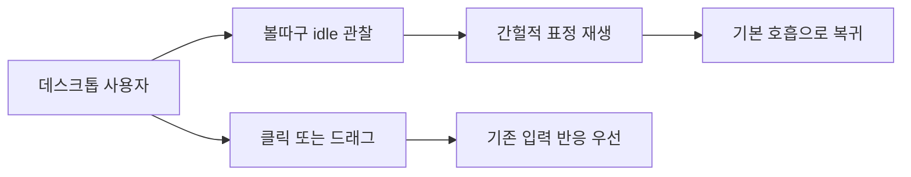
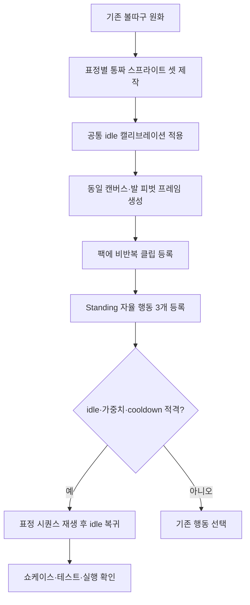
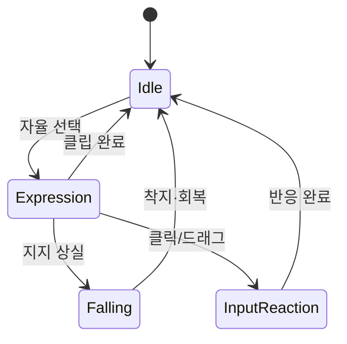

# Idle expression variants

## 1. 의도 (Intent)

| 항목 | 내용 |
|---|---|
| 문제 | 대기 중 같은 호흡 표정이 반복되어 캐릭터의 감정 표현이 단조롭다. |
| 왜 지금 | 이동·낙하·클라이밍이 안정된 상태에서 화면에 머무는 순간의 개성을 높일 수 있다. |
| 주 사용자 | 데스크톱에서 볼따구를 띄워 놓고 일하는 사용자. |
| 불변식 | 볼따구의 짧은 오픈 자켓·초록 셔츠·색·실루엣·발바닥 기준점 유지. 각 프레임은 머리·옷·팔·다리가 함께 그려진 통짜 원화이며 자켓이 망토처럼 분리되어 보이지 않아야 한다. 걷기·달리기·낙하·클라이밍·클릭·드래그를 가로막지 않는다. 외부 캐릭터·이모티콘의 원화를 복제하지 않는다. |
| 비목표 | 기존 이동/충돌 로직 변경, 새로운 상호작용 입력, 몰루콘 원본 스프라이트 사용, 신규 표정의 파츠별 리깅. |

## 2. 수용 기준 (Acceptance)

| ID | 수용 기준 | 검증 방법 |
|---|---|---|
| AC-1 | 기존 볼따구 외형을 유지한 서로 구별되는 idle 행동 3종이 각각 표정과 대응 몸짓을 포함한 비반복 클립으로 재생되고 기본 호흡으로 돌아간다. 멍함은 느린 눈깜빡임·고개 기울임, 뿌듯함은 눈웃음·가슴 펴기·허리 손, 삐짐은 볼 부풀림·팔 모으기·작은 홱 돌림을 기본안으로 한다. | 자산 빌드·카탈로그 테스트와 투명 배경 프레임/GIF 육안 확인. |
| AC-2 | 세 표정은 서 있는 idle에서만 낮은 가중치로 선택되고, 연속 반복을 피하며, 걷기·달리기 빈도와 사용자 입력 우선순위를 손상하지 않는다. | 행동 정의/플래너/런타임 테스트에서 선택·쿨다운·중단·복귀 확인. |
| AC-3 | 표정 전환 중 캐릭터 발 위치가 고정되며 기존 애니메이션과 앵커가 일치한다. | 프레임 알파 바운드/피벗 검사 및 실제 Windows 실행에서 발판 접촉과 전환 육안 확인. |
| AC-4 | README 애니메이션 쇼케이스와 실행 자산에 새 표정이 포함된다. | 자산 파이프라인 재생성, GIF·매니페스트 및 실행 클립 확인. |
| AC-5 | 신규 idle 3종은 기존 자산 파이프라인처럼 표정별 통짜 스프라이트 셋을 `animation-recipes.json`에서 잘라 생성하고, 각 셋의 크기 기준은 공통 `canonical-idle-calibration-v1.png`로 고정한다. 레이어 리그는 빌드·런타임 경로에서 제거하고 기존 카탈로그 형식은 유지한다. | 레시피·캘리브레이션·생성 프레임·리그 참조 부재 검사와 기존 클립 회귀 테스트. |

## 3. 확정 사실 (Findings)

| 항목 | 확인된 사실 | 설계 반영 |
|---|---|---|
| 기본 idle | `pack.json`의 `idle_breathe`는 512×512, 4프레임 반복 클립이고 피벗은 (256, 480)이다(파일 확인). | 새 표정도 같은 캔버스·발 피벗을 쓴다. |
| 행동 문법 | `BehaviorDefinitions.Autonomous`에 `LookAround` 19, `Stretch` 14, `Walk` 80, `Run` 55 등이 있으며 각 행동은 clip step을 가진다(코드 확인). | 표정은 별도 Standing→Standing 행동 3개로 추가한다. |
| 선택 조건 | `BehaviorPlanner.ChooseAutonomousBehavior`는 idle hub 진입 1.5초 이후 가중 선택하고 최근 2개 행동 및 행동별 cooldown을 배제한다(코드 확인). | 표정 가중치는 이동보다 낮게 두고 별도 cooldown을 준다. |
| 복귀 경로 | `PetAnimationController.OnSequenceCompleted`가 `EnterIdle`을 호출하며 `EnterIdle`은 `idle_breathe`를 재생한다(코드 확인). | 비반복 표정 시퀀스 완료 후 기존 복귀 경로를 재사용한다. |
| 자산 파이프라인 | `README.md`에 `tools/Bolttagu.AssetBuild -- all` 명령이 있고 쇼케이스 GIF는 `asset/bolttagu/build/review/animation-showcase.gif`다(파일 확인). | 자산 레시피·팩·쇼케이스를 함께 갱신한다. |
| 현재 렌더 경계 | `PetSpriteView`는 매 틱 하나의 atlas crop을 단일 `Image`에 넣는다. 자산 빌더는 프레임 PNG를 atlas에 그린다(코드 확인). | 기존 통짜 프레임/atlas 계약을 그대로 쓴다. |
| 검증된 제작 방식 | `look-around-grid-v2.png`·`stretch-grid-v2.png`는 통짜 캐릭터 셀과 `animation-recipes.json`의 셀별 sourceRect, 별도 `canonical-idle-calibration-v1.png`로 빌드된다(파일·레시피 확인). | 신규 표정도 동일한 방식으로 제작한다. |
| 실패한 레이어 시안 | 기존 `idle-rig` 결과는 자켓 앞섶과 소매가 분리되며 망토 같은 실루엣이 되었고, 사용자가 부적합하다고 판단했다(대화·프레임 확인). | 레이어 아트는 채택하지 않고 통짜 원화로 교체한다. |
| 접촉 효과 | `ContactVfxWindow`가 손·발 접촉 이펙트를 별도 창으로 그린다(코드 확인). | 화면/발판 접촉 VFX는 캐릭터 리그의 배경 파츠로 합치지 않는다. |
| 자산 출처 기록 | 현재 빌드 매니페스트가 model PNG와 레시피를 해시한다(코드 확인). | 신규 통짜 셋을 매니페스트 입력에 포함한다. |
| 회귀 기준 | 자산 테스트가 전체 프레임·개별 GIF 길이와 발바닥 좌표를 고정한다(테스트 확인). | 156프레임, 새 클립 7프레임과 크기·바닥선 기대치를 함께 갱신한다. |

## 4. 유스케이스 / 시나리오

**주 시나리오**: 캐릭터가 발판 위에서 서서 쉰다 → 간헐적으로 멍함·뿌듯함·삐짐 중 하나를 표정과 대응 몸짓으로 짧게 표현한다 → 기본 호흡으로 돌아간다.

**예외 시나리오**: 표정 중 지지가 사라지거나 사용자 입력이 오면 기존 중단 경로가 표정 시퀀스를 정리하고 낙하/입력 반응으로 전환한다. 누락된 자산은 빌드/카탈로그 검증에서 실패한다.

## 5. 파이프라인 (flowchart)

## 6. 액션 · 상태 전이 (action diagram)

| 상태 | 저장/이벤트 | UI 반응 |
|---|---|---|
| Idle | 기존 idle hub·선택 기록 유지 | 호흡 클립 반복 |
| Expression | 선택한 행동 ID·시퀀스 진행 | 비반복 표정 클립, 발 피벗 고정 |
| Falling/InputReaction | 기존 중단 경로로 표정 시퀀스 해제 | 기존 낙하/클릭/드래그 애니메이션 우선 |

## 9. 변경 지점

| 파일 | 변경 |
|---|---|
| `asset/bolttagu/derived/model/animation-recipes.json` | 세 표정의 통짜 스프라이트 셋·셀 경계·공통 idle 캘리브레이션 등록. |
| `asset/bolttagu/derived/model/idle-*-grid-v1.png` (신규) | 표정별 전신 포즈 원화. |
| `asset/bolttagu/derived/animations/pack.json` | 3종 비반복 클립·동일 피벗 추가. |
| `tools/Bolttagu.AssetBuild/Program.cs` | 별도 리그 합성 호출 제거; 기존 레시피 경로 사용. |
| `src/Bolttagu.Contracts/AnimationContracts.cs` | 표정 클립 ID 추가. |
| `src/Bolttagu.Core/BehaviorDefinition.cs` | 낮은 가중치·cooldown의 서 있는 표정 행동 추가. |
| `tests/Bolttagu.Runtime.Tests/BehaviorGrammarTests.cs` | 새 행동의 클립·가중치·반복 방지 검사. |
| `tests/Bolttagu.Assets.Tests/AssetPipelineTests.cs` | 프레임·피벗·쇼케이스 검사. |
| `README.md` | 새 idle 표정 설명 및 쇼케이스 갱신 안내. |

## 10. 잠재 문제 & 대응

| 문제 | 대응 |
|---|---|
| 이미지 생성물이 원화와 다르거나 발 위치가 흔들릴 수 있다. | 기존 원화를 참조하고 프레임을 육안 선별한다. 부적합한 결과는 채택하지 않는다. |
| 가중치가 이동 빈도를 떨어뜨릴 수 있다. | 표정 행동 각각 이동보다 낮게 설정하고 분포 테스트로 확인한다. |
| 원본 이모티콘과 닮아 보일 수 있다. | 표현 원리만 참고하고 볼따구 고유 외형·포즈를 유지한다. 외부 이미지는 자산에 포함하지 않는다. |
| 통짜 셀 간 머리·옷·발 위치가 흔들릴 수 있다. | 공통 calibration을 고정하고 프레임별 실루엣·발바닥을 육안 및 메트릭으로 비교한다. |
| 이미지 생성물이 망토처럼 보이거나 자켓 디테일을 잃을 수 있다. | 기존 원화를 강한 참조로 사용하고 자켓·초록 셔츠·고유 장식의 유지 여부를 셀마다 검수한다. |

## 11. 착수 순서

- [x] 1. 멍함 통짜 셋과 공통 idle 캘리브레이션으로 프레임을 만들고 원본 실루엣을 비교한다 (AC-1, AC-3, AC-5).
- [x] 2. 뿌듯함·삐짐 셋을 같은 방식으로 만들고 기존 행동 선택·중단 검증을 유지한다 (AC-1, AC-2, AC-3, AC-5).
- [ ] 3. 레이어 리그 경로를 제거하고 쇼케이스·README·테스트를 갱신한 뒤 실제 실행을 확인한다 (AC-4, AC-5).

2026-09-22: 사용자가 레이어 시안의 외형을 거부하고 기존 통짜 셋 + 공통 idle 캘리브레이션으로
방향을 변경했다. 기존 리그 커밋은 히스토리에 남지만 이 설계의 최종 구현으로 채택하지 않는다.
손발 접촉 배경 VFX는 별도 런타임 창으로 유지한다. 새 원화는 사용자 육안 승인 전까지 `candidate`다.
