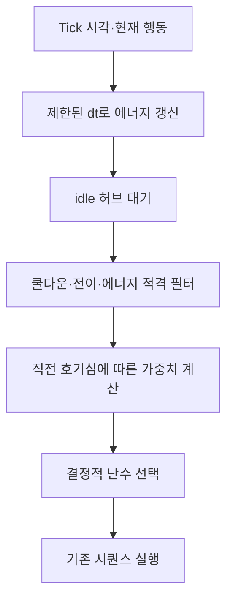
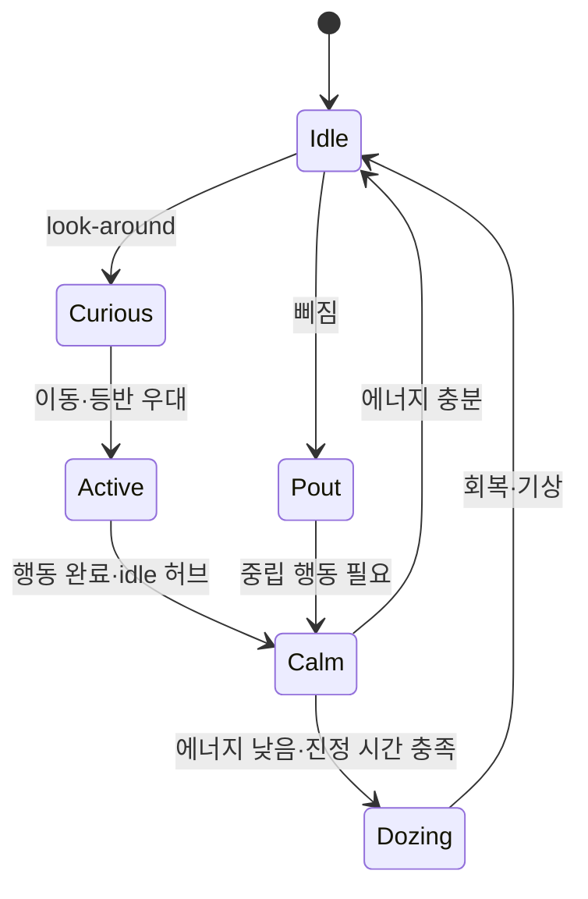

# Mood and transition continuity

## 1. 의도 (Intent)

| 항목 | 내용 |
|---|---|
| 문제 | 자율 행동이 가중치만으로 이어져 달리기 직후 졸거나 삐진 직후 웃는 듯한 부자연스러운 연결이 가능하다. |
| 왜 지금 | 통짜 표정 3종을 도입하면서 표정과 이동의 연속성이 실제 품질을 좌우한다. |
| 주 사용자 | 작업 중 데스크톱 펫의 행동을 간헐적으로 보는 사용자. |
| 불변식 | 발판·낙하·클라이밍 물리 판정과 클릭·드래그 우선순위를 유지한다. 자율 행동만 제한하고 안전 중단은 제한하지 않는다. |
| 비목표 | 영속 저장, 복잡한 감정 시뮬레이션, 새 UI 게이지, 스프라이트 재제작. |

## 2. 수용 기준 (Acceptance)

| ID | 수용 기준 | 검증 방법 |
|---|---|---|
| AC-1 | 에너지는 0~100으로 한정되고 걷기보다 달리기·등반에서 더 빠르게 감소하며 idle·졸기에서 회복한다. 큰 틱 간격은 상한을 두어 일시 중단 뒤 즉시 방전되지 않는다. | 가짜 시간으로 Core 단위 테스트. |
| AC-2 | 충분히 피곤하고 최근 이동/입력 이후 진정 시간이 지난 때만 자율 졸기를 선택한다. 낮은 에너지에서는 달리기·자율 등반을 피하되 사용자 입력과 필수 물리 이동은 계속된다. | 플래너 및 런타임 테스트. |
| AC-3 | 호기심(`look-around`) 뒤에는 짧은 시간 이동·등반 가중치가 커지고, 삐짐 직후 뿌듯함 및 그 역방향은 직접 전이하지 않는다. | 결정적 난수 기반 전이 테스트. |
| AC-4 | 행동 시퀀스가 끝나기 전 다른 자율 행동을 끼워 넣지 않고, 표정은 정본 idle을 거쳐 복귀한다. | 기존 BehaviorSequenceRunner·Controller 회귀 테스트. |

## 3. 확정 사실 (Findings)

| 항목 | 확인된 사실 | 설계 반영 |
|---|---|---|
| 현재 플래너 | `BehaviorPlanner`는 1.5초 idle 허브, 최근 2개 ID, 개별 쿨다운과 가중치만 사용한다(코드 확인). | 에너지와 직전 행동 문맥은 플래너가 소유한다. |
| 현재 졸기 | `SitDoze`는 최근 이동 8초·입력 10초 동안만 금지되며 나머지는 5 가중치로 선택된다(코드 확인). | 저에너지 조건을 추가하고 회복량을 계산한다. |
| 활동 정보 | `PetAnimationController.Tick`이 현재 Walking/Running/Climbing 및 시퀀스 정보를 안다(코드 확인). | 경과 시간과 활동 등급을 플래너에 전달한다. |
| 시퀀스 | `BehaviorSequenceRunner`는 한 정의의 step을 순서대로 재생하고 완료 시 idle로 돌아간다(코드·테스트 확인). | 기존 시퀀스 경계는 유지한다. |

## 4. 유스케이스 / 시나리오

**주 시나리오**: 둘러보기 → 이동/등반 → 활동량에 따른 피로 축적 → 잠시 진정 → 저에너지에서 앉아 졸기 → 회복.

**예외 시나리오**: 클릭·드래그, 발판 소실, 화면 변화는 기존 우선순위대로 즉시 중단한다. 프로그램이 장시간 멈춘 뒤 돌아와도 한 틱에서 에너지가 모두 소모되지 않는다.

## 5. 파이프라인 (flowchart)

## 6. 액션 · 상태 전이 (action diagram)

| 상태 | 저장/이벤트 | UI 반응 |
|---|---|---|
| Active | 걷기·달리기·등반 활동 등급, 경과 시간 | 기존 클립 그대로 재생. |
| Calm | 최근 이동·입력 시각, 에너지 | idle 호흡으로 연결. |
| Dozing | 낮은 에너지와 졸기 시퀀스 | 기존 앉기→졸기→기상 클립. |
| Curious/Pout | 직전 자율 행동 ID와 시각 | 새 UI 없이 후속 선택에만 반영. |

## 9. 변경 지점

| 파일 | 변경 |
|---|---|
| `src/Bolttagu.Core/BehaviorPlanner.cs` | 에너지 갱신·후보 적격성·전이 가중치 추가. |
| `src/Bolttagu.Runtime/PetAnimationController.cs` | Tick에서 활동 등급을 전달. |
| `tests/Bolttagu.Runtime.Tests/BehaviorGrammarTests.cs` | 에너지·졸기·호기심·감정 전이 단위 테스트. |
| `tests/Bolttagu.Runtime.Tests/PetAnimationControllerTests.cs` | 기존 중단/복귀 회귀 테스트 유지. |

## 10. 잠재 문제 & 대응

| 문제 | 대응 |
|---|---|
| 너무 드문 졸기 또는 활동이 생길 수 있다. | 계수와 임계값을 명명한 상수로 두고 선택 테스트와 실제 실행에서 조정한다. |
| 상태 갱신이 프레임률에 따라 달라질 수 있다. | 시각 차이를 사용하며 한 틱 최대 1초만 반영한다. |
| 물리적으로 필요한 등반까지 막을 수 있다. | 플래너의 자율 후보만 필터링하고 지지 상실·필수 클라이밍 경로는 건드리지 않는다. |

## 11. 착수 순서

- [x] 1. 에너지 모델과 활동별 갱신, 결정적 테스트를 추가한다 (AC-1).
- [x] 2. 저에너지 졸기와 자율 이동/등반 제한을 추가한다 (AC-2).
- [x] 3. 호기심·상반 감정 전이와 기존 시퀀스 회귀를 확인한다 (AC-3, AC-4).
