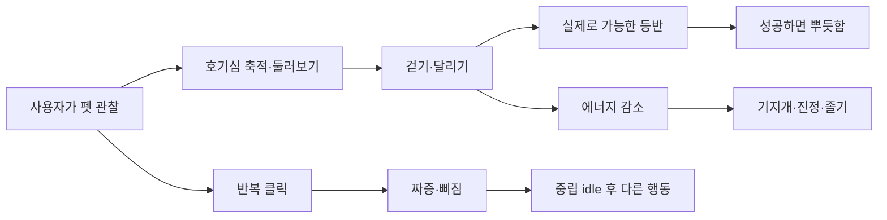
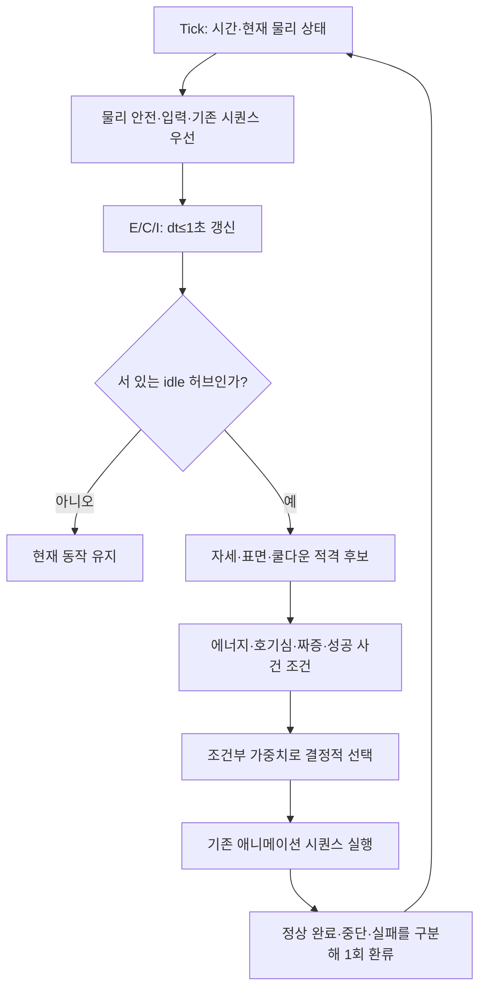
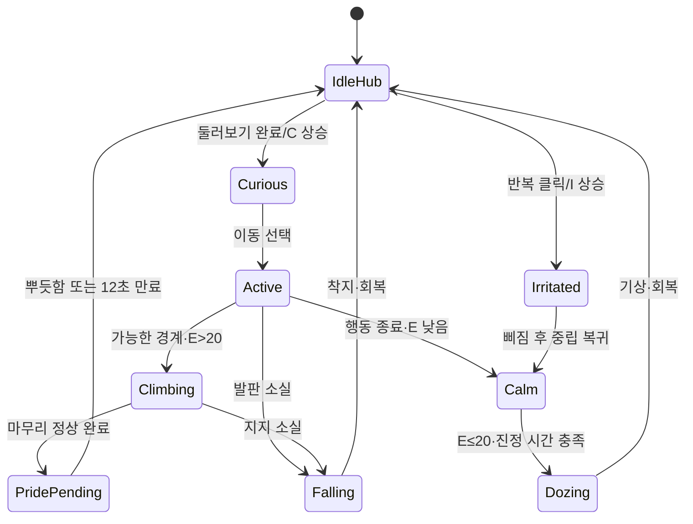
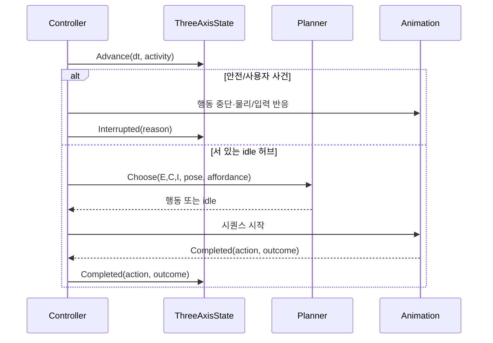

# Autonomous state and action dynamics

## 1. 의도 (Intent)

| 항목 | 내용 |
|---|---|
| 문제 | 기존 플래너는 에너지 1축과 직전 행동 타이머만 사용한다. 뿌듯함·삐짐은 이유 없이 무작위로 나올 수 있고 호기심은 둘러보기 클립 완료가 아닌 선택 시점에 켜진다. |
| 왜 지금 | 현재 애니메이션 셋의 자연스러움은 새 클립 수보다 상태·사건·다음 행동의 인과관계에 달려 있다. |
| 주 사용자 | 작업 화면에서 볼따구를 간헐적으로 관찰하는 사용자. |
| 불변식 | 물리 안전(발판 소실·낙하·착지), 종료, 사용자 입력이 자율 선택보다 우선한다. 진행 중인 행동을 무드 임계값으로 중간 취소하거나 순간이동시키지 않는다. 한 번에 하나의 행동 시퀀스만 재생한다. |
| 비목표 | 새 스프라이트·게이지 UI, 화면 인식 수정, 강화학습 모델 훈련, ConnectomeAGA/Engram 실연동, 앱 재시작 간 상태 저장. |

사용자가 정한 1차 모델은 **에너지 E(움직임), 호기심 C(동적 행동), 짜증 I(사용자 입력)**의 3축이다. 지루함 축은 두지 않는다. 아래 수치는 초기 튜닝값이며 시드 고정 시뮬레이션과 실제 화면 관찰로 조정한다. 기존 `0013-mood-transition-continuity.md`의 단일 에너지 모델을 교체한다.

## 2. 수용 기준 (Acceptance)

| ID | 수용 기준 | 검증 방법 |
|---|---|---|
| AC-1 | E/C/I는 0~100으로 제한되고 단조시계의 경과 시간으로 갱신한다. 한 틱 최대 1초만 적용하며 동일 입력·시드는 동일 상태/행동 trace를 만든다. | Core 가짜 시간 및 결정성 테스트. |
| AC-2 | 기존 자율 행동 10종은 아래 표의 조건·효과에 연결된다. E가 낮으면 달리기·자율 등반을 줄이고 진정 후 졸며, C가 높으면 이동·등반이 늘고, I가 높을 때만 삐진다. | 모든 행동 ID의 적격성/가중치/완료 이벤트 표 기반 테스트. |
| AC-3 | 둘러보기 **정상 완료**만 C를 충전한다. 반복된 유효 클릭만 I를 올리고, 성공한 등반 완료만 뿌듯함 기회를 만든다. 중단·낙하·종료는 성공 이벤트를 만들지 않는다. | Controller/Planner 이벤트 순서 테스트. |
| AC-4 | 달리기→즉시 졸기 및 삐짐↔뿌듯함 직접 전이가 없다. 물리/입력 사건은 무드를 무시하고 즉시 처리하며, 후보가 없으면 idle을 유지한다. | 금지 전이 행렬 및 사용자 입력/지지면 소실 회귀 테스트. |
| AC-5 | 시드 고정 10분 시뮬레이션이 선택 이유·E/C/I·전이·중단 원인을 기록한다. 무한 상태/연속 재입면이 없고 행동 비율을 검토할 수 있다. | 시뮬레이션 trace와 실제 Windows 런타임 관찰. |

## 3. 확정 사실 (Findings)

| 항목 | 확인된 사실 | 설계 반영 |
|---|---|---|
| 착수 당시 에너지 | 이전 `BehaviorPlanner.AdvanceMood`는 E=100에서 시작하며 idle +0.25/s, 걷기 -0.9/s, 달리기 -2.5/s, 등반 -2/s, 졸기 +7/s와 dt≤1초를 사용했다(착수 시 코드 확인). | 10분 시뮬레이션에서 졸기 6회로 확인되어 소모율을 낮추고, 낙하·드래그·종료를 휴식으로 계산하지 않는다. |
| 선택기 | idle 허브 1.5초, 최근 2행동·쿨다운·가중 추첨이 있다. E≤20에서 졸기 후보, E≤8에서 강제 선택이다(코드 확인). | 안전/입력/시퀀스 완료/동기별 자율 후보의 우선순위를 명시한다. |
| 행동 목록 | 현재 `BehaviorDefinitions.Autonomous`에는 Walk, Run, LookAround, Stretch, IdleDazed, IdleProud, IdlePout, SitDoze, FreeClimb, FreeDescend 10종이 있다(코드 확인). | 각 행동을 빠짐없이 아래 수치 표에 연결한다. |
| 표현 시점 | 세 표정 각 1.7초, 둘러보기 1.1초, 기지개 1.12초, 앉기 0.76초, 졸기 한 순환 2.4초다(`pack.json` 확인). | 표정 사이의 중립 시간과 졸기 전 진정 시간이 클립 길이보다 짧지 않아야 한다. |
| 완료 경계 | `BehaviorSequenceRunner.Completed`는 정상 완료에만 발생한다. 자유/줄 등반 마무리는 `PetAnimationController.OnPlaybackCompleted`에서 별도로 `EnterIdle`한다(코드 확인). | 둘러보기/등반 성공 사건을 각각 올바른 완료 경계에서 1회 발행한다. |
| 사용자 입력 | `ReactToClick`은 유효한 자세에서 클릭 반응을 시작하고, 드래그·발판 소실은 현재 시퀀스를 취소한다(코드 확인). | 무효 클릭은 I를 올리지 않고, 드래그/낙하는 표정 보상 토큰을 폐기한다. |

## 4. 유스케이스 / 시나리오

**주 시나리오**: C가 쌓여 둘러보기 → 정상 완료 후 C 상승 → 걷기/달리기 → 실제 경계가 있을 때 등반 → 성공 시 뿌듯함 → E가 떨어지면 달리기를 줄이고 기지개/idle을 거쳐 졸기 → 회복.

**예외 시나리오**: 클릭·드래그·발판 소실은 어떤 무드에서도 즉시 반응한다. 중단된 둘러보기·등반은 성공 보상을 남기지 않는다. 화면 변화로 경계가 사라지면 안전 낙하하며 자율 등반 의도는 폐기한다.

## 5. 파이프라인 (flowchart)

### 세 축의 동역학 — 초기값

`x(t+dt)=clamp(x(t)+rate(activity)×min(dt,1s)+eventDelta, 0,100)`.
시각 역행은 0초로 처리한다. 게이지는 관찰/선택에 쓰되 물리 상태를 직접 바꾸지 않는다.

| 축 | 초기값 | 시간 변화 | 사건 변화 | 의미 |
|---|---:|---|---|---|
| E 에너지 | 100 | idle +0.25/s; 걷기 -0.5/s; 달리기 -1.5/s; 등반 -1.2/s; 졸기 +8/s; 낙하·드래그·종료 0 | 기지개 정상 완료 +3 | E≤20 달리기/자율 등반 금지·졸기 후보; E≤8이면 진정 후 졸기 우선. 진행 중인 행동은 완료/안전 중단까지 유지. |
| C 호기심 | 25 | 서 있는 idle +0.20/s; 걷기 -1/s; 달리기/등반 -3/s; 졸기 -2/s | 둘러보기 정상 완료 +55; 새 화면의 의미 있는 경계 발견은 **후속 단계**에서만 +15 | C≥45 달리기 우대; C≥55이고 경계 적격이면 등반 우대. 행동하면서 감소한다. |
| I 짜증 | 0 | 모든 비클릭 상태 -2/s | 유효 클릭 +30; 6초 내 세 번째 유효 클릭 추가 +20 | I≥55일 때만 삐짐 후보. 삐짐 정상 완료 시 -40. 무효 클릭·화면 변화는 증가시키지 않는다. |

뿌듯함은 네 번째 게이지가 아니라 **등반 마무리 클립 정상 완료에만 생성되는 12초짜리 1회 토큰**이다. 낙하/클릭/드래그로 무효화된다. 표정 클립을 선택할 때 토큰을 소비하며, 성공과 표정 사이에는 기존 idle 허브가 놓인다.

### 현재 행동의 조건·효과

| 행동 | 선택 조건/가중치 방향 | 정상 완료 또는 중단 효과 |
|---|---|---|
| Walk | E>0이면 기본 이동. E가 낮을수록 짧고 느린 이동을 우대. | 시간에 따라 E 소모, C 소폭 해소. 낙하 중단 시 보상 없음. |
| Run | E>20; C가 높을수록 가중 증가. | E·C를 걷기보다 빨리 소모. 끝나면 idle/정리 동작을 거침. |
| LookAround | C가 낮아도 가끔 탐색; C가 높으면 가중 증가. | **정상 완료 시** C+55. 중단 시 충전 없음. |
| Stretch | E≤60일 때 우대, E>60에서도 낮은 기본 가중치. | 정상 완료 시 E+3; 피곤한 이동과 졸기 사이의 연결 후보. |
| IdleDazed | E≤35일 때만 후보. | 중립 idle로 복귀; 별도 보상 없음. |
| IdleProud | 살아 있는 등반 성공 토큰 1개 필요. | 토큰 소비; 짜증이 높으면 먼저 중립/해소를 기다림. |
| IdlePout | I≥55이고 최근 8초 내 사용자 입력이 있었을 때만 후보. | 정상 완료 시 I-40. 뿌듯함으로 직접 전이 금지. |
| SitDoze | E≤20, 마지막 이동 이후 ≥8초, 마지막 입력 이후 ≥10초, idle 허브 충족. | 기존 앉기→졸기→기상 시퀀스 동안 E 회복. 종료 후 E>20이면 일반 선택 복귀. |
| FreeClimb | E>20, **실제 가능한 지지면/경계**가 있을 때만; C≥55면 우대. | 등반 완료 시 뿌듯함 토큰; 지지 소실 시 안전 낙하·토큰 없음. |
| FreeDescend | E>20, 실제 하강 가능 공간/착지 경로가 있을 때만; C에 따라 우대. | 정상 착지 시 중립 복귀; 낙하/지지 소실 시 보상 없음. |

화면 경계와 충돌해 시작되는 줄타기는 자율 후보 표와 별도로 선택한다. 수직선이라도 자동으로 타지 않고 E>20 및 C에 따른 확률을 적용한다. 거절한 같은 접촉에서는 프레임마다 재추첨하지 않으며, 실제로 탔던 선은 상·하행 공통 20초 재사용 대기시간을 둔다. 줄타기를 건너뛰더라도 발판이 없어지면 기존 안전 낙하가 우선한다. 시간에 따른 에너지 비용은 실제 활동으로 기록한다.

### 우선순위와 전이 보호

1. 종료·사용자 입력·발판 소실/낙하/착지 등 외부·물리 사건.
2. 진행 중인 행동 시퀀스의 정상 완료 또는 중단. 무드가 바뀌어도 즉시 덮지 않는다.
3. E≤8이고 진정 시간이 충족되면 졸기 우선. 그 전에는 `turn_to_idle`/기지개/idle 호흡이 시각적 다리다.
4. 완료 사건에 따른 뿌듯함, I에 따른 삐짐 등 조건부 표정.
5. 나머지 적격 행동의 가중 선택. 후보가 없으면 idle.

| 직전 행동/맥락 | 자연스러운 다음 행동 | 막을 연결 |
|---|---|---|
| 둘러보기 정상 완료 | 걷기→달리기→가능한 등반 | 즉시 졸기 |
| 달리기·등반 | idle 호흡/기지개/계속 이동 | 바로 졸기·삐짐 |
| 삐짐 | 중립 idle·둘러보기·걷기 | 새 성공 사건 없는 뿌듯함 |
| 뿌듯함 | 중립 idle·걷기 | 새 클릭 사건 없는 삐짐 |
| 졸기·기상 | idle 호흡·느린 걷기 | 즉시 재입면·전력 질주 |

## 6. 액션 · 상태 전이 (action diagram)

| 축/상태 | 소유 데이터/사건 | UI 반응 |
|---|---|---|
| 물리 | 기존 `PetRuntimeState`·`PetPose`·지지면 | 낙하·등반·드래그 최우선. |
| 행동 | 활성 행동 ID·step·완료/중단 | 한 시퀀스만 재생; 완료 사건 1회. |
| 동기 | E/C/I, 클릭 시각, 뿌듯함 토큰 | 별도 UI 없이 다음 행동 후보/가중치만 변경. |
| IdleHub/Calm | 후보·진정 시간 | 기본 idle 호흡·기지개로 연결. |

## 7. 타이밍 (sequence)

정상 완료 사건은 선택 시점이 아니라 마지막 클립의 종료 시점에 기록한다. 화면 변화나 입력으로 중단되면 `Interrupted`만 기록한다. 시드 고정 trace에는 수치·선택 후보·최종 선택·완료/중단 이유만 남기고 화면 글씨나 캡처 원본은 남기지 않는다.

## 8. 후속 단계 — 학습과 외부 연동 (이번 구현 대상 아님)

1. **규칙 기반 기준선**: 3축 동역학과 행동 적격성, 결정적 trace, 사용자의 자연스러움 피드백을 확보한다. 보상 정의와 비교 대상이 없는 상태에서 강화학습부터 붙이지 않는다.
2. **정책 학습**: 충분한 trace와 평가 기준이 생기면 행동 *선택/순위*만 학습시킨다. 물리·자세·입력·안전 제약은 하드 마스크로 유지한다. 실제 데스크톱에서 무제한 온라인 탐색은 하지 않고 오프라인 시뮬레이터에서 평가한 뒤 제한적으로 실험한다.
3. **ConnectomeAGA/Engram**: 추후 어댑터가 최소화된 의미 사건(클릭, 행동 완료, 새로운 지지면 등)과 선택 가능한 행동 목록을 주고받는다. 외부 시스템은 임의 프로세스 실행·화면 원문 수집·안전 제약 우회 권한을 갖지 않는다. 통신 실패/지연 시 로컬 결정적 플래너로 복귀한다. 구체 API는 실제 양측 계약을 확인한 뒤 별도 명세로 정한다.

## 9. 변경 지점

| 파일 | 변경 |
|---|---|
| `src/Bolttagu.Core/PetMoodState.cs` | E/C/I, 유효 클릭·완료 사건·토큰 만료 및 시간 갱신의 단일 소유자. |
| `src/Bolttagu.Core/BehaviorPlanner.cs` | 세 축·사건·환경 적격성에 따른 후보/가중치와 선택 이유. |
| `src/Bolttagu.Runtime/PetAnimationController.cs` | 행동 정상 완료/중단·유효 클릭·등반 성공 사건을 정확히 1회 전달. |
| `tests/Bolttagu.Runtime.Tests/BehaviorGrammarTests.cs` | 모든 행동의 임계값·가중치·금지 전이 테스트. |
| `tests/Bolttagu.Runtime.Tests/PetAnimationControllerTests.cs` | 물리/입력 우선, 완료와 중단의 구별, 실제 affordance 회귀. |
| `tests/Bolttagu.Runtime.Tests/MoodDynamicsTests.cs` | 시드 고정 trace, 상태 경계, 10분 행동 빈도 검사. |

## 10. 잠재 문제 & 대응

| 문제 | 대응 |
|---|---|
| 세 축의 수치가 실제 행동 빈도와 맞지 않을 수 있다. | 계수는 초기값으로 보고 10분 시뮬레이션 및 사용자 화면 관찰로 교정한다. |
| 등반 affordance가 선택 직후 사라질 수 있다. | 시작 직전 재확인; 실행 중에는 기존 지지면 재검사·안전 낙하 유지. |
| 클릭/중단 후 성공 토큰이 남을 수 있다. | 완료·중단을 분리하고 토큰 소멸 테스트를 둔다. |
| 새 무드 모델과 기존 에너지·호기심 타이머가 이중 적용될 수 있다. | `BehaviorPlanner`가 단일 `PetMoodState`를 소유하게 교체하고 구 타이머를 제거한다. |
| 미래 RL/외부 연동이 예측 가능성을 해칠 수 있다. | 정책은 안전 마스크 안에서만 행동을 고르고, 타임아웃 시 결정적 로컬 정책을 사용한다. |

## 11. 착수 순서

- [x] 1. E/C/I의 순수 Core 모델·시간 갱신·사건을 테스트와 함께 추가한다 (AC-1, AC-3).
- [x] 2. 현 행동 10종의 조건·효과를 플래너에 연결한다 (AC-2, AC-4).
- [x] 3. controller 완료/중단·유효 클릭·등반 성공과 환경 적격성을 연결한다 (AC-3, AC-4).
- [ ] 4. 시드 고정 10분 trace 및 실제 Windows 실행 관찰로 수치를 교정한다 (AC-1, AC-2, AC-5).
